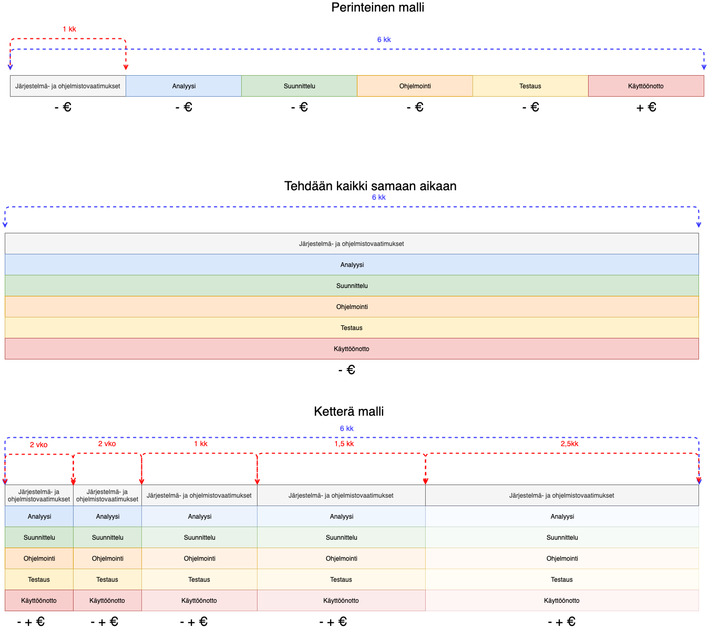
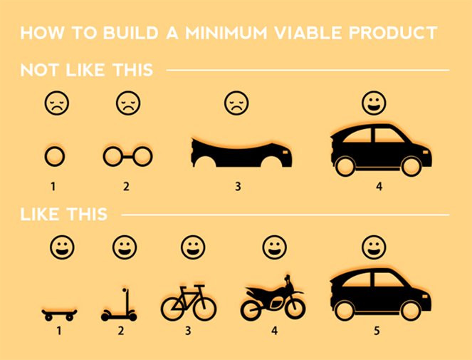
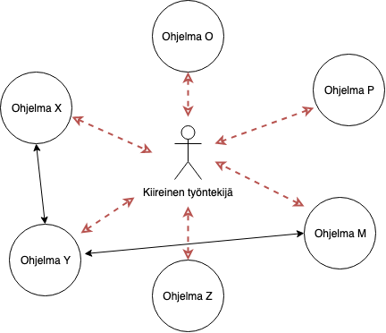

# TL;DR

## Mitä on ohjelmistokehityksen ostaminen?

* Maksat asiasta, jota ei voi haistaa, maistaa, kuulla, koskea, tuntea tai nähdä.
* Ohjelmistokehitys terminä käsittää kaikki työtehtävät ohjelman käyttöönottoon ja ylläpitämiseen asti.
* Ostat henkilön osaamista ja kokemusta.
* Lopputuloksena syntyy ohjelman lähdekoodi, jos ei synny niin kyse ei ole ohjelmistokehityksestä.
* Syntynyt lähdekoodi on se juttu, joka mahdollistaa liiketoiminnan. Lähdekoodi kirjoitetaan aina toiselle henkilölle, ei tietokoneelle.
* Lähdekoodi syntyy luovan prosessin lopputuloksena.

## Miten ohjelmistokehityksen ostaminen eroaa ns. valmiin verkkopalvelun ostamisesta?

* Valmiilla ohjelmistolla tarkoitan esimerkiksi palveluita, jotka ovat keskittyneet johonkin yrityksen liiketoiminnan alueeseen. \(kirjanpito, markkinointi, verkkokauppa, projektinhallinta, työajanseuranta. jne.\)
* Valmiin verkkopalvelun alkukustannukset ja käyttö voivat olla alhaisia.
* Valmiin verkkopalvelun ostamisen yhteydessä mieti, onko liiketoimintasi oikeasti niin uniikki vai ei?
* Valmiin verkkopalvelun kohdalla taivuttelet sen toimintojen mukaisesti.
* Valmiin verkkopalvelun kohdalla ylläpito ei ole sinun huolehdittavana.
* Ohjelmistokehityksen ostamisessa puolestaan ei ole tarkoitus tehdä kaikkea itse, voidaan keskittyä yhteen tärkeään osa-alueeseen.
* Valmiin verkkopalvelun ostaminen on kuitenkin hankinta, joten ohjelmistokehityksen kaikista vaiheista jäljelle jää usein käyttöönotto.

## Miten arvioin sijoitukseni kannattavuutta?

* Ohjelma ei tuota arvoa heti vaan alkukustannukset voivat olla suuria. Vertaa tätä ravintolan perustamiseen.
* Arvoa ohjelma voi tuottaa vasta kun pienikin osa siitä on julkaistu. Ennen sitä kaikki tehty on lähinnä arvaus mikä voisi tyydyttää tarpeet mutta arvoa se tuottaa vasta julkaistaessa. **Älä venytä julkaisua.**
* Muista pitää aina tavoitteet kirkkaana. **Tavoite ei saa olla €€**. Tavoitteen pitää olla mitattavissa. Eurot ovat seuraus tavoitteeseen pääsemisestä. Lue aiheesta [Impact Mapping](https://www.impactmapping.org/book.html)
* Laske kuinka nopeasti voit teoriassa saada sijoituksen takaisin \(päivässä, viikossa, kuukaudessa, vuodessa\)
* Laske minkälaista arvoa ohjelma tuottaa.
* **Älä tee, jos et pysty laskemaan arvoa.**

### Joitakin tavoitteita, joista sitten soveltaa miten niihin päästään.

* Kun ominaisuus X valmistuu, se lisää asiakkaiden kertaostosten loppusumma Y%.
* Kun ominaisuus X valmistuu, se lisää asiakkaiden ostojen toistuvuutta Y%.
* Kun ominaisuus X valmistuu, se lisää asiakkaiden määrää Y%
* Kun ominaisuus X valmistuu, se säästää työtehtävään käytettävästä ajasta 5min joka päivä. \(5min x 226 päivää x 5 henkilöä = 94h 10min\)


Käännä edelliset tavoitteet ympäri eli aloita kysymällä **"Miten?"**


## Mitä asioita minun tulisi huomioida ennen ohjelmistokehityksen ostamista?

* Varaa riittävästi aikaa. 1 työpäivä vähintään, mieluiten enemmän joskus.
* Älä arkaile asiasi esille tuomisessa, ei ole suurta pelkoa ideoiden varastamisesta.
* Yritä jäsentää asia ja tavoitteet. Kokeile piirtää oma visiosi ohjelmasta ulkonäöllisesti tai käytettävyyden näkökulmasta.
* Kysy tarjouksia eri lähteistä. Eroja on huomattavasti. Tämä ei tarkoita, että halpa on hyvä.
* Mieti pienin mahdollinen osuus, joka tuo arvoa ja pysy siinä.
* Kustannuksia tulee kun työmäärät ovat useita kuukausia, varmista siis mitä rahalla saa.
* Ohjelman ensimmäinen versio, keneltä tahansa ostettuna, tee se kiinteällä summalla. Tuntihinnalla kustannukset nousevat helposti.
* Muista neuvotteluvara, katso alla oleva kolmio. \(usein aika ja raha ovat rajallisia, joten jousta sisällöstä, vain kaksi kulmaa voidaan valita.\)
* Älä niinkään peljästy kustannuksia. Yritä saada kuva mitä ne ovat ja tarkista tavoitteesi. Muista, että tämä on sijoitus.
* Älä seuraa isompia. Tee omaa juttuasi. 
* Ulkoasu maksaa myös.
* Kun palaveeraat niin kysy mukaan ohjelmoija \(tai se henkilö, joka oikeasti kirjoittaa lähdekoodin\)
* Tutustu aiheeseen. Ohjelmoijat yrittävät opetella puhumaan "asiakasta". Opettele puhumaan "ohjelmoijaa". Viestintä on suuressa osassa, että tavoitteisiin päästään.
* Lue [Getting Real](https://basecamp.com/books/getting-real)
* Lue [Shape up](https://basecamp.com/shapeup)

## Esimerkkejä mitä euroilla saa

* **0 - 5 000€** pienet ja keskisuuret verkkosivut, pienen verkkokaupan käyttöönotto. Valmiiden palveluiden vuosikustannukset. Pienet demot tai ideoiden kokeilu. Pienet integraatiotyöt kuten esimerkiksi kahden järjestelmän välinen keskustelu. Verkko- tai luottokorttimaksujen toteuttaminen.
* **5 000€ - 10 000€** Kauniimmat verkkosivut, pienen verkkokaupan käyttöönotto ja räätälöidyt ulkoasut. Valmiiden palveluiden vuosikustannukset. Hyvin mahdollisesti jo pienen räätälöidyn verkkosovelluksen ensimmäinen versio mutta hyvin rajattu.
* **10 000€ - 15 000€** Mahdollisesti pienen verkkopalvelun alkukustannukset, rajatuilla ominaisuuksilla. Erilaiset järjestelmien väliset integraatiotyöt. Pienen mobiilisovellukset toteuttaminen rajatuin ominaisuuksin.
* **15 000€ - 25 000€** Mobiilisovellus, jossa myös verkkopalvelun osuus mukana. Rajattu sellainen ja todennäköisin summa ensimmäisestä versiosta. Usein toteutuksissa tarvitaan muitakin järjestelmiä eli verkkomaksujen käyttöönottoa jne.
* **+25 000€** Puhutaan jo sellaisesta työmäärästä, että tekemistä on paljon ja kustannukset nousevat. Riippuen kustannuksista, voi tarkoittaa 1-6kk työtä eli eroa on paljon. Toimittajia on monenlaisia eri lähtöön.
* Esimerkit on mietitty siitä näkökulmasta, että asiakkaana on jotakin liiketoimintaa harjoittava yritys. Ei niinkään Startup -kuviot. Tottakai samat lait pätevät näissä, että isompaa tuottoa odottaessa, kustannukset ovat suuremmat.

