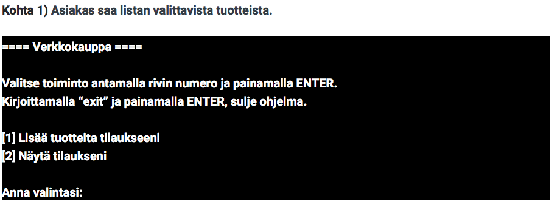
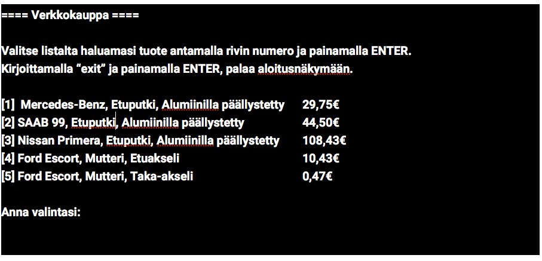

# Projekti 2018/01 Käyttötapauksesta työtehtäviin

## Valittu käyttäjätarina

**KOPIO** edellisistä esimerkeistä.

Yritysasiakkaana ****_**\(jäljempänä asiakas\)**_ ****tahdon pystyä _**poimimaan tilaukseen**_ haluamani _**tuotteita**_ voin luoda haluamani tilauksen.

## Tarinan ensimmäinen käyttötapaus

**KOPIO** edellisistä esimerkeistä.



#### TAPAUS 01

**Tavoite**

Verkkokauppaohjelmistoa käyttävä _**asiakas**_ saa lisättyä _**vahvistamattomaan tilaukseen tu**_otteita.

**Esiehdot**

* Ohjelmassa on oltava _**saatavilla olevia tuotteita**_, joita asiakas voi valita.

**Onnistunut lopputulos**

Asiakas näkee tilauksessaan tuotteen, jonka hän on toiminnon aikana valinnut.

**Virheellinen lopputulos**

Asiakkaan valitsema tuote ei näytä tilauksessa. Ohjelma ei kaadu mikäli virhe sattuu vaan ilmoittaa virheellisestä toimenpiteestä.

**Kuvaus käyttötapauksesta**

1. Asiakas saa listan valittavista tuotteista.
2. Asiakas valitsee tuotteen listalta ja hyväksyy sen tilaukseen.
3. \(järjestelmä lisää tässä kohdin tuotteen tilaukseen\)
4. \(järjestelmä ilmoittaa asiakkaalle, että tuote on lisätty tilaukseen\)

**Kuvaus virheellisestä käyttötapauksesta**

**Kohdassa 3** tuotteen lisäys tilaukseen ei onnistu. **Kohdan 4** sijaan ohjelman _**tulisi ilmoittaa asiakkaalle, että tuotetta ei voitu lisätä tilaukseen**_.



## VAIHE 1: Käyttöliittymän luonnokset

Kun asia on vieras ja siitä on saatu kyseltyä kaikki mahdollinen, hyvä tapa lähteä liikkeelle on tehdä käyttöliittymä luonnoksia. Vastataan siis kysymykseen: 

_Miltä ohjelma tulisi näyttämään ja sen käyttö tuntumaan?_


Helpoin tapa on paperi ja kynä, sitten erilaiset luonnosteluohjelmat jne. Mikä vain tuntuu luontevimmalta on aina hyvä lähtökohta. Alla esimerkki tähän harjoitukseen liittyen. Kuvat on tehty yksinkertaisesti tekstieditorilla ja otettu kuvakaappaukset.


### Kuvakaappaukset

## VAIHE 2: Ohjelman rakenteen luokkakaavio



Liitteesstä _**"Ohjelman rakenteen luonnos"**_ on käyty läpi ohjelman rakennetta mitä se voisi olla teknisesti toteutettuna. Kyseessä on vain esimerkki omasta näkemyksestä ja se saa ja voi erota riippuen ohjelmoijasta.

Kaavioon on tuotu mukana olio-ohjelmoinnin piirteitä ja siksi siinä puhutaan luokista ja komponenteista. Kaavion tarkoitus ei ole kertoa miten ohjelmoida vaan taas tuoda erilainen näkökulma asiaan ja löytää lisää kysymyksiä mihin löytää vastaus... eli asioihin joita ei tiedetä.

## VAIHE 3: Analyysin jälkeen listatut työkokonaisuudet

Kun ohjelman rakennnetta ja vaatimuksia on käyty läpi, pitää vielä listata tehtäviä mistä lähdetään liikkeelle. Tässä tehtävät ovat vain listaus niistä asioista, josta ei tiedetä mitään ja ne pitää selvittää ennenkuin kokonaisuus saadaan tehtyä loppuun.

Seuraava kokonaisuus on taas hieman helpompi kun asia on tutumpi ja alun ongelmat ratkaistu.

* 
## VAIHE 4: Ohjelmointi

Tässä kohdin on vain aloitettava ohjelmointi. Vasta sitten tiedetään oikeat ongelmakohdat ja puutteet tiedoissa. Sillä ei ole väliä miten tämä tulee tapahtumaan vaan yksi kerrallaan pyritään tekemään työkokonaisuus ja oppia sen kautta.


Kun ohjelmoidaan, se ei tarkoita, että kaikki asiat pitää tietää ja osata. Sellaista tilannetta ei olekaan. On paljon tärkeämpää tunnistaa osa-alueet, joista ei tiedä mitään ja mitkä ovat haastavia, koska silloin niitä on tarkoitus osa-alueita on tarkoitus parantaa.


