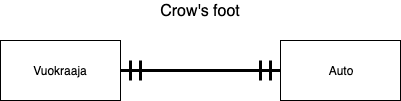
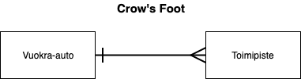
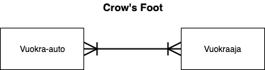
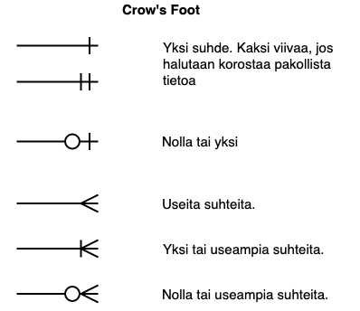
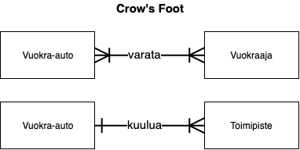

# ER kaaviot

## Kaavioiden tarkoitus

Tietokantasuunnittelussa yksi osa-alue on kuvata tietokantarakennetta. Todellinen rakenne tiedetään kun se on toteutettu mutta monet ongelmat voi ratkaista paperilla. Jotta rakenteiden tulkinta olisi ymmärrettävämpää usean henkilön kanssa, on tätä varten luotu erilaisia kuvaustapoja.

ER -kaavio eli Entity Relationship Diagram kuvaa taulujen välisiä suhteita sekä niiden sisältöjä. Esimerkki kaaviosta alla.

## Termistön läpikäynti

**Entiteetti \(eng. entity\)** - tarkoittaa käsiteltävää asiaa, esinettä, aihetta tai muuta kuvattua asiaa. Taulua voidaan kutsua myös tällä termillä.

**Attribuutti \(eng. attribute\)** - tarkoittaa entiteettiä kuvaavia asioita. Esimerkiksi autolla voi olla väri, malli tai  renkaiden koko. Sellaiset asiat mitkä ovat tyypillisiä kuvattaville asioille. Taulujen sarakkeita kutsutaan myös siis termillä attribuutti.

**Suhde \(eng. relationship\)** - tarkoittaa kahden entiteetin välistä suhdetta miten ne ovat yhteydessä toisiinsa. Kaavioissa tämä on kuvattu viivana ja viivan päissä oleva merkintä voi tarkentaa suhteen muotoa.

**Notaatio \(eng. notation\)** - tarkoittaa yksinkertaisesti kuvaustapaa. Voidaan puhua, että kaavio on kuvattu UML notaatiolla. Esimerkeissä käytämme variksen varpaita. \(Crow's Foot\)

## Taulujen väliset suhteet

Tietokantoja suunnitellessa on tärkeää tuntea taulujen väliset suhteet ja niiden kuvaustavat. Kyseessä ei ole sen erityisempi asia kuin, että tarkoitus on kuvata tietokannan sisältämän tiedon keskinäisiä suhteita. Esimerkiksi, jos opiskelija voi osallistua useammalle kurssille, voidaan tällöin sanoa, että opiskelijan ja kurssin välillä on eräänlainen suhde mikäli se mallinnetaan tietokannaksi. Näitä suhteita siis löytyy arkielämästä asioista, joita tietokanta sisältää.

Tietojen välillä voi olla seuraavia suhteita:

* Yksi suhde yhteen \(eng. One-to-One\)
* Yksi suhde moneen \(eng. One-to-Many\)
* Moni suhde yhteen \(eng. Many to One\)
* Moni suhde moneen \(eng. Many-to-Many\)

**Yksi suhde yhteen** - tarkoittaa sellaista suhdetta kahden asian välillä, joita voi olla olemassa vain yksi kerrallaan. Esimerkkinä voisimme ajatella autovuokraamoa. On sovittu, että vuokraajalla voi olla vain yksi auto vuokralla kerrallaan ja auto voi olla vain yhdellä vuokraajalla. Voisimme esittää suhteen seuraavalla kaaviolla.

**Yksi suhde moneen** - tarkoittaa sellaista suhdetta, jossa asia voi esiintyä usean kerran. Jatkaaksemme edellistä esimerkkiä voimme ajatella, että toimipisteellä voi olla useita vuokra-autoja mutta auto voi kuulua vain yhteen toimipisteeseen. Tällainen suhde voidaan kuvata seuraavalla kaaviolla.

**Moni suhde yhteen** - tarkoittaa pitkälti samankaltaista suhdetta kuin yllä oleva esimerkki. Kyse on lähinnä näkökulmasta miten asiaa tarkastellaan. Esimerkin vuoksi voimme ajatella, että usea vuokra-auto kuuluu samalle toimipisteelle ja kuvata sen seuraavasti. Huomaa, että entiteetit ovat käännetty ympäri.

**Moni suhde moneen** - tarkoittaa suhdetta, jossa kaksi entiteettiä voi esiintyä pareittain usealla eri tavalla. Esimerkissämme voimme ajatella, että vuokra-auton voi varata useampi henkilö ja henkilö voi vuokrata useita eri autoja. Suhde kuvattaisiin seuraavalla tavalla.

Pääasiassa tärkeimmät suhteet on kuvattu yllä. Lähestulkoon kaikki toimivat näiden mallien mukaisesti yhdistellen. Esimerkeissä on käytetty kuvaamiseen [Crow's Foot \(variksen varpaat\)](http://www2.cs.uregina.ca/~bernatja/crowsfoot.html) notaatiota. Esimerkeissä ei käyty läpi kaikkia eri kuvaustapoja vaan yksittäisillä viivoilla on merkityksensä, joilla voidaan vielä tarkentaa niiden merkitystä. Käydään yksittäiset merkintätavat läpi vielä.

Kuvaustapoja tarkastelemalla voimme vielä todeta, että ne eivät aina selitä itseään. Siksi on tärkeää tarvittaessa perustella mikä liitos on tai mitä sillä tarkoittaa. Usein liitos voidaan pukea lauseeksi. Esimerkiksi

* _Opiskelijan on kuuluttava vähintään yhteen vuosiryhmään, vuosiryhmään voi kuulua useampi opiskelija._
* _Opiskelijalla voi kerrallaan olla yksi käynnissä oleva moduuli, moduulissa voi olla vähintään yksi tai useampi opiskelija._

Kaavioissa voidaan korostaa vielä suhteita esimerkiksi kirjoittamalla suhdetta kuvaavan viivan päälle mitä se tarkoittaa.

Kun tiedetään miten suhteita kuvataan, niitä voidaan aina tarkentaa. Esimerkiksi heti alussa esitetty tietokantamallin kuva sisältää taulujen nimiä ja sarakkeita. Näillä voidaan vielä selkeästi tarkentaa miten yhteydet on muodostettu asioiden välille.

Huomaa kuitenkin, että kuvaustapa ei välttämättä kerro miten teknisesti suhde toteutetaan. Esimerkiksi Mysql -tietokannassa suhde voidaan luoda eri tavoin. Kaavion onkin tarkoitus olla ohjeistus miten tietokantamallin tulisi toimia mutta toteutustapa voi eroa eri relaatiotietokannoissa. Ota aina tarvittaessa selvää miten näitä tulee toteuttaa. **Moni suhde moneen** -tilanteissa on hyvin tyypillistä luoda ns. liitostaulu.

## Taulujen väliset suhteet SQL kielellä

[Tutustu pää- ja viiteavaimiin](paeae-ja-viiteavaimet.md). SQL kielessä nämä suhteet luodaan käyttäen kyseisiä avaimia ja tarvittaessa erilaisia taulurakenteita. Myös mahdollisesti `UNIQUE` määrityksen käyttäminen sarakkeissa on tarpeen.

## Muita notaatioita

Esimerkeissä on käytetty notaatioina variksen varpaita. Se on yksi tunnetuista tavoista mutta kuvaustapoja on myös useita muita. Tarvittaessa ota selvää mikä kuvaustapa on, jotta osaat tulkita suhteet. Joitakin kuvaustapoja on lueteltu alla olevassa lähteessä.

{% embed url="https://en.wikipedia.org/wiki/Entity%E2%80%93relationship\_model\#Cardinalities" %}

## Lähteet







