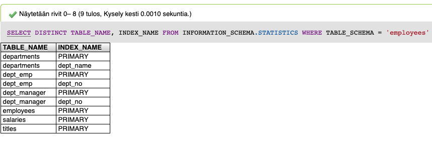

# Indeksointi

Indeksillä tarkoitetaan tiedon rakennetta, jonka tarkoituksena on nopeuttaa relaatiotietokantojen hakuja, jotta järjestelmä palauttaa haetut tiedot nopeammin. Vaikuttaa myös tietokannan suorituskykyyn. Käytännössä indeksi on uudelleen järjestettyä tietoa, joka vastaa paremmin haluttuun hakuun. Tietokanta ei kuitenkaan tallenna samaa tietoa uudelleen vaan käyttää viittauksia alkuperäiseen tietoon.


## Esimerkki



## Algoritmit



### B-tree \(B-puu\)


## Käytännön esimerkki

Testitietokanta ladattavissa [https://github.com/nyluntu/test\_db](https://github.com/nyluntu/test_db) ja siihen liittyvää dokumentointia [https://dev.mysql.com/doc/employee/en/](https://dev.mysql.com/doc/employee/en/).

Seuraavia asioita voit kokeilla, jos luot itsellesi testitietokannan githubissa olevien ohjeiden mukaisesti. Testitietokannassa on miljoonia rivejä, joten se on hieman suurempi kuin muut esimerkit.

### Mitä indeksejä tietokannassa on?

Jos et tunne käsiteltävää tietokantaa. Seuraava SQL kysely auttaa sinua löytämään kaikki siinä käytössä olevat indeksit.

```sql
SELECT DISTINCT TABLE_NAME, INDEX_NAME 
FROM INFORMATION_SCHEMA.STATISTICS 
WHERE TABLE_SCHEMA = 'employees' -- employees on siis tietokannan nimi tässä.

-- Yhden taulun indeksit voi hakea seuraavalla komennolla:
SHOW INDEX FROM employees;
```



Kun käytetään `SELECT` hakua, se suoritetaan yksi komento kerrallaan. Hakujen nopeuteen vaikuttavat useat siinä esiintyvät avainsanat. `(join order, group, where jne)` Mysql pyrkii käyttämään apuna indeksejä, joilla se voi rajata jo alussa pois rivejä mitä ei tarvitse käydä läpi. Usein `WHERE` ehdossa esitellyt ehdot ovat tärkeimpiä haun nopeuteen liittyen. Väärällä tavalla kirjoitetut haut voivat olla raskaita tietokannalle ja niiden suorittaminen vie aikaa.

### Esimerkki 01

```sql
-- Haetaan työntekijöiden suurin palkka niiltä
-- joiden työnimike on Technique Leader sekä
-- etunimi tai sukunimi alkaa Emi -merkeillä.
SELECT 
    em.emp_no, 
    MAX(sa.salary),
    em.first_name,
    em.last_name
FROM salaries as sa
LEFT JOIN employees as em USING(emp_no)
LEFT JOIN titles as ti using(emp_no)
WHERE ti.title like 'Technique Leader'
and (em.first_name like 'Emi%' or em.last_name like 'Emi%')
GROUP BY em.emp_no

-- Sama kysely käyttäen EXPLAIN komentoa
EXPLAIN SELECT 
    em.emp_no, 
    MAX(sa.salary),
    em.first_name,
    em.last_name
FROM salaries as sa
LEFT JOIN employees as em USING(emp_no)
LEFT JOIN titles as ti using(emp_no)
WHERE ti.title like 'Technique Leader'
and (em.first_name like 'Emi%' or em.last_name like 'Emi%')
GROUP BY em.emp_no
	
-- Komentojen indeksien luontiin
ALTER TABLE `employees`.`employees` ADD INDEX `ix_employees_firstname` (`first_name`);
ALTER TABLE `employees`.`employees` ADD INDEX `ix_employees_lastname` (`last_name`);

```

## Lähteet






