# Normalisointi

## Mitä normalisoinnilla tarkoitetaan?

Lyhyesti sanottuna normalisointi \(eng. normalization\) tarkoittaa tietokantasuunnitteluun liittyviä tekniikoita, joiden tarkoitus on minimoida tiedon toistuvuutta ja riippuvuutta. Säännöt keskittyvät oleellisesti tietokantataulujen sisältöihin.

Noudattamalla sääntöjä ne ohjaavat siihen, että suuri taulu saadaan pilkottua pienemmiksi tauluiksi sekä luomaan näiden välille riippuvuussuhteita. Kts. [Pää- ja viiteavaimet](paeae-ja-viiteavaimet.md). Lopputuloksena tietokannassa oleva tieto on siis selkeämmin järjestetty. Terminä normalisointi viittaakin tietokannan rakenteisiin . 

Erilaisia normaalimuotoja on yhteensä kuusi kappaletta mutta pääasiassa kolme ensimmäistä on tärkeintä. Kolmannen jälkeen ei aina saada suuria hyötyjä mutta hyvä tapa on yrittää noudattaa kolmea ensimmäistä. Sääntöjen noudattaminen tarkoittaa myös, että toteuttaakseen esimerkiksi kolmannen normaalimuodon pitää sen hetkisen ratkaisun toteuttaa myös kaksi edellistä normaalimuotoa.

Kun tietokannassa on huomioitu nämä säännöt niin voidaan lyhyesti aina ilmaista esimerkiksi, että tietokantamalli on 3. normaalimuodon mukainen. Tämä jo heti antaa viitteen sille minkälainen tietokanta on kyseessä. Aina näin ei ole ja suunnitteluvirheet johtavat erilaisiin ongelmiin tiedon käsittelyn kanssa.

Normalisoinnin lisäksi voidaan puhua denormalisoinnista \(eng. denormalization\), joka tarkoittaa sääntöjen rikkomista. Tämä tehdään usein hyvästä syystä ja perustellen. Ei siksi, että sääntöjä ei noudatettaisi vaan sillä voidaan joissain tilanteissa nostaa esimerkiksi suorituskykyä.

Tietokannan normalisoinnin taustalla on [Edgar Codd](https://fi.wikipedia.org/wiki/Edgar_F._Codd), joka on esitellyt ja määritellyt ensimmäiset kolme sääntöä. Tutustutaan seuraavaksi kolmeen ensimmäiseen normaalimuotoon syvemmin.

## Normalisoimaton tieto

Normalisointisäännöt tullaan esittämään esimerkin kautta. Ensimmäisenä esittelemme  normalisoimattoman taulun, josta esimerkit syntyvät. Tietokantamalli ei voi toteuttaa seuraavaa normaalimuotoa ellei se toteuta myös edellisiä normaalimuotoja.

On mahdollista, että oikean tiedon kanssa tietyissä olosuhteissa normalisointisäännöt eivät toteudu tai ne niiden yli voidaan hypätä. Esimerkki on kuitenkin tehty siitä näkökulmasta, että erilaiset tilanteet tulevat vastaan. Tietokantamallina toimii seuraavanlainen tv-sarjoja sisältävä tietokantataulu.

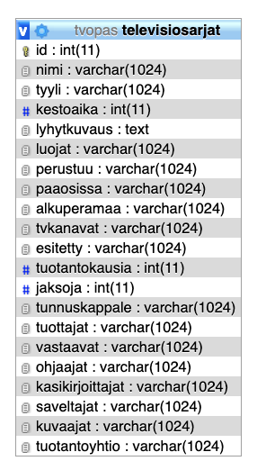



```text
*************************** 1. row ***************************
              id: 1
            nimi: Game of Thrones
           tyyli: fantasia
       kestoaika: 4920
     lyhytkuvaus: Game of Thrones on yhdysvaltalainen fantasiadraamasarja, jonka ovat luoneet David Benioff ja D. B. Weiss. Se perustuu George R. R. Martinin Tulen ja jään laulu -fantasiakirjasarjaan.

Martin toimi yhtenä sarjan vastaavista tuottajista ja myös käsikirjoitti muutaman jakson.
          luojat: David Benioff,D.B. Weiss
        perustuu: George R. R. Martinin kirjasarjaan Tulen ja jään laulu
       paaosissa: Peter Dinklage,Lena Headey,Nikolaj Coster-Waldau,Emilia Clarke,Kit Harington,Sophie Turner,Iain Glen,Aidan Gillen,Maisie Williams,Alfie Allen,Isaac Hempstead-Wright,Rory McCann,Jack Gleeson,Michelle Fairley,Richard Madden,Sean Bean,Mark Addy,Harry Lloyd,Conleth Hill,John Bradley,Jerome Flynn,Charles Dance,Sibel Kekilli,James Cosmo,Joe Dempsie,Dean-Charles Chapman,Tom Wlaschiha,Jason Momoa,Liam Cunningham,Carice van Houten,Natalie Dormer,Stephen Dillane,Rose Leslie,Oona Chaplin,Gwendoline Christie,Hannah Murray,Michael McElhatton,Kristofer Hivju,Iwan Rheon,Michiel Huisman,Nathalie Emmanuel,Indira Varma,Jonathan Pryce
     alkuperamaa: Yhdysvallat
       tvkanavat: HBO,HBO Nordic,C More,Yle TV2
        esitetty: 17. huhtikuuta 2011 – 19. toukokuuta 2019,12. tammikuuta 2012 – jatkuu edelleen
  tuotantokausia: 8
         jaksoja: 73
   tunnuskappale: Ramin Djawadin säveltämä
       tuottajat: Frank Doelger,Carolyn Strauss,Greg Spence
       vastaavat: David Benioff,D. B. Weiss,Carolyn Strauss,Frank Doelger,Bernadette Caulfield
        ohjaajat: Jack Bender,Alex Graves,Michelle MacLaren,Neil Marshall,Daniel Minahan,Mark Mylod,David Nutter,Daniel Sackheim,Alik Sakharov,Miguel Sapochnik,Tim Van Patten,Jeremy Podeswa,Michael Slovis,Alan Taylor
kasikirjoittajat: David Benioff,D. B. Weiss,Bryan Cogman,George R. R. Martin,Vanessa Taylor,Dave Hill,Jane Espenson
      saveltajat: Ramin Djawadi
        kuvaajat: Alik Sakharov,Marco Pontecorvo,Matthew Jensen
   tuotantoyhtio: HBO
```



Yllä oleva malli esittää yhden esimerkkirivin millaista tietoa taulu sisältää. Kun tietoa ei ole tallennettu oikealla tavalla, tuottaa se usein ongelmia. Tiedon lisääminen, muokkaaminen ja poistaminen osoittautuu yleensä hankalaksi. Ensimmäiseksi tarkastelemme esimerkkiä 1. normaalimuodon määrittelemällä tavalla.

## Ensimmäinen normaalimuoto \(1NF\)

Ensimmäinen normaalimuoto on tosi, jos:

* jokainen taulun sarake sisältää yhden arvon.
* jokainen taulun rivi on uniikki.


Englanninkielisissä lähteissä puhutaan termillä **atomic value**. Sillä tarkoitetaan arvoa, jota ei voi enää jakaa pienempiin osiin.


Kun tarkastellaan esimerkin taulua **televisiosarjat** niin on melko selkeää, ettei se vastaa ensimmäistä sääntöä lainkaan. Pelkästään esimerkin tiedot paljastavat toistuvat arvot. Katsotaan esimerkkinä sarake **luojat**, joka sisältää kaksi nimeä: **David Benioff ja D.B. Weiss**. Lähestulkoon aina sarake, jossa on kokoelma tietoa niin voidaan pilkkoa. Jotta pääsemme kohti 1. normaalimuotoa niin ratkaisu tähän on pilkkoa kenttä omaan tauluunsa. Luodaan siis taulu **luojat**.

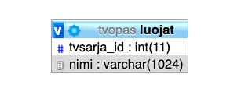

Nyt tilanne ei vielä ole muuttunut paremmaksi. Taulujen välillä ei ole liitosta ja uusi **luojat** -taulu ei sisällä pääavainta. Jos mietimme ensin pääavainta niin valintamme voisi olla jokin seuraavista:

* Juokseva numerointi \(1,2,3,4,5....\)
* Jokin luonnollinen yhdistelmä sarakkeita, kuten esimerkiksi **sarjan tunniste** ja **henkilön nimi**.

Koska taulujen välillä ei ole minkäänlaista suhdetta niin voimme vielä miettiä, että mikä sen kuuluisi olla. Kun tiedämme, että alkuperäisessä sarakkeessa on ollut kaksi arvoa niin voimme päätellä, että yhdellä tv-sarjalla on yksi tai useampi luoja. Voimme tarkastella aina myös muita taulun rivejä, josta voisimme päätellä lisää mutta tässä kohdin tiedämme, että luojia voi olla useita mutta usein vähintään yksi. Tottakai tilanne, jossa luojaa ei tiedetä on aivan mahdollinen. Muotoillaan suhde seuraavasti:

* **Tv-sarjalla voi olla useita luojia tai ei yhtään.** 

Tämän perusteella saattaisimme päästä seuraavanlaiseen taulujen suhteeseen. Esimerkki sisältää jo kentät edellä olevan suhdetyypin luomiselle. Alla olevassa kuvassa taulu **televisiosarjat** on liitetty **luojat** -tauluun. Kuvassa ei näy suhteen tyyppiä mutta se on aiemmin kuvatun mukainen. [\(Suhteiden kuvaamistavasta on oma lukunsa\)](er-kaaviot.md). **Televisiosarjat** -taulusta huomaamme, että siitä puuttuu nyt kokonaan **luojat** -sarake. Sarakkeen tietojen perusteella on siis luotu kokonaan oma taulunsa. Huomaamme myös, että **luojat** -taulun pääavaimena toimii nyt sen kaksi saraketta. Palaamme tähän vielä myöhemmin.

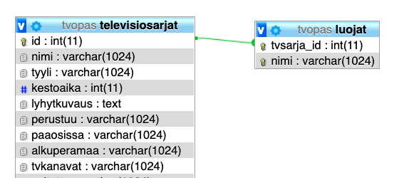

Alla näemme esimerkit tämän ensimmäisen kohdan normalisoinnin jälkeen eli miten tieto on esitetty **luojat** -taulussa. **Luojat** taulussa siis viitataan **televisiosarjat** -riviin sen tunnisteella **\(id\)**.


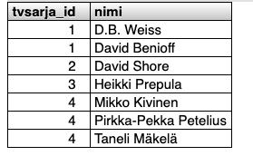


Luojat -taulun pääavain ei ole vielä kovin järkevät mutta asioita usein tehdään yksi kerrallaan. Pääavaimessa on kuitenkin se etu, että henkilöä ei voi nyt lisätä toiseen kertaan samaan tv-sarjaan luojaksi mikäli rivi on jo olemassa. Mysql antaa seuraavanlaisen virheen kun pääavaimen ehdot eivät täyty:

`#1062 - Duplicate entry '1-David Benioff' for key 'PRIMARY'`


Pääsääntöisesti tässä on kyse 1. normaalimuodon toteutumisesta eli jokainen tällainen sarake, joka sisältäisi useita arvoja niin tulee käsitellä. Usein ratkaisu on juurikin toinen taulu mutta taulujen väliset suhteet voivat vaihdella tiedon sisällön mukaan. Tehdään vielä toinen vastaava esimerkki käyttäen **tvkanavat** -saraketta. Kun noudatamme samanlaista sääntöä niin lopputulos voisi olla seuraavanlainen.

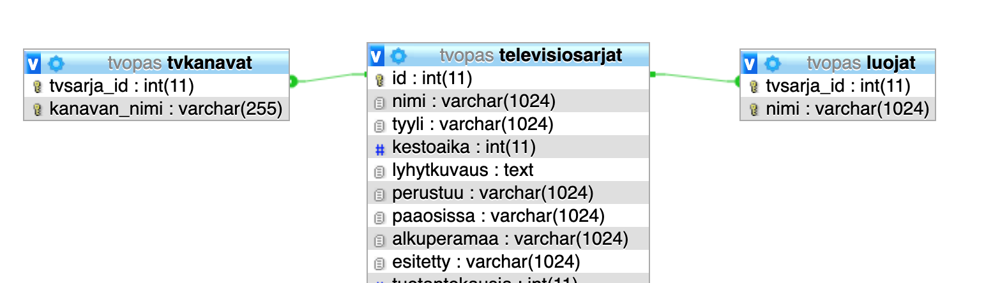

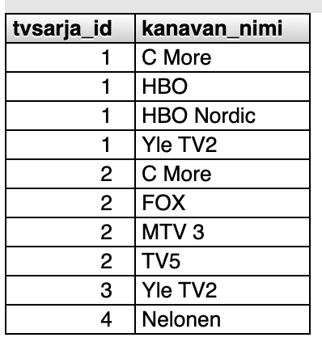

Molemmissa tilanteissa **tvsarja\_id** -sarake viittaa **televisiosarjat** -taulun pääavaimeen. Tällöin siis **tvsarja\_id -sarake toimii viiteavaimena**. Tähän tapaan jatkettaisiin muiden tietojen kohdalla. Kaikkia ei käydä läpi yksitellen, koska vastaavia sarakkeita on esimerkissä paljon. Nyt siis taulut eivät vielä täysin toteuta 1. normaalimuotoa mutta jatkamalla loppuun asti samalla tapaa, näin tulisi käymään. Esimerkissämme siirrymme 2. normaalimuotoon. 


Taulussa voisi olla myös tilanne missä olisi sarakkeet: paaosa\_01, paaosa\_02, paaosa\_03 jne. Tällaiset sarakkeet kertovat myös huonosta suunnittelusta, koska ovat samalla tavoin arvoja, joita on useita vaikka eivät yhdessä sarakkeessa olekaan. Ongelma on myös, että joudumme aina muuttamaan tietokantarakennetta, jos tietojen määrä kasvaa. Tähän tulisi myös noudattaa 1. normaalimuodon sääntöä.


## Toinen normaalimuoto \(2NF\)

Toinen normaalimuoto on tosi, jos:

* ensimmäinen normaalimuoto on tosi.
* kaikki sarakkeet ovat täysin riippuvia koko pääavaimesta, poislukien avaimet.

Nykyinen esimerkkimme on 2. normaalimuodon osalta huono. **Televisiosarjat** -taulu sisältää pääavaimen, joka koostuu yhdestä sarakkeesta niin tällöin kaikki muut sarakkeet ovat riippuvaisia siitä. Toinen normaalimuoto korostuu erityisemmin silloin kun taulun pääavain koostuu useammasta sarakkeesta. Tämän esimerkin vuoksi muutamme hieman **tvkanavat** -taulua seuraavanlaiseksi.


Kuvan mukaisessa tilanteessa **tvkanavat** -taulu sisältää nyt uuden pääavaimen, **joka koostuu tvsarja\_id ja kanavan\_id -sarakkeesta**. Kun nyt tarkastelemme kanavan nimeä niin voimme miettiä riippuuko se koko pääavaimesta. Nimi riippuu selkeästi kanavan tunnisteesta \(kanavan\_id\) arvosta. Kun taas TV-sarjan tunniste muuttuu niin sillä ei ole mitään yhteyttä kanavan nimeen. 

Tällaisessa tilanteessa huomaamme, että **kanavan\_nimi** -sarake ei riipu molemmista pääavaimen sarakkeista mutta sen arvo myös toistuu. Jos kanavan tunniste vaihtuu niin kuuluisi muistaa päivittää vielä kanavan nimi sekä muut toistuvat tiedot. Kuvattu tilanne usein tarkoittaa, ettei taulu toteuta 2. normaalimuotoa. Näissä tilanteissa tiedot pitää myös purkaa omaan tauluun. Esimerkin tilanteessa voimme saada aikaiseksi seuraavan tietokantarakenteen:

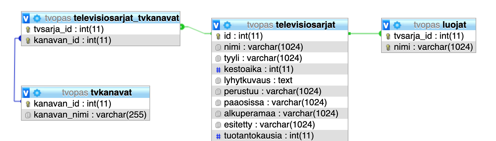

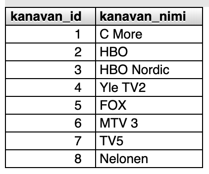

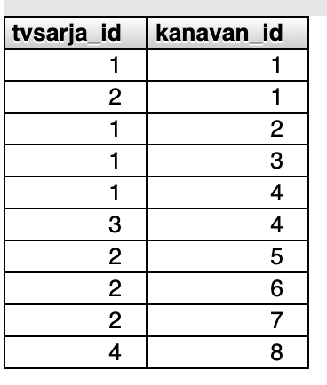

Tv-kanavat taulu muuttui siten, että tv-sarjan tunniste poistettiin. Tällöin sisältö vastaa paremmin taulun sisältöä muutenkin eli se sisältää tv-kanavien tietoja. Muutoksen myötä kadottaisimme tiedon siitä missä tv-kanavissa kyseistä sarjaa on esitetty. Tätä varten voidaan luoda usein liitostaulu, joka yhdistää nämä asiat. Esimerkissämme olemme siis luoneet **televisiosarjat\_tvkanavat** -nimisen taulun, jossa on vain tunnisteet.

Jos nyt päivittäisimme TV-kanavan tietoja niin sisältö pysyy ajantasaisena. Koska kanavia voi olla useita yhtä tv-sarjaa kohden niin kyseessä on **monen suhde moneen -liitos**.

Samankaltainen tilanne saattaisi tulla vastaan **luojat** -taulun kanssa. Kun taas mietimme tietokannan sisältöä niin tällaiset suhteet voitaisiin pystyä huomaamaan jo tietokannan suunnittelun aikana ja siten suunnitella etukäteen. Toisinaan taas yhteydet huomataan myöhemmin kun oikeaa tietoa saadaan luotua. Usein tietojen suhteet keskenään eivät ole selviä kuten aina esimerkeissä.

## Kolmas normaalimuoto \(3NF\)

Kolmas normaalimuoto on tosi, jos:

* toinen normaalimuoto on tosi.
* sisältää sarakkeita, jotka eivät ole transitiivisesti riippuvaisia taulun pääavaimesta.


**Transitiivisella riippuvuudella** tarkoitetaan sitä, että sarake A on riippuvainen sarakkeesta B jonkun toisen sarakkeen kautta. Käytännössä sarake A on transitiivisesti riippuvainen sarakkeesta B, jos sarake A on riippuvainen sarakkeesta C, joka on riippuvainen sarakkeesta B. Tässä A, B ja C voivat sisältää myös useampia sarakkeita.


Esimerkkiä varten keskitymme **televisiosarjat** -taulun **tyylit** -sarakkeeseen. Yksinkertaisuuden vuoksi olemme luoneet taas tilanteen missä tauluun on lisätty sarake **tyyli\_id**. Alla on kuva tilanteesta, jossa ei näy kaikkia sarakkeita taulusta.

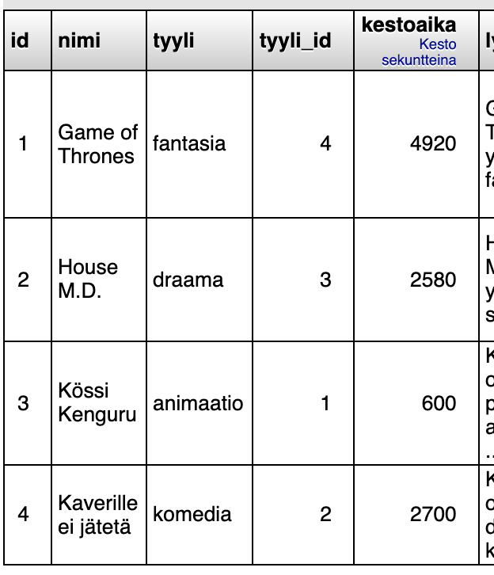

Kun tarkastelemme taulua nyt 3. normaalimuodon ehdoilla niin voimme ilmaista asian seuraavasti. Sarakkeet **tyyli** \(tv-sarjan kategoria tai tyylilaji\) ja **tyyli\_id** ovat molemmat riippuvaisia pääavaimesta. Se siis määrittää tyylilajin. Mainitut kaksi saraketta eivät kuitenkaan ole toisistaan riippumattomia. Tyylilaji voidaan tässä päätellä tyylilajin tunnisteen perusteella. Tv-sarjoja on olemassa vielä useampia kuin tyylilajeja, joten tämä aiheuttaa myös tiedon toistuvuutta **televisiosarjat** -taulussa.

Kun edellä mainitun oloinen tilanne kohdataan, ratkaisu on jälleen kerran helppo. Tiedot tulisi siirtää omaan tauluunsa. Tämän perusteella voimme siis päästä seuraavanlaiseen tietokantaratkaisuun.

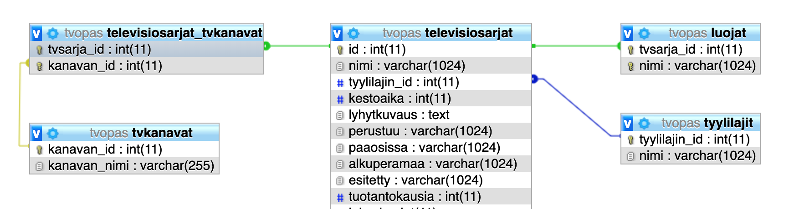

**Televisiosarjat** -tauluun jäi siis vain tyylilajin tunniste \(sarake myös uudelleen nimetty\) ja tyylilaji erotettiin omaksi taulukseen. Televisiosarja -taulusta viitataan tyylilajeihin ja **tyylilajit** -taulu ei sisällä tv-sarjan tunnistetta. Tällöin voidaan puhua, että puhutaan **yksi suhde yhteen -liitoksesta** taulujen välissä. Taulujen sisältämä tieto näyttää nyt vielä seuraavalta.

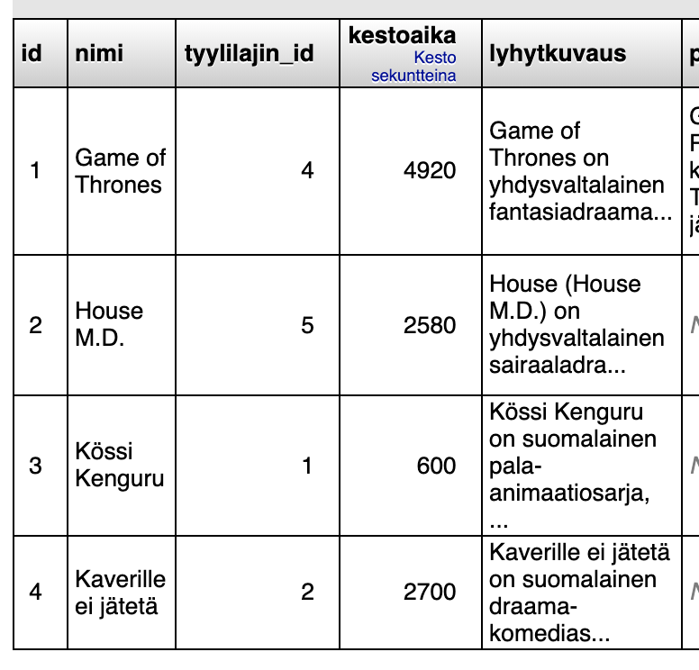

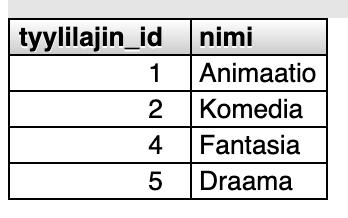

Esimerkissämme jätämme normaalimuotojen käsittelyn tähän. Usein 3. normaalimuoto on hyvä tavoite ja työmäärä tai hyöty seuraavista vaiheista ei aina maksa itseään takaisin. Perusteina on hyvä tuntea nämä kolme ensimmäistä. Normaalimuotojen tunnistaminen on usein haastavaa ja siksi kannattaa katsoa myös alla olevista lähteistä lisää tietoja ja esimerkkejä miten nämä on kerrottu muiden esimerkkien avulla.

## Normalisoinnin tavoitteet

Kertaamme vielä miksi normalisointi on tärkeä aihe tietokantasuunnittelussa. Se sopii myös hyvin erilaisiin tietokantaratkaisuihin tarvittaessa vaikka onkin alunperin suunniteltu relaatiotietokantojen suunnitteluun.

Tavoitteet lyhyesti:

* Luoda sellaiset suhteet tietojen välille, että vältytään ei-toivottujen lisäys, muokkaus tai poisto komentojen riippuvuuksista.
* Vähentää taulujen rakenteiden muuttamista tilanteissa, jossa esitellään uusia tietoja sekä kasvattaa rakenteen elinkaarta.
* Tehdäkseen taulujen välisistä suhteista ja sen sisältämästä tiedosta ymmärrettävämpää käyttäjille.

Niin sanottuja **ei-toivottuja** riippuvuuksia tiedon muuttamisen kohdalla ovat pääasiassa seuraavat tilanteet, jotka esiintyvät mahdollisesti huonosti normalisoidun tietokannan kohdalla.

**Tiedon lisäämisen yhteydessä -** Uutta tietoa ei voida luoda ilman, että sille luodaan jokin muu riippuvuus mitä ei välttämättä ole olemassa. Esimerkkinä voimme ajatella vaikkapa **Luojat** -sarakkeen tämän luvun esimerkeissä. Kyseessä voisi olla tilanne, että emme saisi lisättyä uutta Tv-sarjaa ellemme tiedä myös sen luojaa, mikäli se on pakollinen tieto. Voisimme aina laittaa kyseisen kentän tyhjäksi mutta se usein viittaa tämän kaltaiseen tilanteeseen, jossa riippuvuudet eivät ole määritetty oikein.

**Tiedon päivittämisen yhteydessä -** Sama informaatio voidaan esittää usealla rivillä. Tällöin tiedon päivittäminen yhden rivin kohdalla voi johtaa tilanteeseen, missä tiedon eheys on laiminlyöty. Voidaan siis joutua tilanteeseen, missä esimerkiksi jokin tunniste ei vastaa sitä vastaavaa aihetta.

**Tiedon poistamisen yhteydessä** - Poistaessa tietoja saatamme joutua tilanteeseen, jossa poistamalla esimerkiksi TV-sarjat, joudumme poistamaan paljon muita siihen viittaavia tietoja. Tällöin jokin tieto ei voi esiintyä ilman toista vaikka ne oikeassa maailmassa olisivat riippumattomia toisistaan.

Hyvin normalisoidut tietokannan kohdalla tietojen päivittäminen ja sen käyttö on sujuvaa. Uusien tietojen esittäminen ei vaadi rakenteen muuttamista. Kaikki tämä on siis hyvä tavoite ja kun puutteita näkee, niitä pitäisi yrittää korjata ajoissa mallintamalla tietoa uudelleen. Myöhemmässä vaiheessa tämä on usein hankalaa kun tietoa on jo olemassa ja tällöin vaatisi erilaisia migraatioita tietokannan rakenteeseen.

## Lähteet











