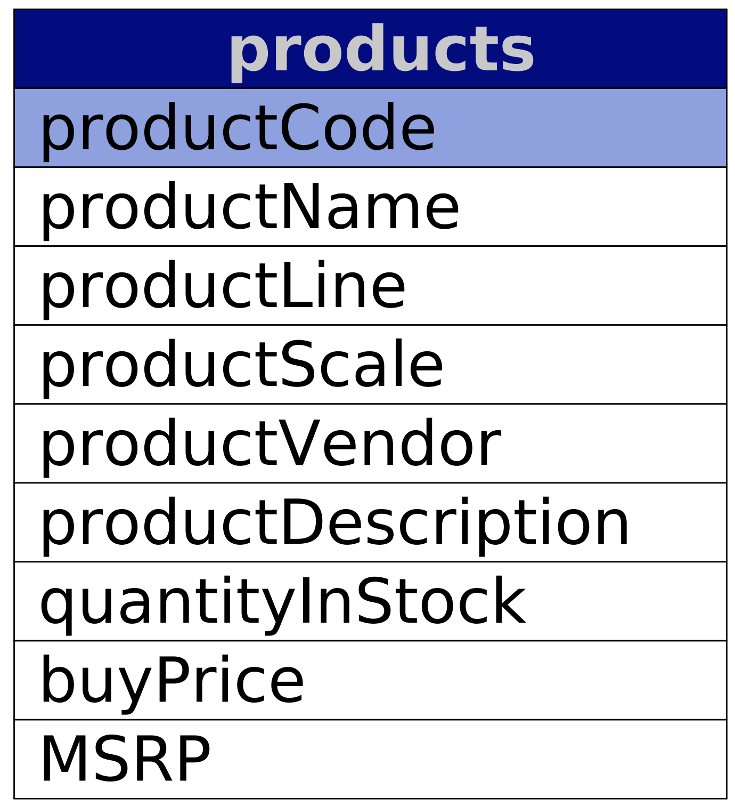
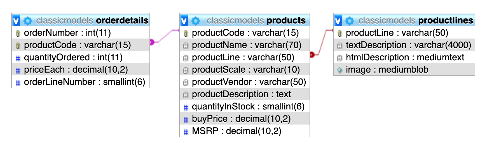

# Pää- ja viiteavaimet

Relaatiotietokannat sisältävät tauluja. Taulut sisältävät suhteita toisiinsa, joita on muutamia erilaisia. Erilaiset suhteet on kuvattu myöhemmässä luvussa. Tässä luvussa keskitytään taulujen pää- ja viiteavaimien tarkoituksiin.

## Pääavain

Pääavaimen tarkoituksena on olla uniikki arvo taulussa olevien rivien erottamiseksi toisistaan. Yhdessä taulussa ei voi olla useita samanarvon sisältäviä pääavaimia. Jokaisella taululla on oltava pääavain ja niitä voi olla vain yksi per taulu. Pääavaimen arvo ei voi olla NULL eli tyhjä.

Pääavain voi koostua yhdestä tai useammasta taulun sisältämistä sarakkeista. Arvon ei siis tarvitse olla pelkkä numero vaan voi sisältää muitakin arvoja. Usein voidaan nähdä nousevasti laskettu numeroarvo \(1,2,3,4,5...\), joka toimii pääavaimena. Suositus on kuitenkin, että pääavain olisi mahdollisimman luonnollinen. Esimerkiksi henkilötunnus voisi toimia pääavaimena taulussa, jossa on kuvattu henkilöitä.

Tutustutaan esimerkin kautta pääavaimeen. Tutkitaan **products** taulua harjoitustietokannasta.




```sql
CREATE TABLE `products` 
  ( 
     `productcode`        VARCHAR(15) NOT NULL, 
     `productname`        VARCHAR(70) NOT NULL, 
     `productline`        VARCHAR(50) NOT NULL, 
     `productscale`       VARCHAR(10) NOT NULL, 
     `productvendor`      VARCHAR(50) NOT NULL, 
     `productdescription` TEXT NOT NULL, 
     `quantityinstock`    SMALLINT(6) NOT NULL, 
     `buyprice`           DECIMAL(10, 2) NOT NULL, 
     `msrp`               DECIMAL(10, 2) NOT NULL, 
     PRIMARY KEY (`productcode`), 
     KEY `productline` (`productline`), 
     CONSTRAINT `products_ibfk_1` FOREIGN KEY (`productline`) REFERENCES 
     `productlines` (`productline`) 
  ) 
engine=innodb 
DEFAULT charset=latin1 
```


Yllä on siis kuva tuote-taulusta sekä sen luontikomento. Kuvassa pääavaimen kenttä on värjätty sinisellä. Pääavaimena toimii siis **productCode** niminen sarake, joka on tietotyypiltään **varchar**. 

Luontikomennosta nähdään kuinka pääavain on määritetty taulua luodessa. Alla oleva rivi siis kertoo, että mikä sarake toimii pääavaimena. Sarakkeella tulisi siis olla ne ominaisuudet mitä edellä jo lueteltiin eli tärkeintä on, jotta arvo ei voi toistua toisen tuotteen kohdalla. Tuotteita ajatellessa tuotenumero on hyvä lähtökohta pääavaimelle vaikka joskus se ei toimi käytännössä. Tällöin jos huomataan, ettei pääavain sovi, niin yritä miettiä muuta pääavaimeksi tai useita sarakkeita.

```sql
-- Rivi 12
-- Luontikomento on seuraavan muotoinen.
-- PRIMARY KEY ([pääavaimen_sarake])
PRIMARY KEY (`productcode`)
```

Pääavaimen määrittäminen ei ole edellistä esimerkkiä hankalampaa. Usein voi olla vaikeampi löytää sopiva pääavain. Usein nähdään käytettävän juoksevaa numeroa pääavaimena, että luku kasvaa aina yhdellä kun rivi lisätään. Tällainen pääavain voidaan luoda käyttäen `AUTO INCREMENT` määritystä. Itsenäisesti kasvava pääavain on kätevä monessa tilanteessa mutta kannattaa aina miettiä löytyykö pääavaimeksi jokin muu arvo taulun sarakkeista. Käydään seuraavaksi esimerkki miten juokseva pääavain luodaan.


```sql
CREATE TABLE `customers_example` 
  ( 
     `customernumber`         INT(11) NOT NULL auto_increment, 
     `customername`           VARCHAR(50) NOT NULL, 
     `contactlastname`        VARCHAR(50) NOT NULL, 
     `contactfirstname`       VARCHAR(50) NOT NULL, 
     PRIMARY KEY (`customernumber`) 
  ) 
engine=innodb 
DEFAULT charset=latin1 
```


Esimerkin vuoksi taulu on pidetty yksinkertaisena ja perustuu **customers** tauluun. Erona on, että nyt pääavaimena toimiva sarake on määritetty rivillä 3 `auto_increment` määrityksellä. Tämä tekee pääavaimesta juoksevan numeron ja tietokanta itsessään huolehtii, että seuraava arvo on aina uniikki.

Tietokanta sisältää tiedon siitä mikä on taulun pääavain ja mikäli kyseessä on juokseva numero niin aina viimeisin arvo tiedetään. Tämän vuoksi tietokanta huolehtii, ettei samaa arvoa anneta kahteen kertaan. Esimerkiksi jos tietokannassa on pääavaimena arvot **1001, 1002 ja 1003**. Rivi **1002 ja 1003** poistetaan. Kun uusi rivi lisätään niin arvoksi tulee **1004** eikä jokin poistetuista. Tällä tavoin ei jo kertaalleen olleita arvoja anneta uudestaan. On tottakai mahdollista saada sama arvo mutta tämä tarkoittaa sitä, että taulun ylläpitämää tietoa on muutettu toisella komennolla hyvästä syystä.

Pääavaimella on vielä yksi tärkeä ominaisuus. Se on aina [indeksoitu](http://www.mysqltutorial.org/mysql-index/). Indeksi on selitetty omassa luvussaan myöhemmin. Lyhyesti tämä tarkoittaa sitä, että toimiakseen tehokkaasti niin pääavain toimii indeksina kun taulusta haetaan tietoa. Jos tiedetään pääavain, esimerkiksi tuotenumero **S12\_3380** niin hakiessa tällä arvolla **WHERE** ehdon kanssa, rivi löytyy lähes välittömästi. Pääavain on siis usein nopein tapa etsiä yksittäinen rivi, koska sen kuuluu olla uniikki taulun sisältämille riveille.

## Viiteavain

Kun taulujen välisiä suhteita kuvataan niin tauluihin pitää pystyä viittaamaan. Pääavain toimii aina uniikkina avaimena ja siksi voi toimia toisessa taulussa viiteavaimena. Viiteavaimella voidaan sanoa olevan seuraavia ominaisuuksia.

Taulu voi sisältää yhden tai useamman viiteavaimen toisiin tauluihin. Viiteavain voi myös viitata tauluun itseensä eikä erilliseen tauluun. Viiteavaimet ovat myös indeksoituja, jotta tietojen hakeminen nopeutuu. Viiteavaimena toimivan kentän ei tarvitse olla uniikki.

Päätarkoitus viiteavaimella on toimia tietokannan näkökulmasta tiedon eheyden varmistuksessa. Tämä tarkoittaa sitä, että kun tietoja poistetaan, lisätään tai päivitetään, tulisi viittausten pysyä toimivina. Esimerkiksi, jos poistamme tuoteryhmän niin sitä ei tulisi pystyä poistamaan, jos siihen on viitattu tuotteissa. Muutoin tuotteella ei olisi enää tuoteryhmää.

Eheyden varmistamiseksi on olemassa muutamia sääntöjä mitä tietokanta noudattaa tietoja poistettaessa. Puhutaan ns. eheyssäännöistä. Nämä käsitellään erillisessä luvussa.

Käydään viiteavaimen käyttöä vielä läpi edellisen esimerkin tapaan. Laajennamme kuitenkin esimerkkiä siten, että otamme mukaan kaksi muuta taulua. Esimerkissämme esiintyy siis taulut **products, productLines** ja **orderDetails**. 



Kuvasta pystymme lukemaan seuraavaa. **Products** -taulun pääavaimena toimii **productCode** -sarake. **ProductLines** -taulun pääavain on **productLine** -sarake. OrderDetails -taulun pääavain koostuu kahdesta sarakkeesta, **orderNumber** ja **productCode**. Tälssä taulussa on hyvä esimerkki siis juurikin pääavaimesta, joka koostuu useammasta sarakkeesta. 

Esitellään vielä taulujen luontikomennot, jotka kertovat saman asian. Products -taulun luontikomento on jo esitelty pääavaimen osiossa, joten tässä esitellään vain uusien taulujen luontikomennot.


```sql
CREATE TABLE `orderdetails` (
 `orderNumber` int(11) NOT NULL,
 `productCode` varchar(15) NOT NULL,
 `quantityOrdered` int(11) NOT NULL,
 `priceEach` decimal(10,2) NOT NULL,
 `orderLineNumber` smallint(6) NOT NULL,
 PRIMARY KEY (`orderNumber`,`productCode`),
 KEY `productCode` (`productCode`),
 CONSTRAINT `orderdetails_ibfk_1` FOREIGN KEY (`orderNumber`) REFERENCES `orders` (`orderNumber`),
 CONSTRAINT `orderdetails_ibfk_2` FOREIGN KEY (`productCode`) REFERENCES `products` (`productCode`)
) ENGINE=InnoDB DEFAULT CHARSET=latin1

CREATE TABLE `productlines` (
 `productLine` varchar(50) NOT NULL,
 `textDescription` varchar(4000) DEFAULT NULL,
 `htmlDescription` mediumtext,
 `image` mediumblob,
 PRIMARY KEY (`productLine`)
) ENGINE=InnoDB DEFAULT CHARSET=latin1
```


Yllä olevissa uontikomennoissa rivit 9 ja 10 ovat tärkeitä. Niissä on määritetty miten viiteavain luodaan. \(huomaa myös rivillä 7 oleva usean sarakkeen pääavaimen luonti.\)

```sql
-- Luontikomento on seuraavan muotoinen.
-- CONSTRAINT [viiteavaimen_nimi] FOREIGN KEY ([viiteavain_sarake]) REFERENCES [viitattava_taulu] ([viitattavan_taulun_pääavain])

-- Luodaan viittaus orders taulun orderNumber sarakkeeseen. Orders -taulue
-- ei esiinny esimerkissä.
CONSTRAINT `orderdetails_ibfk_1` FOREIGN KEY (`orderNumber`) REFERENCES `orders` (`orderNumber`),

-- Luodaan viittaus products taulun productCode sarakkeeseen.
CONSTRAINT `orderdetails_ibfk_2` FOREIGN KEY (`productCode`) REFERENCES `products` (`productCode`)
```

Edellä on siis vain kuvattu **orderLines** -taulun viiteavaimet. Kuvassa oleva **productLines** -taulu ei sisällä viiteavaimia vaan lähinnä siihen viitataan **products** -taulussa. Katsotaan siis vielä tarkemmin aiemmin esitellyn **products** -taulun luontikomennosta, miltä sen viiteavaimet näyttävät.

```sql
-- Rivi 14 pääavaimen kohdalla esitetyssä esimerkissä.
CONSTRAINT `products_ibfk_1` FOREIGN KEY (`productline`) REFERENCES `productlines` (`productline`) 
```

Viiteavaimesta voimme siis nähdä, että **products** -taulussa on sarake **productline**, joka viittaa **productLines** -taulun **productline** -sarakkeeseen, joka taas on sen pääavain.

## Rajoitteet

Tietokantojen kohdalla puhutaan usein myös rajoitteista. Pää- ja viiteavaimet itsessään ovat tietynlaisia rajoitteita miten tietokanta toimii. On myös olemassa muutama muu rajoite, jotka yhdistetään pää- ja viiteavaimiin. Tässä kohdin voidaan puhua viittaussäännöistä, jotka pyrkivät huolehtimaan tietokannan tiedon eheydestä.

Säännöt jaetaan kahteen eri osaa:

* `ON DELETE [käyttäytymissääntö]` - määrittää tapahtuvan, jonkin alla olevista säännöistä kun rivi poistetaan.
* `ON UPDATE [käyttäytymissääntö]` - määrittää tapahtuvan, jonkin alla olevista säännöistä kun rivin tietoja päivitetään.

Näille kahdelle säännöille on olemassa tarkemman käyttäytymismallinsa, joita on pääasiassa viisi:

* `CASCADE` - jos päätaulun rivi poistetaan tai päivitetään, lapsitaulussa olevat viitatut rivit poistetaan tai päivitetään automaattisesti.
* `SET NULL` -  jos päätaulun rivi poistetaan tai päivitetään, lapsitaulussa olevien viittaus-sarakkeiden arvot asetetaan tyhjiksi. \(NULL\)
* `RESTRICT` - jos lapsitauluissa on viittauksia päätauluun, tietokanta itsessään estää poistamasta tai päivittämästä päätaulun rivejä.
* `NO ACTION` - on sama kuin edellä mainittu RESTRICT
* `SET DEFAULT` - Mysql syntaksissa komento tunnistetaan mutta ei voi käyttää InnoDB tyyppisen tietokannan kanssa. Eli ei usein tarvita vaan voidaan käyttää esimerkiksi SET NULL -sääntöä tämän sijasta.

Edellä mainittiin **pää- ja lapsitaulut**. Käsite on hyvä tuntea. Englanninkielisissä lähteissä puhutaan usein _Parent tables_ ja _Child tables_ nimityksillä. Nämä ovat tärkeitä, jotta voidaan ymmärtää edellisten sääntöjen vaikutus. Otetaan esimerkki jo aiemmin esitettyjen taulujen kohdalta.


Harjoitustietokannassa ei ole määritetty `ON DELETE` tai `ON UPDATE` sääntöjä. Tällöin oletuksena Mysql käyttää tämän tyyppisessä tilanteessa sääntöä `RESTRICT`. Säännöt tulisi määrittää viiteavainten luonnin yhteydessä seuraavanlaisella komennolla.

```sql
-- Tämä on siis osa CREATE TABLE komentoa, jolloin
-- voidaan määrittää nämä säännöt.
-- Esimerkissä sääntönä on, että arvot asetetaan tyhjäksi,
-- jos viittauksia on lapsitauluissa.
CONSTRAINT fk_category
    FOREIGN KEY (categoryId) 
        REFERENCES categories(categoryId)
        ON UPDATE SET NULL
        ON DELETE SET NULL
```

**Päätauluksi** kutsutaan sitä taulua, jossa pääavain sijaitsee. Edellisessä esimerkissä **productlines** ja **products** -taulut ovat kummatkin päätauluja. Suhde niiden välillä määräytyy vasta tarkemmin viittauksia tarkaltaessa.

**Lapsitauluksi** kutsutaan sitä taulua, jossa on viittauksia muiden taulujen pääavaimiin eli sisältävät viiteavaimia. Esimerkissä **orderdetails** ja **products** -ovat lapsitauluja. Suhde määräytyy taas kun viittauksia tarkastellaan lähemmin.

Kun puhutaan **products** taulusta niin:

* taulu sisältää pääavaimen **productCode**. \(on tässä päätaulu\)
* taulu sisältää viiteavaimen **productLine**, joka viitaa **productLines** -tauluun. \(on tämän mukaan myös **productLines** -taulun lapsitaulu.\)
* **orderDetails** -taulu sisältää viittauksen **products** -taulun **productCode** -pääavaimeen, joten **orderDetails** on lapsitaulu **products** -taulun näkökulmasta.

Muutamia esimerkkejä käytännössä on esitetty lähteissä, jotka näyttävät eri sääntöjen vaikutuksista: [http://www.mysqltutorial.org/mysql-foreign-key/](http://www.mysqltutorial.org/mysql-foreign-key/)

Esimerkit tullaan myöhemmin lisäämään myös tänne mutta sääntöja pitäisi olla helppo tulkita kun ne tietää. On kuitenkin tärkeää huomata, että tietokantaa suunnitellessa on pistetty ylös mitä sääntöä tulisi käyttää oletuksena. Kun eri sääntöjä sekoitetaan paljon niin ne aiheuttavat vaikeuksia päivittää tietokantaa. Kannattaa siis pysyä esimerkiksi `CASCADE` tai turvallisemmassa `RESTRICT` säännössä, jos nämä eivät ole tuttuja.

## Lähteitä




