# SQL JOIN -lauseke

## Mikä on JOIN -lausekkeen tarkoitus?

SQL -kielissä JOIN -lauseke esiintyy vahvasti osana hakukyselyjä. JOIN voi esiintyä myös tietoja lisättäessa \(INSERT\), päivittäessä \(UPDATE\) tai poistaessa \(UPDATE\). Alla esimerkki perinteisestä JOIN -ehdon sisältämästä kyselystä.



```sql
SELECT asiakkaat.customernumber, 
       tilaukset.ordernumber, 
       tilaukset.orderdate, 
       tilaukset.status 
FROM   customers AS `asiakkaat` 
       LEFT JOIN orders AS `tilaukset` 
              ON asiakkaat.customernumber = tilaukset.customernumber 
ORDER  BY asiakkaat.customernumber ASC 
```



Yllä olevassa esimerkissä on kuvattu kuinka JOIN -ehto on lisätty kyselyn osaksi. _\(rivi 6\)_ Esimerkin LEFT JOIN on yksi ehto mutta SQL kielessä on muutamia ehtoja taulujen liittämiseen. JOIN -ehdot toimivat eräänlaisina suodattimina WHERE ehdon tapaan. 

SQL -kielten kehityksen historiassa tällaiset liitokset on voitu tehdä WHERE ehdolla. JOIN -siis esittelee vain erilaisen tavan koostaa taulujen tietoja yhteen hakuja varten. JOIN -myös ratkaisee joitakin ongelmia mitkä pelkillä WHERE -ehdoilla on ollut vaikeata tai monimutkaista toteuttaa.


Muista seuraavat:

* JOIN tarkoittaa käytännössä kahden eri taulun tietojen koostamista yhdeksi tulosjoukoksi.
* JOIN -ehtoja voi sisällyttää kyselyyn myös useamman kuin yhden.
* JOIN -ehdon tyyppi määrittää sen mitä lopulliseen tulosjoukkoon saadaan koostettua.


Seuraava kuva havainnollistaa taulujen liittämistä JOIN -ehdon avulla yllä olevan esimerkin kaltaisessa tilanteessa. Seuraavissa esimerkeissä käymme läpi pääasialliset JOIN -ehdot, joilla voi vaikuttaa lopulliseen tilanteeseen.

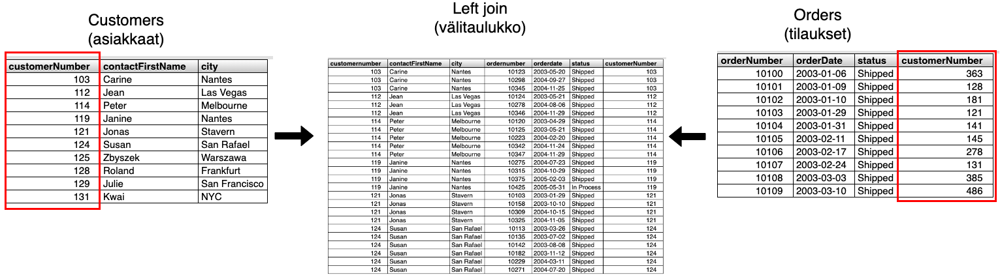

Esimerkin kuvassa ei esiinny kaikkia tietoja taulusta, jotta se olisi selkeämpi. Kuvassa esiintyvä välitaulukko on nimensämukaisesti väliaikainen taulu, jota SQL käyttää apunaan kyselyä tehdessä. Välitaulukko on olemassa vain palvelimen muistissa sen aikaa kun sitä tarvitaan ja se poistuu tämän jälkeen. Se ei esiinny missään oikeana tauluna tietokannan näkökulmasta.

Välitaulukko sisältää  tietoja mitä kahdessa laidalla olevissa tauluissa ei näy. Lähteissä on mainittu sivusto, josta harjoitustietokanta on ladattu. Kuvan esimerkissä punaisella on rajattu hakukyselyssä käytetty ehto eli kaksi taulua on liitetty asiakasnumeron perusteella toisiinsa.

Tauluja voi olla useampiakin kuin kaksi. Tällainen tilanne on esitelty tässä artikkelissa myöhemmin. Käytäntö on kuitenkin sama, että taulut liitetään esimerkin mukaisesti yhteen. **SQL kuitenkin suorittaa taulujen JOIN -komennot järjestyksessä ja käyttää aina edellisen JOIN -lausekkeen tulosjoukkoa seuraavassa liitoksessa.**


Taulujen väliset liitokset esitellään usein eri lähteissä yllä olevan tapaisella [Vennin diagramilla](https://fi.wikipedia.org/wiki/Venn-diagrammi). Vennin diagrammiin on hyvä tutustua mutta se on matematiikassa joukko-opissa käytettävä diagrammi. Sen tarkoituksena on kuvata joukon välisiä suhteita. Esimerkin kuvassa on esitetty LEFT JOIN -liitos ja diagrammia tullaan käyttämään artikkelissa eri liitosten havainnollistamisessa.

Esimerkin kuvan voi lyhyesti lukea seuraavasti:

* Joukko A on tässä esimerkin taulu asiakkaat.
* Joukko B on tässä esimerkin taulu tilaukset.
* Esimerkin LEFT JOIN palauttaa tässä kaikki rivit joukosta A, vaikka ne eivät esiintyisi joukossa B. Puuttuvat arvot saavat arvon NULL.

Myöhemmin eri JOIN -ehdot on selitetty niiden omissa osioissa auki, että mitä esiintyy lopullisessa tulosjoukossa.

## INNER JOIN -selitettynä

> INNER JOIN palauttaa kaikki rivit, jotka esiintyvät molemmissa tauluissa ehdon mukaisesti.


Kyseinen liitostyyppi on hyvin yleinen ja usein oletustapa miten SQL -liittää tauluja yhteen ellei muuta tapaa ole erikseen kerrottu. **Mysql** -tietokannassa tämä on oletusliitos.


Seuraavan esimerkin vuoksi on hyvä muistaa, että harjoitustietokannassa **customers** taulu sisältää 122 riviä. **Orders** taulu sisältää 326 riviä.




```sql
SELECT asiakkaat.customernumber, 
       tilaukset.ordernumber, 
       tilaukset.orderdate, 
       tilaukset.status 
FROM   customers AS `asiakkaat` 
       INNER JOIN orders AS `tilaukset` 
               ON asiakkaat.customernumber = tilaukset.customernumber 
ORDER  BY `customernumber` ASC;
```



**SELECT kysely selitettynä**

* **Rivi 5:** FROM kertoo, että ensimmäinen taulu on customers.
* **Rivi 6:** INNER JOIN määrittää, että tehdään liitos orders tauluun.
* **Rivi 7:** ON kertoo ehdon eli liitetään taulut käyttäen niiden customernumber -saraketta.
* **HUOM!** rivillä 6 join voitaisiin kirjoittaa myös ilman INNER avainsanaa, koska se on oletustapa Mysql -tietokannassa.

Kun esimerkin mukainen kysely suoritetaan harjoitustietokantaa vasten, saadaan vastaukseksi 326 riviä. Alla kuvakaappaus osasta tuloksista.

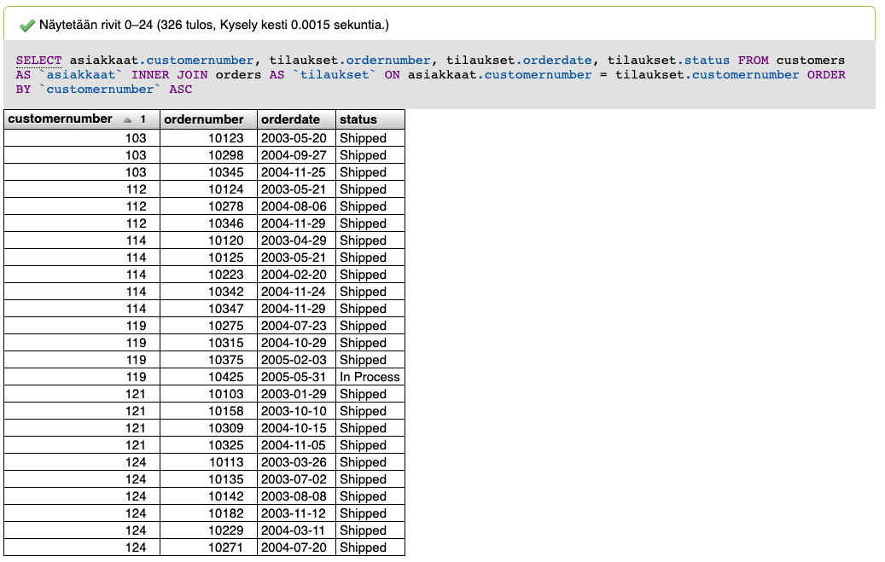

**Mistä tulosjoukko muodostuu?**

Ensimmäisenä voidaan huomata, että 326 riviä on yhtä paljon kuin **orders** -taulun sisältämä rivien määrä. Kuvasta näkyy myös, että **customerNumber** -kentässä esiintyy useamman kerran sama asiakastunniste.

INNER JOIN hakee tulokseksi siis niiden asiakkaiden tilaukset, joiden asiakastunniste esiintyy **orders** -taulussa. **Orders** -taulussa ei esiinny tilauksia kaikille asiakkaille ja tällöin tulosjoukko ei sisällä näitä asiakkaita, joilla tilauksia ei ole vielä yhtään.

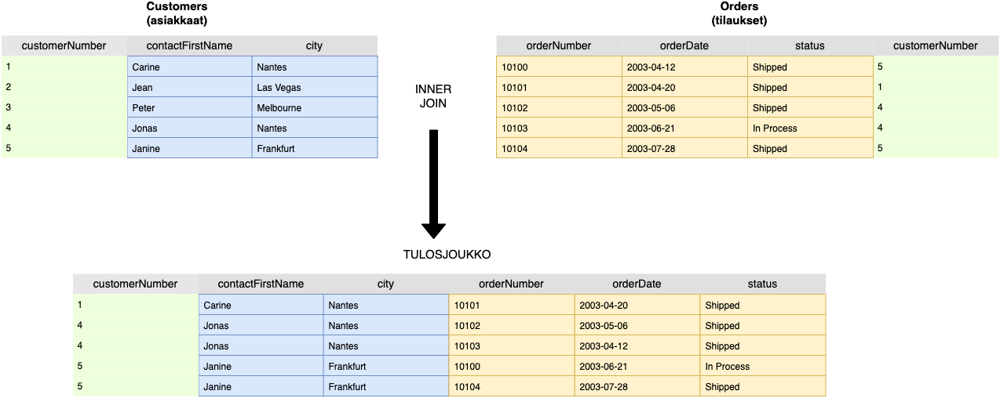

Yllä oleva pelkistetty kuva havainnollistaa vielä INNER JOIN -lausekkeen käyttäytymistä. 

* **Vihreä** **customerNumber** sarake esittää kahden taulun välistä liitosehtoa. Taulut liitetään siis asiakastunnisteen perusteella.
* **Sininen tausta** havainnolistaa vasemman taulun tietoja. \(asiakkaat\)
* **Keltainen tausta** havainnollistaa oikean taulun tietoja. \(tilaukset\)

Tulosjoukko on siis INNER JOIN kyselyn tulos. Siitä nähdään, että mitkä rivit ovat valikoituneet lopuksi. Liitos valitsee vain ne asiakkaat, jotka esiintyvät **tilaukset** -taulussa. Kun siis katsot tarkkaan tulosjoukkoa niin huomaat, että asiakkaat _Jean_ ja _Peter_ puuttuvat alapuolella olevasta yhteenvedosta. Heillä ei siis ole yhtään tilausta esimerkin mukaan.

Ne asiakkaat, joilla on tilauksia niin esiintyvät tulosjoukossa. Huomaa kuitenkin, että jos tilaukset -taulu sisältää tässä kohdin useita tilauksia samalta asiakkaalta, asiakasrivi monistuu tulosjoukossa. Esimerkiksi asiakas _Janine_ ja _Carine ****_ovat tehneet kaksi tilausta.

Tällainen tietojen monistuminen on hyvin yleistä JOIN -kyselyissä ja tulee ottaa huomioon. Riippuen tietokantojen [normalisointisääntöjen](https://fi.wikipedia.org/wiki/Tietokannan_normalisointi) noudattamisesta, nämä eivät ole usein vakavia. Jos normalisointisääntöjen noudattaminen on laiminlyöty pahasti niin silloin tietojen monistuminen saattaa olla ongelma. Tarkoittaa käytännössä sitä, että tietokannassa ei välttämättä ole toteutettu oikeanlaisia viiteavaimia tai sarakkeiden sisältävien tietojen purkamista pienempiin itsenäisiin kokonaisuuksiin.

Seuraava lähde havainnollistaa tätä liitosta pienellä animaatiolla. [https://dataschool.com/how-to-teach-people-sql/inner-join-animated/](https://dataschool.com/how-to-teach-people-sql/inner-join-animated/)

## LEFT JOIN -selitettynä

> LEFT JOIN -palauttaa kaikki rivit vasemmasta joukosta \(taulusta\) VAIKKA ne eivät esiintyisi oikeanpuoleisessa joukossa \(taulussa\). Puuttuvat tiedot merkitään NULL -arvoisiksi.


Liitos tulee hyvin usein vastaan ja toimii samankaltaisesti monessa eri SQL -tietokannassa. Liitoksesta löytyy myös LEFT OUTER JOIN -variaatio mikä tarkoittaa sitä, että se palauttaa vain A -joukon rivit. Tämä tarkoittaa, että voitaisiin saada tulokseksi ne rivit, jotka eivät esiinny B joukossa. Tämä variaatio on käyty läpi alempana ensimmäisen esimerkin jälkeen.



```sql
SELECT asiakkaat.customernumber, 
       tilaukset.ordernumber, 
       tilaukset.orderdate, 
       tilaukset.status 
FROM   customers AS `asiakkaat` 
       LEFT JOIN orders AS `tilaukset` 
               ON asiakkaat.customernumber = tilaukset.customernumber 
ORDER  BY `customernumber` ASC;
```




Esimerkin kysely on aivan samanlainen kuin INNER JOIN -esimerkissä. Nyt LEFT JOIN esiintyy vain INNER JOIN -tilalla.


Kun esimerkin mukainen kysely suoritetaan harjoitustietokantaa vasten, saadaan vastaukseksi 350 riviä. Alla kuvakaappaus osasta tuloksista. 

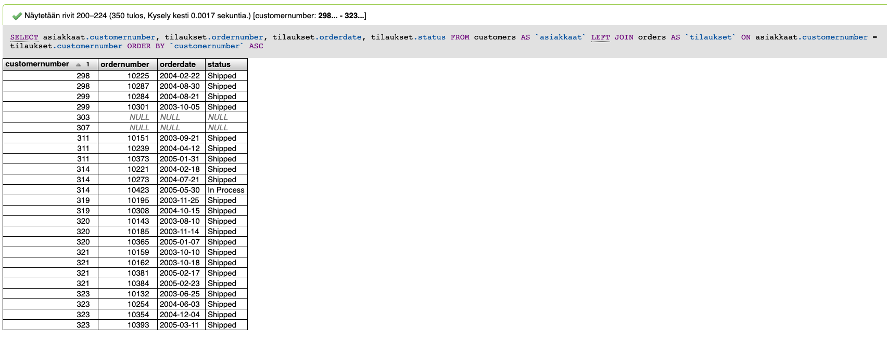

**Mistä tulosjoukko muodostuu?**

Huomioi heti alkuun, että tilauksia on vain tietokannassa 326 riviä. Asiakkaitakin vain 122 riviä. Mistä siis tulevat nämä 350 riviä?

Tulosjoukosta huomaat myös, että se sisältää rivejä, joissa on NULL -arvoja. NULL tarkoittaa tässä, että vasemman puoleisen taulun \(asiakkaat\) tietoja ei löytynyt oikeanpuoleisesta taulusta \(tilaukset\). Kuitenkin **LEFT JOIN** -ehdon määritelmä on se, että sisällytä **KAIKKI** vasemmanpuoleisen taulun tulokset **SEKÄ** oikeanpuoleisen taulun tulokset, jotka osuvat JOIN ehtoon.

Edellä mainittu asia on tärkein muistettava seikka. INNER JOIN -esimerkistä muistat, että se sisälsi vain 326 riviä, joka oli yhtä paljon kuin **tilaukset** -taulussa olevien rivien määrä. Nyt LEFT JOIN -tilanteessa näiden tilauksien lisäksi tulosjoukkoon tulevat siis asiakkaiden tiedot vaikka heillä ei olisi yhtään tilausta.

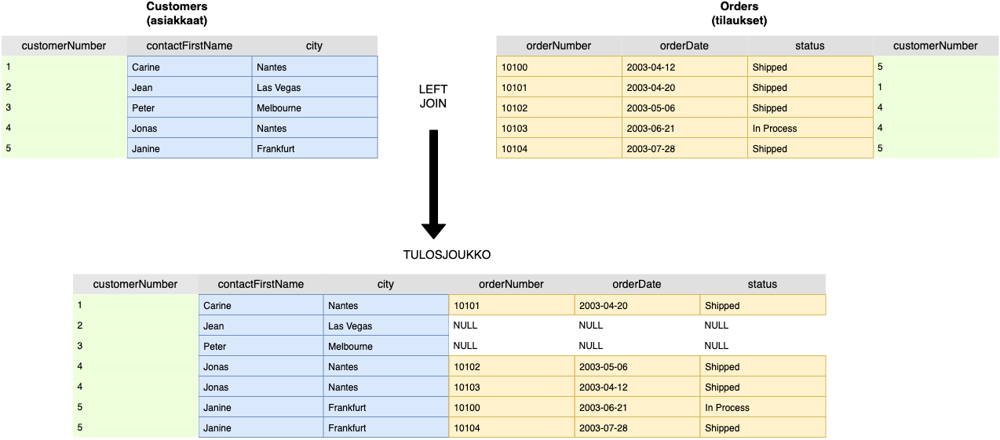

Yllä oleva pelkistetty kuva havainnollistaa vielä LEFT JOIN -lausekkeen käyttäytymistä. 

* **Vihreä** **customerNumber** sarake esittää kahden taulun välistä liitosehtoa. Taulut liitetään siis asiakastunnisteen perusteella.
* **Sininen tausta** havainnolistaa vasemman taulun tietoja. \(asiakkaat\)
* **Keltainen tausta** havainnollistaa oikean taulun tietoja. \(tilaukset\)

Tulosjoukko muistuttaa tässä tilanteessa paljon INNER JOIN -esimerkin tulosjoukkoa. Erona on kuitenkin tällä kertaa asiakkaiden _Jean_ ja _Peter_ rivit, jotka ovat mukana tulosjoukossa mutta tilaustietoina heillä ei ole mitään. Nämä asiakkaat puuttuivat INNER JOIN -esimerkin tulosjoukosta.

Tämän liitoksen avulla voitaisiin siis nähdä myös asiakkaat, joilla ei ole vielä yhtään tilausta. Käytännön esimerkkinä tilanne, jossa näille asiakkaille voitaisiin suunnnata jonkinlaista markkinointia, että saadaan heidät tekemään ostopäätös.

Seuraavasta lähteestä löydät myös animoidun version liitoksen käyttäytymisestä: [https://dataschool.com/how-to-teach-people-sql/left-right-join-animated/](https://dataschool.com/how-to-teach-people-sql/left-right-join-animated/)

**LEFT OUTER JOIN -variaatio**

Liitoksesta on myös mahdollista tehdä variaatio, jossa haettaisiin vain ne asiakkaat, joilla ei ole yhtään tilausta. Tämä onnistuisi seuraavanlaisella hakulauseella, joka on muokattu esimerkistä:



```sql
SELECT asiakkaat.customernumber, 
       tilaukset.ordernumber, 
       tilaukset.orderdate, 
       tilaukset.status 
FROM   customers AS `asiakkaat` 
       LEFT JOIN orders AS `tilaukset` 
              ON asiakkaat.customernumber = tilaukset.customernumber 
WHERE  tilaukset.customernumber IS NULL 
ORDER  BY `customernumber` ASC;
```




Esimerkissä ero on rivillä 8, jossa määritetään haettavan vain ne rivit, joissa tilaukset taulun asiakastunniste on arvoltaan NULL. Huomioi, että tällaisia arvoja ei ole **orders** -taulussa vaan NULL tulee tulosjoukkoon LEFT JOIN -liitoksen vuoksi.


Kun esimerkin mukainen kysely suoritetaan niin tulosjoukosta huomataan, että nyt palautuu vain asiakastietoja, joissa tilauksien kentät ovat tyhjiä. Tällaisia asiakkaita on 24 riviä. Kun taas muistetaan, että **orders** -taulu sisälsi alunperin 326 tilausta niin summaamalla nämä luvut \(326+24\) saamme yhteismääräksi 350 riviä eli juurikin LEFT JOIN -esimerkin mukaisen tulosjoukon.

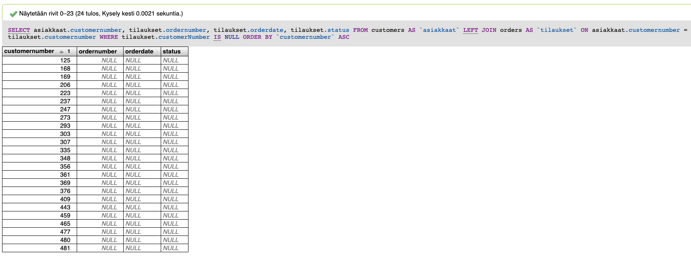

## RIGHT JOIN -selitettynä

> RIGHT JOIN -palauttaa kaikki rivit oikeanpuoleisesta joukosta \(taulusta\) VAIKKA ne eivät esiintyisi vasemmanpuoleisessa joukossa \(taulussa\). Puuttuvat tiedot merkitään NULL -arvoisiksi.


Liitoksista RIGHT JOIN ei ole kovin yleinen. Usein huomataan, että tämänkaltaiset liitokset voidaan kuvata myös LEFT JOIN -ehtoina. Periaate kummassakin on samanlainen. Tällöin olemme kiinnostuneet vain B joukon sisällöstä.



```sql
SELECT asiakkaat.customernumber, 
       tilaukset.ordernumber, 
       tilaukset.orderdate, 
       tilaukset.status 
FROM   customers AS `asiakkaat` 
       RIGHT JOIN orders AS `tilaukset` 
               ON asiakkaat.customernumber = tilaukset.customernumber 
ORDER  BY `customernumber` ASC;
```




Ainoa ero LEFT JOIN esimerkkiin on rivin 6 muutos, jossa on määritetty RIGHT JOIN.


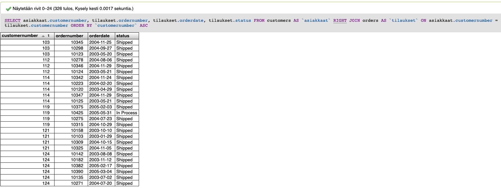

Kun esimerkin kaltainen kysely suoritetaan harjoitustietokantaan, saadaan tulosjoukoksi 326 riviä. Määrä vastaa **orders** -taulun rivimäärää. Tässä esimerkissä määrä ei eroa INNER JOIN -liitoksen tulosjoukosta, koska nyt valitsemme oikeanpuoleisesta taulusta pääasiallisesti **KAIKKI** tiedot.

**Orders** -taulu on siitä syystä "oikeanpuolimmainen", koska se esiintyy JOIN kyselyssä. FROM kyselyssä on siis ensin mainittu **customers** taulu. SQL suorittaa kyselyt vasemmalta oikealle järjestäen eli tässä tilanteessa juurikin aina ensin mainittu taulu on vasemmanpuoleinen.



```sql
SELECT asiakkaat.customernumber, 
       tilaukset.ordernumber, 
       tilaukset.orderdate, 
       tilaukset.status 
FROM   customers AS `asiakkaat` 
       RIGHT JOIN orders AS `tilaukset` 
              ON asiakkaat.customernumber = tilaukset.customernumber 
WHERE  asiakkaat.customernumber IS NULL 
ORDER  BY `customernumber` ASC;
```



**RIGHT OUTER JOIN** -variaatio muodostetaan ylläolevan esimerkin mukaisesti. Muistuttaa tilannetta LEFT JOIN kohdalla. Huomaa kuitenkin rivillä 8, että nyt ehtona on, että **customers** \(asiakkaat\) -taulun asiakastunniste on tyhjä. Tällaista tilannetta ei kuitenkaan löydy harjoitustietokannasta ja tulosjoukko on tyhjä. 

Alla on esitelty esimerkki käyttäen **employees \(työntekijät\)** -taulua, jossa voidaan esitellä paremmin RIGHT JOIN -liitos.



```sql
SELECT tyontekijat.employeenumber, 
       asiakkaat.customernumber 
FROM   customers AS `asiakkaat` 
       RIGHT JOIN employees AS `tyontekijat` 
               ON asiakkaat.salesrepemployeenumber = tyontekijat.employeenumber 
ORDER  BY tyontekijat.employeenumber;
```



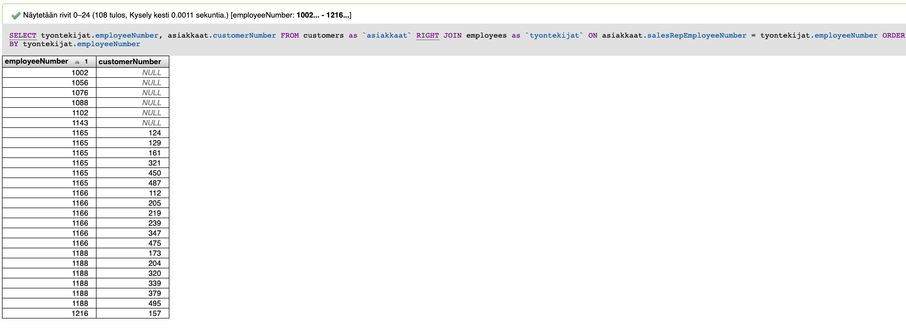

Customers -taulu on esitetty ensimmäisenä, joten siitä tulee vasemmanpuoleinen taulu. Employees -taulu on oikeanpuoleinen. Esimerkistä näemme, että nyt asiakasnumero on osassa tyhjä. Tämä tarkoitaa sitä, että osa myyjistä ei ole laskuttanut vielä yhtään asiakasta.

 Jos muutamme hakua seuraavan esimerkin mukaisesti niin saamme muodostettua **RIGHT OUTER JOIN** -ehdon ja tällöin tulosjoukko kertoo suoraan ne työntekijät, joilla ei ole laskutettuja asiakkaita.



```sql
SELECT tyontekijat.employeenumber, 
       asiakkaat.customernumber 
FROM   customers AS `asiakkaat` 
       RIGHT JOIN employees AS `tyontekijat` 
               ON asiakkaat.salesrepemployeenumber = tyontekijat.employeenumber 
WHERE  asiakkaat.salesrepemployeenumber IS NULL 
ORDER  BY tyontekijat.employeenumber;
```



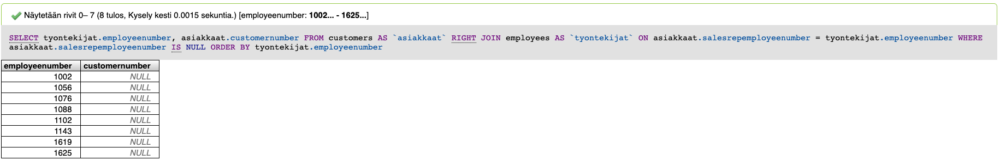

## CROSS JOIN -selitettynä

> CROSS JOIN on liitos, jonka tulosjoukkona on [**karteesinen tulo**](https://fi.wikipedia.org/wiki/Karteesinen_tulo). Tämä tarkoitaa sitä, että kaikki vasemmanpuoleisen taulun rivit liitetään jokaisen oikeanpuoleisen taulun riveihin. Puuttuvat kentät merkitään NULL arvolla.

Liitos on harvinaisempi eikä siihen usein törmää. Liitosta on vaikea esittää Vennin diagrammia käyttäen, joten esitetään suoraan esimerkki.



```sql
SELECT tyontekijat.employeenumber, 
       tyontekijat.firstname, 
       asiakkaat.customernumber, 
       asiakkaat.contactfirstname 
FROM   customers AS `asiakkaat` 
       CROSS JOIN employees AS `tyontekijat` 
ORDER  BY tyontekijat.employeenumber;
```




Huomaa, että rivillä 6 CROSS JOIN kanssa ei tule käyttää ON -avainsanaa kuten muissa liitoksissa. Tätä ei siis tarvita tämän liitoksen toimintatavan vuoksi.


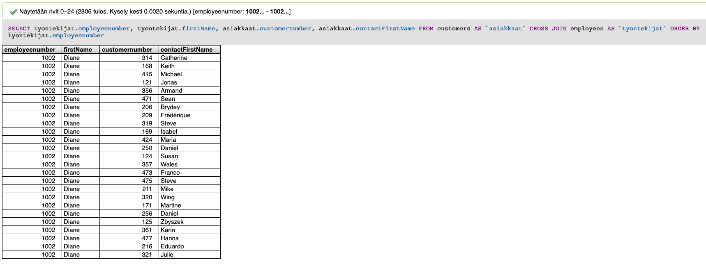

Tulosjoukosta huomaamme heti, että rivejä on 2806. Harjoitustietokannassa on kuitenkin **employees** **\(tyontekijat\)** taulussa vain 23 riviä ja **customers \(asiakkaat\)** taulussa 122. Liitos käyttäytyy oikeasti siten, että se liittää jokaisen rivin kahdesta taulusta toisiinsa. Eli jos laskemme 23x122 niin saamme tulokseksi 2806 riviä. Seuraavassa esimerkissä on kuvattu CROSS JOIN -liitoksen käyttäytymistä yksinkertaisemmalla tavalla.

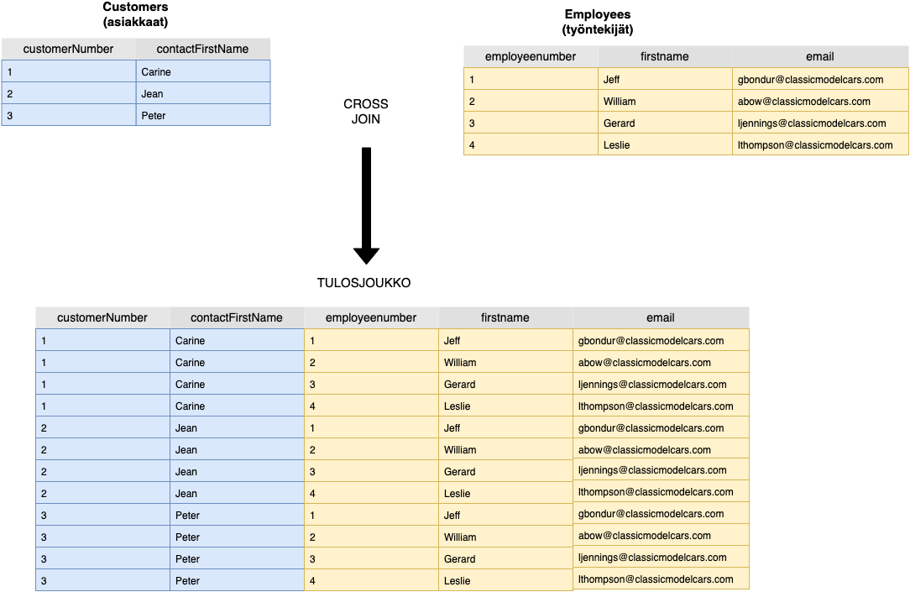

## Useampi JOIN -ehto kyselyssä

Kun tunnet ensin perusteet miten eri JOIN ehdot toimivat niin olet valmis siirtymään eteenpäin. Tietokantojen kanssa työskentelyssä tulee vastaan myös kyselyjä, jotka vaativat useamman JOIN -kyselyn yhdistämistä. Tämän vuoksi sinun on hyvä tuntea miten SQL -tietokanta käsittelee näitä kyselyjä.

Yritä muista seuraavat säännöt:

* Taulu, joka on esitelty esimerkiksi SELECT lauseessa ennen toista taulua, on aina vasemmanpuoleinen taulu. \(yritä pitää mielessä Vennin diagrammin, A ja B joukot\)
* Esimerkiksi, jos kyselyssä on mainittu **FROM customers** ja sen jälkeen myöhemmin **LEFT JOIN orders** niin tällöin customers -taulu on vasemmanpuoleinen.
* SQL -tietokanta, joka tulkitsee kyselyn, suorittaa JOIN -lauseet siinä järjestyksessä kun ne on esitelty.



```sql
-- Hakulauseke hakee Suomessa asuvien asiakkaiden tilausrivit ja 
-- ilmoittaa kuinka paljon on yksittäisten tilausrivien ostosten
-- kokonaissumma. Tämä ei vielä ryhmitä summia tilauksien mukaan.
SELECT c.customernumber, 
       c.contactfirstname, 
       c.contactlastname, 
       o.ordernumber, 
       o.status, 
       od.orderlinenumber, 
       od.productcode, 
       od.quantityordered, 
       od.priceeach, 
       ( od.quantityordered * od.priceeach ) AS `orderLineTotalSum` 
FROM   customers c 
       INNER JOIN orders o USING (customernumber) 
       LEFT JOIN orderdetails od USING (ordernumber) 
WHERE  Lower(c.country) LIKE 'finland';
```



Ylläoleva esimerkki sisältää useamman JOIN lauseen ja käymme läpi seuraavaksi vaiheittain kuinka se suoriutuu. Kun kysely ajetaan harjoitustietokantaan niin siitä saadaan alla oleva tulosjoukko.

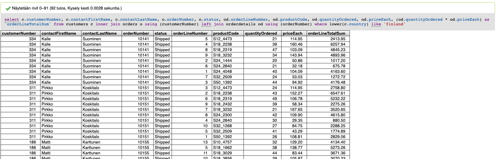

### Ensimmäinen vaihe

Vaiheet käydään läpi yksitellen mutta ei mennä liian syvälle SQL tietokannan yksityiskohtiin. Käymme ne vain päätasolla läpi.

Jos katsomme esimerkin kyselyä niin ensin voimme pilkkoa kokonaisen kyselyn 4 eri vaiheeseen.

Ensimmäinen vaihe koostuu vasemmanpuoleisesta taulusta eli tässä tapauksessa taulu **customers**. ****Jos tekisimme seuraavanlaisen kyselyn niin se vastaisi esimerkkiä ilman mitään ehtoja:

```sql
-- Joukko A
SELECT c.customernumber, 
       c.contactfirstname, 
       c.contactlastname 
FROM customers c;
```


Tämän tulos eli käytännössä koko **customers** taulu on nyt nimetty joukoksi A eli vasemmanpuoleinen taulu Vennin diagrammissa. Pidä tämä mielessä.


### Toinen vaihe

Seuraavassa vaiheessa SQL tietokanta tulkitsee esimerkin rivillä 15 olevan INNER JOIN lauseen. INNER JOIN -tarkoitti, että tulosjoukkoon tulee vain ne rivit, jotka esiintyvät kahdessa liitettävässä taulussa.



```sql
-- Esimerkissä USING on vain lyhenne merkinnälle:
-- ON c.customerNumner = o.customerNumber
INNER JOIN orders o USING (customernumber)
```



Voimme nimetä tämän liitettävän taulun B:ksi. Eli nyt tiedossa on A ja B joukko tämän toiseen vaiheen aikana.


Tässä kohdin teemme kuten normaalisti INNER JOIN -ehdon toteutuessa. Kun suoritamme tämän vaiheen niin voimme ajatella suorittavan seuraavanlaisen kyselyn:



```sql
SELECT c.customernumber, 
       c.contactfirstname, 
       c.contactlastname, 
       o.ordernumber, 
       o.status 
FROM   customers c 
       INNER JOIN orders o USING (customernumber);
```



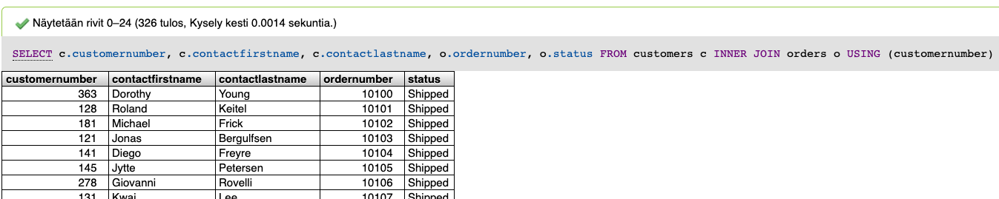

Kun toinen vaihe on suoritettu niin tulosjoukko on yllä olevan kuvan mukainen. Muista kuitenkin mitä artikkelin alussa mainittiin. **Kun JOIN kysely suoritetaan niin SQL tietokanta laittaa tietoja talteen välitauluihin eli muistinvaraisiin tauluihin, joita käytetään seuraavissa vaiheissa.**

Tämä tarkoittaa nyt sitä, että ensimmäisen vaiheen joukko A ei enää ole olemassa vaan voimme ajatella, että nyt toisen vaiheen jälkeinen tulosjoukko on uusi joukko A. Eli siitä tulee vasemmanpuoleinen taulukko Vennin diagrammina kuvattu.

### Kolmas vaihe

Seuraavassa vaiheessa jatkamme SQL kyselyn suorittamista. Nyt meillä on muistissa toisen vaiheen aikana syntynyt tulosjoukko. Esimerkissä rivillä 16 on seuraava JOIN:



```sql
LEFT JOIN orderdetails od USING (ordernumber)
```



Nyt tästä **orderdetails** taulusta tulee B joukko, koska se esiintyy aiempien vaiheiden jälkeen JOIN kyselyssä. Tällöin A joukko on juuri toisen vaiheen lopputulos eli jälleen kerran voimme noudattaa normaalia LEFT JOIN -ehdon sääntöä.


Seuraavaksi voimme ajatella, että suoritetaan alla olevan mukainen SQL kysely, joka muistuttaa jo hyvin alkuperäistä esimerkin kyselyä:



```sql
SELECT c.customernumber, 
       c.contactfirstname, 
       c.contactlastname, 
       o.ordernumber, 
       o.status, 
       od.orderlinenumber, 
       od.productcode, 
       od.quantityordered, 
       od.priceeach, 
       ( od.quantityordered * od.priceeach ) AS `orderLineTotalSum` 
FROM   customers c 
       INNER JOIN orders o USING (customernumber) 
       LEFT JOIN orderdetails od USING (ordernumber);
```



Kun kysely on suoritettu, saamme seuraavan tulosjoukon mikä muistuttaa alla olevaa tulostetta. Tämän kolmannen vaiheen lopussa on taas jäljellä vain yksi tulosjoukko eli voimme jälleen kerran tästä tulevan joukko A.

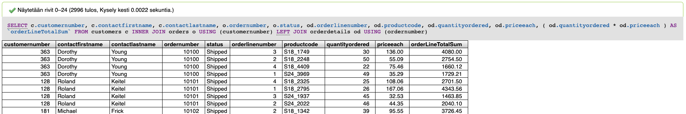

### Neljäs vaihe

Kun meillä on edellsen vaiheen tulosjoukko tiedossa, siirrymme SQL kyselyssä eteenpäin. Seuraavaksi ei ole enää jäljellä kuin hakuehtoa rajaava määritys:



```sql
WHERE Lower(c.country) LIKE 'finland';
```



SQL on tässä kohdin suorittanut siis kaikki JOIN -ehdot ja WHERE ehtoa sovelletaan viimeiseen tulosjoukkoon. Tulosjoukko sisältää kaikki **customers** taulun sarakkeet vaikka niitä ei esiteltäisi SELECT lauseen alussa. Tässä esimerkissä lopputulosta on suodatettu siis vielä maan nimen mukaisesti.

Tällä tavoin vaihe vaiheelta rakentuu usean JOIN kyselyn suoritustapa. Aina edellisen JOIN ehdon tulosjoukkoa käytetään seuraavassa JOIN lausekkeessa. Vastaavanlainen esimerkki erilaisin tiedoin on esitelty seuraavassa lähteessä: [https://academy.vertabelo.com/blog/illustrated-guide-multiple-join/](https://academy.vertabelo.com/blog/illustrated-guide-multiple-join/)

Jos esimerkki sisältäisi esimerkiksi GROUP BY tai ORDER BY sääntöjä niin näitä sovellettaisiin sitten suodatettujen tietojen jälkeiseen tulosjoukkoon.

Käytännössä tällä tavoin SQL tietokanta käsittelee kyselyn kokonaisuudessan eräänlaisten välitaulujen avulla vaikka se ei näy ulospäin suoraan. Tämän tarkoituksena ei ole selittää meneekö asia teknisesti oikein vaan toimia esimerkkinä hahmottamaan kuinka kirjoitta oikein JOIN kyselyjä peräkkäin.


JOIN kyselyissä voi sattua erilaisia virheitä ns. duplikaattirivien vuoksi. Ole siis tarkkana kun teet kyselyjä, jotka sisältävät useita JOIN -ehtoja. [https://alexpetralia.com/posts/2017/7/19/more-dangerous-subtleties-of-joins-in-sql](https://alexpetralia.com/posts/2017/7/19/more-dangerous-subtleties-of-joins-in-sql)


## Yhteenveto 

Taulujen väliset liitokset ovat tärkeä asia tuntea SQL -tietokannoissa. JOIN -ehdot ovat ensimmäinen konsepti mikä voi olla hankala ymmärtää esimerkkien kanssa tai ilman. Usein nämä tulevat vastaan vasta käytännössä tietokantojen kanssa työskentelyn ohessa ja niistä on suuri hyöty. Lisäksi tuntemalla nämä tavat, osaat myös etukäteen suunnitella tietokantamalleja, jotka tukevat tietynlaisia kyselyjä paremmin.


## Lähteet


















