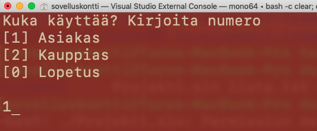

# Harjoitustyö: Matkalasku


Harjoitustyön aiheen voi tehdä myös haluamastaan aiheesta. Tärkeintä on huomioida **harjoitustyön rajaukset**. 


## Matkalasku

Kirjanpitäjänä \(jäljempänä _Asiakas_\) toimiva henkilö laskee usealle yritykselle heidän työntekijöiden matkakorvauksia. Työ on alkanut käymään toistuvaksi puurtamiseksi ja asiakas on miettinyt matkalaskujen hoitamista sähköisesti. Ensimmäiseksi asiakas haluaisi päästä kokeilemaan matkalaskujen luomiseen luotua ohjelmaa. Asiakas on antanut seuraavat lähtötiedot ohjelman ensimmäisistä vaatimuksista.

**Matkalaskun sisältö on seuraavanlainen:**

* Matkan lähtö- ja paluuaika.
* Matkan tarkoitus ja lisätiedot.
* Matkakorvauksen saaja.
* Ajankohta, jolloin matkalasku on luotu.
* Reitin kuvaus ja välimatka \(km\)
* Matkustajien lukumäärä.

**Annettujen tietojen perusteella ohjelman tulisi laskea:**

* Kilometrikorvaus auton käytöstä \([https://www.veronmaksajat.fi/Palkka-ja-elake/Kilometrikorvaukset/kilometrikorvaukset-2020/\#3c29c31d](https://www.veronmaksajat.fi/Palkka-ja-elake/Kilometrikorvaukset/kilometrikorvaukset-2020/#3c29c31d)\)
* Kilometrikorvauksesta tulisi nähdä sen erittely eli mistä kokonaiskorvaus muodostuu. \(kilometrit, henkilöiden lkm., laskemiseen käytetty korvauksen määrä per kilometri\)
* Päivärahat matkan keston perusteella. \([https://www.veronmaksajat.fi/Palkka-ja-elake/Paivarahat/kotimaan-paivarahat-2020/\#3c29c31d](https://www.veronmaksajat.fi/Palkka-ja-elake/Paivarahat/kotimaan-paivarahat-2020/#3c29c31d)\)
* Päivärahasta tulee nähdä määrä, yksikköhinta ja päivärahojen kokonaiskorvaus.
* Lopuksi ohjelman tulee laskea edellisten tietojen pohjalta kokonaiskorvaus. 

Asiakas on vaatimaton ensimmäisen version suhteen kunhan hän pääsee kokeilemaan vain ideaansa.

**Jotta ohjelma olisi käyttökelpoinen**, tulisi sen myös tallentaa muodostetut matkalaskut. Ohjelman avulla voidaan siis tarkastella jo muodostettuja matkalaskuja.

**Ohjelman ei tarvitse tukea** useiden eri korvaustyyppien laskemista vaan riittää, että puhutaan aluksi oman auton käytöstä ja päivärahoista. 

Malli matkalaskun sisällöstä, jonka asiakas on antanut vaatimusten tueksi.

## Ohjelman toimintojen lisätoiveet

* Matkalaskun laskemiseen käytettyjä korvausmääriä voi vaihtaa.
* Matkalaskuun voi merkitä myös auton lisäksi muita kulkuneuvoja.
* Matkalaskuista saisi yhden yhteenvedon kaikista luoduista matkalaskuista.
* Matkalaskun voi merkitä **Maksetuksi** -tilaan.
* Matkalaskuja voi luoda usealle eri henkilöille.

## Harjoitustyön rajaukset

Ohjelman pitää olla konsoliohjelma \(esimerkki alla mikä on konsoliohjelma\).

Ohjelmointikielenä pitää olla C\#.

Harjoitustyössä ei tarvitse tulostaa laskun kuvaa vaan riittää, että konsoliohjelmasta näkee kaikki tiedot.

