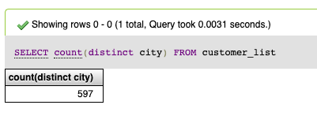
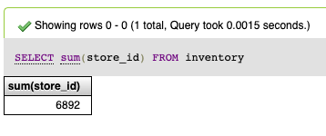

# Mysql perusteet 102

Kirjoita SQL kyselyt, jotka vastaavat alla oleviin kysymyksiin. Yhteen kysymykseen voi liittyä yksi tai useampia SQL lauseita, joten ratkaisutavalla ei sinällään ole väliä kunhan siinä on käytetty SQL -kyselyitä.

Vältä vastausten katsomista etukäteen mutta ne auttavat, jos muuten jää jossakin kohdin jumiin.

Jos vastausta ei silti löydy, niin yritä silloin selittää itsellesi vastauksen SQL kysely ja selvittää mitä se varsinaisesti teki. Esimerkiksi vieraat SQL komennot.



#### 1. Montako riviä on Sakila tietokannan tauluissa? \(jokaisen taulun rivien määrä erikseen, ei tarvitse olla yhteenlaskettua summaa kaikkien taulujen osalta.\)



Vastaukseksi soveltuu myös yksinkertaisempi `SELECT count(*) FROM film` tyylinen komento. Silloin jokaisen taulun nimi pitää erikseen määritellä. Alla kuitenkin vaihtoehtoinen tapa selvittää yhden tietokannan kaikkien taulujen rivimäärät.






#### 2. Keitä eri näyttelijöitä on merkitty tietokantaan? Etu- ja sukunimi riittävät.









#### 3. Missä eri kaupunginosissa asiakkaat ovat? Yksilölliset kaupunginosien nimet ovat tärkeitä ja montako kpl yhteensä eri yksilöllisiä kaupunginosia on? 









#### 4. Elokuvista tarvitaan listaus verkkosivulle, jossa esiintyy niiden nimi, kuvaus, vuokrausajan kesto, vuokran hinta, elokuvan pituus ja luokitus.










#### **5. Inventaariota varten tarvitaan tieto montako kopiota \(inventory taulu\) elokuvista on yhteensä olemassa? Ei tarvitse erotella sitä onko elokuva tällä hetkellä vuokrattu vai ei. Riittää kokonaismäärä.**


Vinkki tehtävään 5. Lue sakila tietokannan kuvauksesta mikä on inventory taulun tarkoitus. https://dev.mysql.com/doc/sakila/en/sakila-structure-tables-inventory.html










**6. Montako erilaista kielivaihtoehtoa elokuville on olemassa?**









**7. Montako eri kategoriaa elokuville on olemassa?**









**8. Tulevaa pääsiäistä varten on suunnitteilla kampanja lapsiperheille. Kampanjaa varten tarvitaan tieto siitä monta elokuvaa on olemassa, joiden genreksi on merkitty** _**animaatio, lapsille tai perheille**_









**9. Edellistä kampanjaa tarvitaan myös lista elokuvien nimestä, vuokran hinnasta ja luokituksesta tulevalle verkkosivulle. Elokuvien genreksi pitää olla merkitty siis** _**animaatio, lapsille tai perheille.**_









**10. Järjestelmä näyttää virhettä elokuvalle, jonka tunniste on 453? Mikä on tämän elokuvan nimi?**







\*\*\*\*

\*\*\*\*

