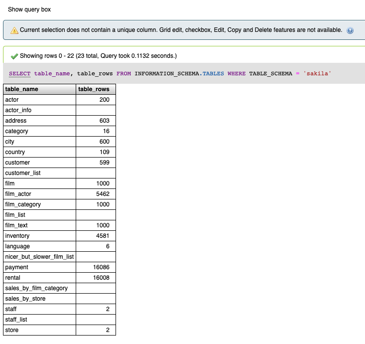
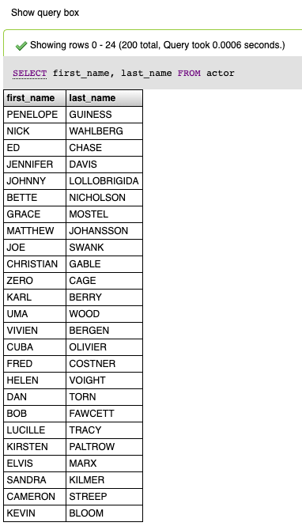
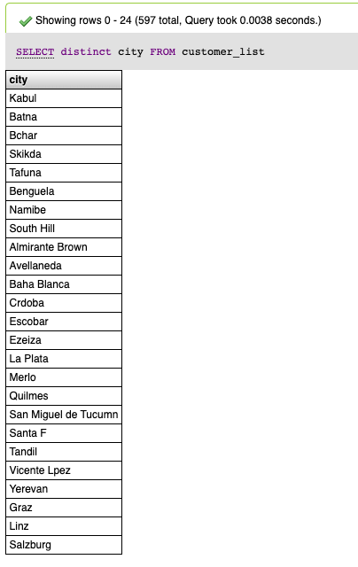
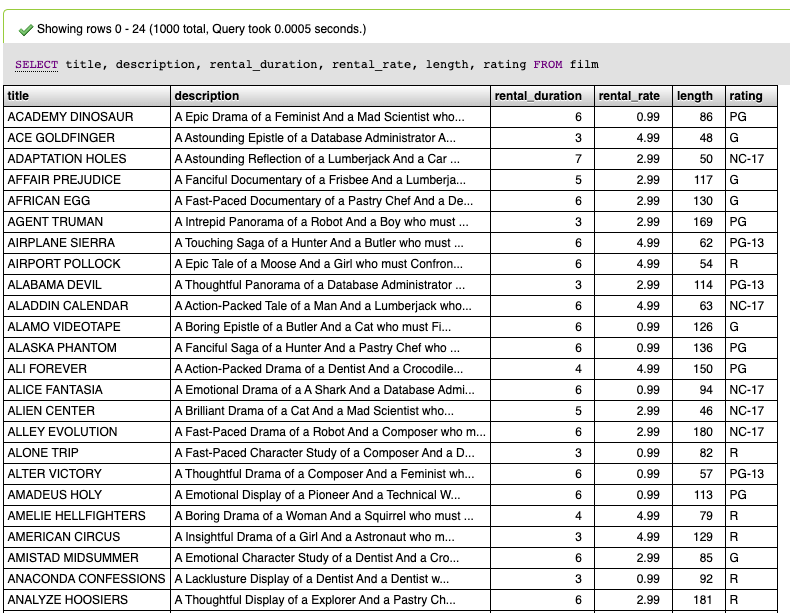
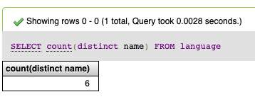
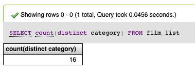
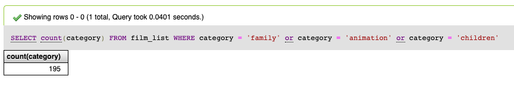
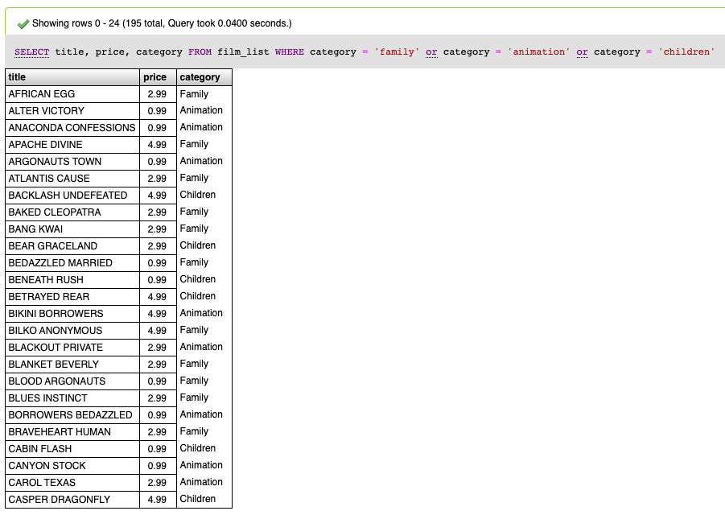

# mysql-perusteet-102-vastaukset

Jos vastausta ei silti löydy, niin yritä silloin selittää itsellesi vastauksen SQL kysely ja selvittää mitä se varsinaisesti teki. Esimerkiksi vieraat SQL komennot.

**1. Montako riviä on Sakila tietokannan tauluissa? \(jokaisen taulun rivien määrä erikseen, ei tarvitse olla yhteenlaskettua summaa kaikkien taulujen osalta.\)**

Vastaukseksi soveltuu myös yksinkertaisempi SELECT count\(\*\) FROM film tyylinen komento. Silloin jokaisen taulun nimi pitää erikseen määritellä. Alla kuitenkin vaihtoehtoinen tapa selvittää yhden tietokannan kaikkien taulujen rivimäärät.

**2. Keitä eri näyttelijöitä on merkitty tietokantaan? Etu- ja sukunimi riittävät.**

**3. Missä eri kaupunginosissa asiakkaat ovat? Yksilölliset kaupunginosien nimet ovat tärkeitä ja montako kpl yhteensä eri yksilöllisiä kaupunginosia on?** 

Kuvan sijaan myös seuraava haku on mahdollinen: `SELECT DISTINCT district FROM address;`

**4. Elokuvista tarvitaan listaus verkkosivulle, jossa esiintyy niiden nimi, kuvaus, vuokrausajan kesto, vuokran hinta, elokuvan pituus ja luokitus.**

**5. Inventaariota varten tarvitaan tieto montako kopiota \(inventory taulu\) elokuvista on yhteensä olemassa? Ei tarvitse erotella sitä onko elokuva tällä hetkellä vuokrattu vai ei. Riittää kokonaismäärä.**


Vinkki tehtävään 5. Lue sakila tietokannan kuvauksesta mikä on inventory taulun tarkoitus. https://dev.mysql.com/doc/sakila/en/sakila-structure-tables-inventory.html


Aiemmassa esimerkkivastauksessa ollut tässä virhe. Vastauksen kysymykseen saa esimerkiksi kyselyllä: `SELECT COUNT(*) FROM inventory;`

Vastaus tulee siis siitä, että dokumenttia lukemalla selviää, että inventory taulussa on yksi rivi per vuokrattavan elokuvan kopio. Kopio tässä tarkoittaa fyysistä dvd-levyä.

**6. Montako erilaista kielivaihtoehtoa elokuville on olemassa?**

**7. Montako eri kategoriaa elokuville on olemassa?**

**8. Tulevaa pääsiäistä varten on suunnitteilla kampanja lapsiperheille. Kampanjaa varten tarvitaan tieto siitä monta elokuvaa on olemassa, joiden genreksi on merkitty animaatio, lapsille tai perheille.**

**9. Edellistä kampanjaa tarvitaan myös lista elokuvien nimestä, vuokran hinnasta ja luokituksesta tulevalle verkkosivulle. Elokuvien genreksi pitää olla merkitty siis animaatio, lapsille tai perheille.**

**10. Järjestelmä näyttää virhettä elokuvalle, jonka tunniste on 453? Mikä on tämän elokuvan nimi?**

\*\*\*\*

