# mysql-perusteet-103-vastaukset

#### 1. Markkinointia varten tarvitaan lista kaikkien niiden asiakkaiden tunnisteesta, etunimestä, sukunimestä ja sähköpostista, joiden nimessä esiintyy _Angela_.

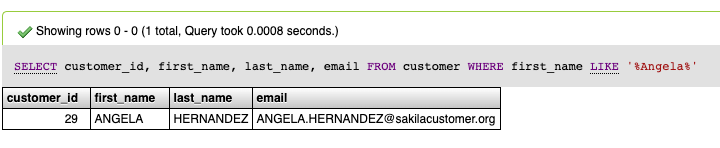

**2. Tulevaa viikonlopun kampanjaa varten tarvitaan lista niiden elokuvien nimistä, vuokran hinnasta ja luokituksesta, joiden kuvauksessa mainitaan sana **_**amazing**_**? Tee kysely käyttäen LIKE ja REGEXP operaattoreita.**

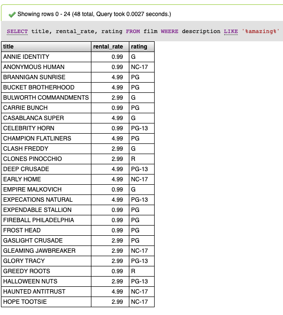

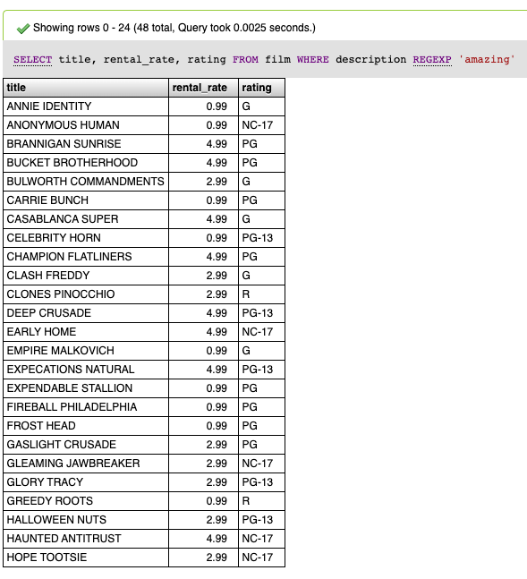

**3. Tulevaa viikonlopun kampanjaa varten tarvitaan lista niiden elokuvien nimistä, vuokran hinnasta ja luokituksesta, joiden nimi alkaa merkeillä **_**pri?**_** Tee kysely käyttäen LIKE ja REGEXP operaattoreita.**

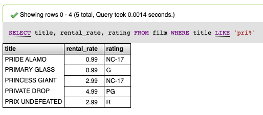

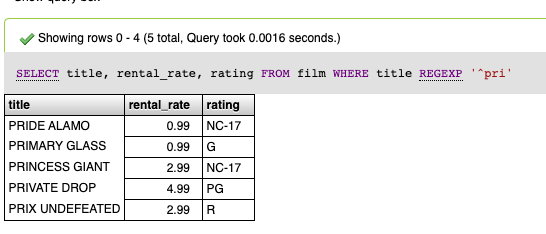

**4. Montako näyttelijää tietokannassa on, joiden sukunimi loppuu **_**son?**_** Tee kysely käyttäen LIKE ja REGEXP operaattoreita.**

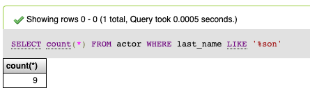

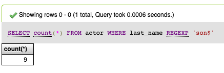

**5. Listaa kaikki asiakkaiden tiedoista löytyvät kaupunkien nimet aakkosjärjestyksessä, jossa kaupunkien nimi loppuu **_**r**_** -kirjaimeen.**

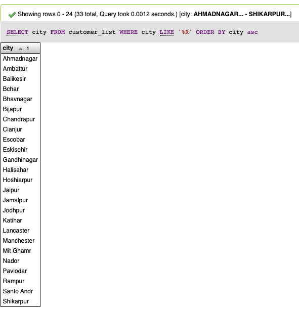

**6. Listaa seuraavien lueteltujen maiden tunniste ja nimi sekä järjestä lopputulos aakkosjärjestykseen:  Lithuania, Finland, Austria (Käytä IN operaattoria)**

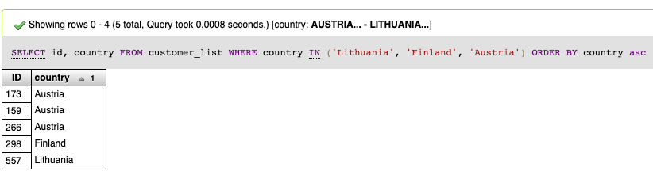

**7. Listaa ne näyttelijät sukunimen mukaan aakkosjärjestyksessä, joiden sukunimi esiintyy kaksi kertaa tai useammin?**

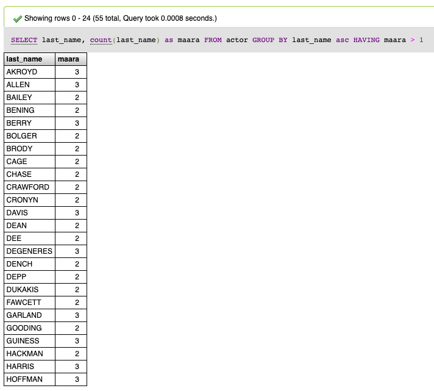

#### **8**. Tulevaa kauppiaspalaveria varten tarvitaan tieto montako elokuvan nimikettä on per kategoria/genre? Tuloksessa pitää näkyä elokuvan kategorian tunniste sekä määrä sen perässä. Järjestä tulokset suurimmasta pienimpään määrän perusteella.

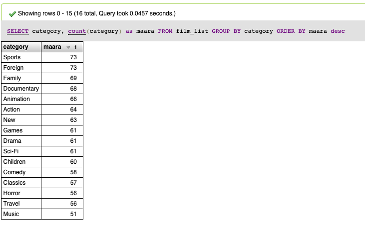

**9. Ryhmiteltynä elokuvien luokituksen (rating) perusteella, mikä on keskimääräinen vuokrahinta ja elokuvan kesto?**

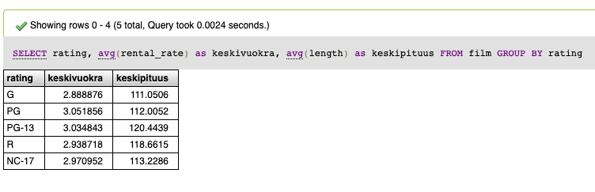

**10. Uusien elokuvien ostamista varten myymälä 2 (store\_id) tarvitsee listan nykyisistä kopioiden määristä varastossa, joka sisältää top 30 elokuvaa varastossa olevien määrän mukaan, järjestettynä suurimmasta  pienimpään. Elokuvasta riittää elokuvan tunniste ja niiden määrä.**

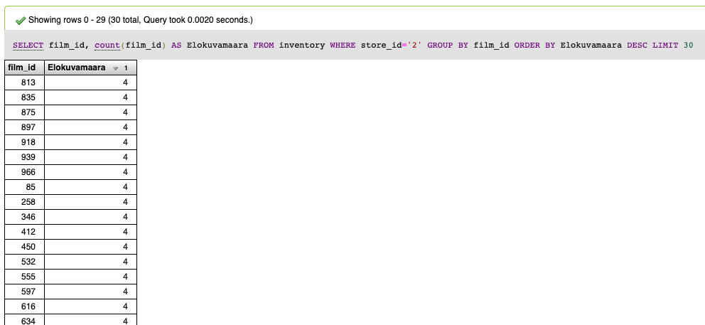
