# mysql-perusteet-104-vastaukset

#### 1. Elokuvista tarvitaan listaus verkkosivulle, järjestettynä nimen mukaan aakkosjärjestyksessä, jossa esiintyy elokuvan nimi, kuvaus, vuokra-ajan kesto, vuokran hinta, elokuvan pituus, luokitus, kategorian nimi. \(**käytä joineja**\)

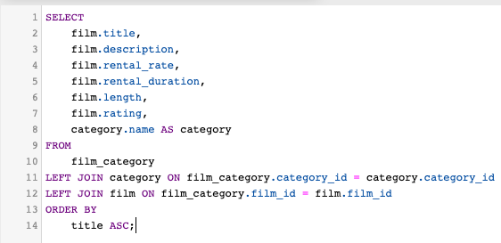

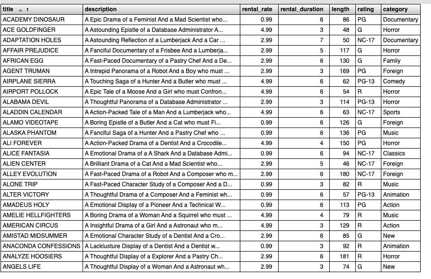

**2. Listaa elokuvista nimi ja siinä olevien näyttelijöiden määrä, järjestettynä näyttelijöiden määrän mukaan suurimmasta pienimpään. \(käytä joineja\)**

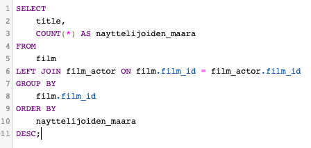

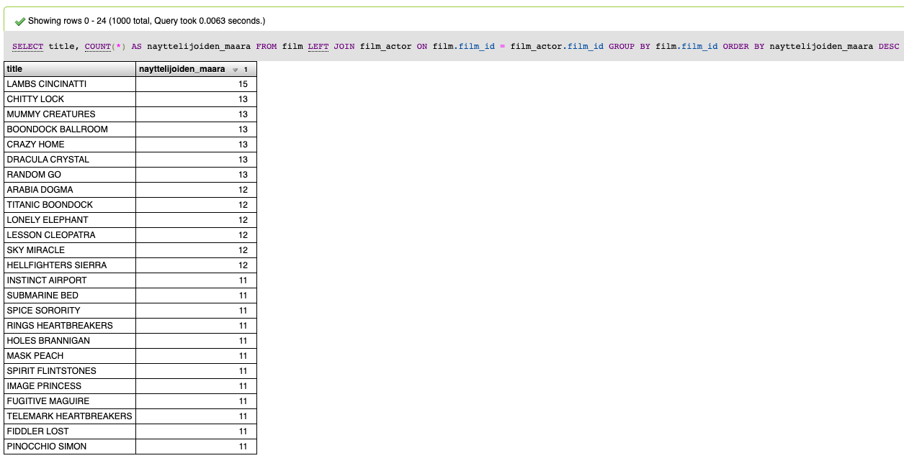

**3. Kuinka paljon eri myyjät \(henkilökunta\) ovat tehneet myyntiä Heinäkuussa 2005 maksusuoritusten perusteella? Listaa myyjän nimi ja sen perässä summa myynnistä. \(taulut payment ja staff, käytä joineja\)**

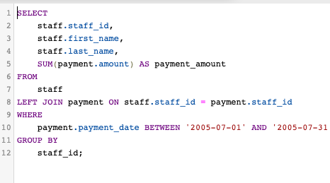

**4. Listaa kaikkien työntekijöiden koko nimi ja koko katuosoite siten, että nimi sekä katuosoite ovat yksittäisiä kenttiä \(Concat, käytä joineja\)**

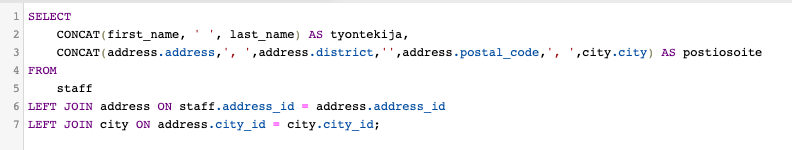

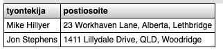

**5. Kuinka monta kopiota on olemassa elokuvasta 'DRACULA CRYSTAL' varastossa? Ei tarvitse välittää onko lainassa vai ei. Tulokseen täytyy tulostaa elokuvan nimi sekä kopioiden määrä \(käytä joineja\)**

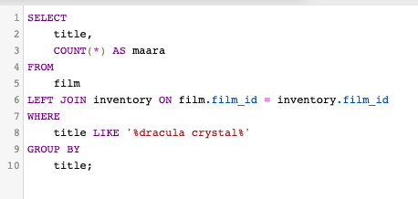

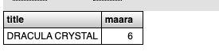

**6. Sähköpostimarkkinointia varten tarvitaan lista top 100 lista kaikista eniten maksaneista asiakkaista. Tulosteessa pitää näkyä asiakkaan etunimi, sukunimi, sähköposti sekä summa paljonko asiakas on maksanut koko ostohistorian aikana. Järjestä tulokset suurimmasta pienimpään kokonaissumman perusteella. \(käytä joineja\)**

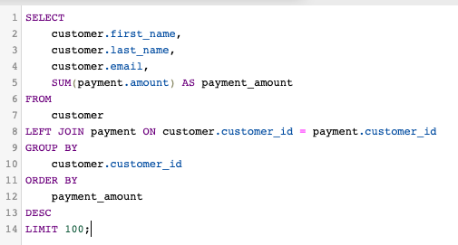

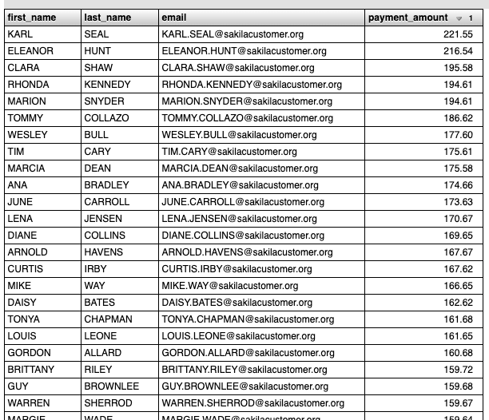

**7. Sähköpostimarkkinointia varten tarvitaan lista kaikista Ukrainassa \(Ukraine\) olevista asiakkaista osoitetiedon perusteella. Listaa asiakkaista etunimi, sukunimi ja sähköposti. \(käytä tauluja customer, address, city, country\)**

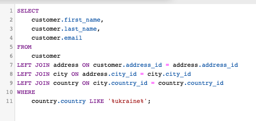

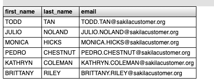

**8. Markkinoinnista vastaavaa henkilöä kiinnostaa tietää top 3 genreä/kategoriaa myynnin perusteella. \(tarvitset useampia tauluja tämän tekemiseen, category, film\_category, inventory, payment, rental\). Listaa tulokset myynnin mukaan suurimmasta pienimpään siten, että tuloksessa näkyy kategorian nimi ja myynti.** 

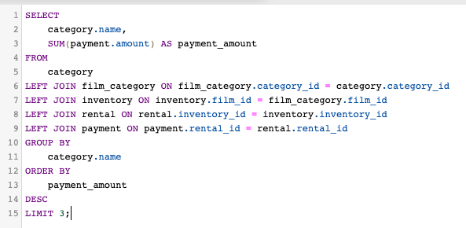

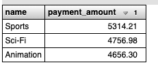

