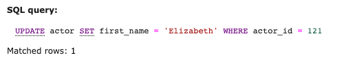
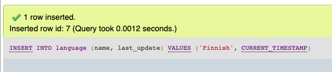
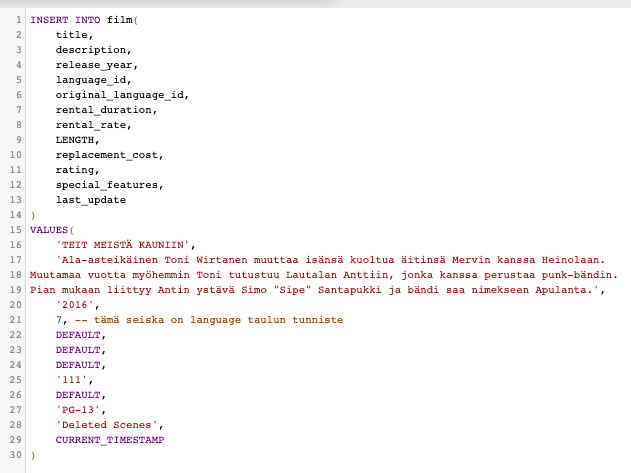
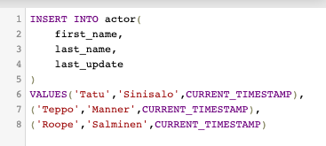
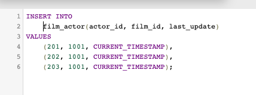
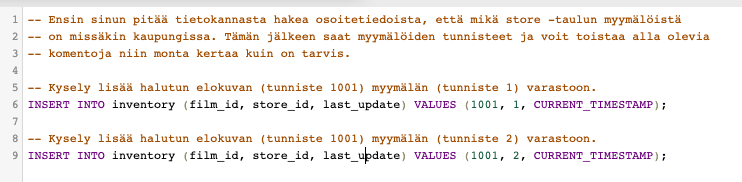
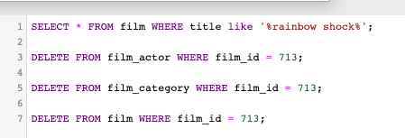
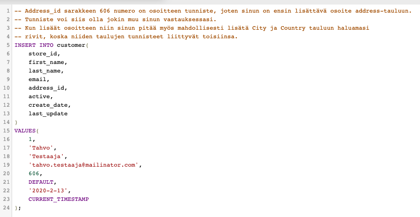

# mysql-perusteet-105-vastaukset

#### 1. Näyttelijän Liza Bergman manageri ilmoitti, että hänen etunimensä on kirjoitettu väärin. Etunimi kuuluisi olla muodossa Elizabeth.. Millä komennoilla voit korjata virheen? Sisällytä kaikki vaiheet mitä tarvitset ratkaisun selvittämiseksi sekä todentamiseksi, että nimi on vaihdettu.

#### 2. Lisää tietokantaan yksi uusi elokuva, __[_Teit meistä kauniin_](https://fi.wikipedia.org/wiki/Teit_meist%C3%A4_kauniin_%28elokuva%29)_._ Ota mallia lähdetiedoista ja lisää niitä käyttäen elokuva listalle, tarvittaessa luo sitä varten eri riippuvuudet. Sisällytä kaikki vaiheet mitä tarvitset ratkaisun selvittämiseksi sekä todentamiseksi.

Ensiksi pitää luoda uusi rivi `languages` tauluun, jotta se voidaan lisätä elokuvaan viitteeksi.

#### 

#### 3. Lisää Teit meistä kauniin -elokuvaan liittyvät pääosien näyttelijät. Sisällytä kaikki vaiheet mitä tarvitset ratkaisun selvittämiseksi sekä todentamiseksi.

Ensin lisätään näyttelijät. Kun nämä on lisätty niin hae tietokannan taulusta näyttelijät, jotta tiedät mitkä ovat niiden rivien pääavaimet jälkimmäistä kyselyä varten. Esimerkissä pääavaimet ovat numerot 201, 202, 203 ja nämä voivat olla eri sinun tietokannassa.

**4. Teit meistä kauniin -elokuvan kopioita on ostettu yhteensä 15 kappaletta siten, että 9 niistä on lähetetty**  _**Lethbridgen**_ **myymälään. Loput kopiot sijaitsevat** _**Woodridgen**_ **myymälässä. Kirjoita kaikki vaiheet millä tavoin saat lisättyä kopiot tietokantaan sekä ratkaisun todentamiseksi.** 

**5. Elokuvan Rainbow Shock näyttäminen on lopetettu tekijänoikeusrikkomusten vuoksi. Poista elokuva ja siihen liittyvät tiedot tietokannasta. Sisällytä kaikki vaiheet mitä tarvitset ratkaisun selvittämiseksi sekä todentamiseksi.**

**6. Lisää itsesi uudeksi asiakkaaksi asiakasrekisteriin. Osoitteen voit keksiä päästä mutta sen pitää olla jokin uusi osoite eikä mikään olemassaolevista. Sisällytä kaikki vaiheet mitä tarvitset ratkaisun selvittämiseksi sekä todentamiseksi.**

**7. Kotikaupunkiisi avataan uusi elokuvavuokraamo. Lisää tämä uusi myymälä tietokantaan sekä sille uusi myymälävastaava \(manageri\). Sisällytä kaikki vaiheet mitä tarvitset ratkaisun selvittämiseksi sekä todentamiseksi.**

Tässä vastaus on monivaiheinen, joten mieti ensin, että mitä tietokantaan pitää lisätä ja mihinkä tauluihin. Tässä vaiheittain mitä pitää hoitaa.

* _Luodaan kaupalle osoite_
* _Luodaan työntekijälle osoite_
* _Luodaan kauppias_
* _Luodaan kauppa ja määritetään sinne juuri luotu kauppias_
* _Varmistetaan että kauppiaalla on oikea myymälä vastuulla_

**8. Päivitä edellä luomasi asiakkaan asiakastietoihin, että hänen pääasiallinen myymälänsä on edellisessä kohdassa luotu myymälä. Lisää myös 5 kappaletta** _**Teit meistä kauniin**_ **-elokuvan kopioita tälle uudelle myymälälle.**

Katso mallia aiemmasta tehtävästä, jossa jo lisättiin vuokrattavia elokuvia myymälään.

**9. Vuokraat** _**Teit meistä kauniin**_ **-elokuvan asiakkaana, jona sinut on merkitty tietokantaan. Katso malli elokuvan vuokraamisesta seuraavasta lähteestä ja muokkaa komentoja siten, että ne soveltuvat tähän esimerkkiin:** [**https://dev.mysql.com/doc/sakila/en/sakila-usage.html\#sakila-usage-rent-a-dvd**](https://dev.mysql.com/doc/sakila/en/sakila-usage.html#sakila-usage-rent-a-dvd)\*\*\*\*

Tässä katso linkin esimerkki ja kokeile miten se toimii.

**10.** _**Teit meistä kauniin**_ **täytti kaikki odotuksesi. Palautat elokuvan. Katso esimerkki elokuvan palauttamisesta seuraavasta lähteestä ja muokkaa komentoja siten, että ne soveltuvat tähän esimerkkiin:** [**https://dev.mysql.com/doc/sakila/en/sakila-usage.html\#sakila-usage-return-a-dvd**](https://dev.mysql.com/doc/sakila/en/sakila-usage.html#sakila-usage-return-a-dvd)\*\*\*\*

Tässä katso linkin esimerkki ja kokeile miten se toimii.

\*\*\*\*

