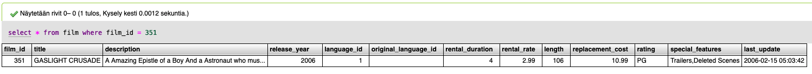
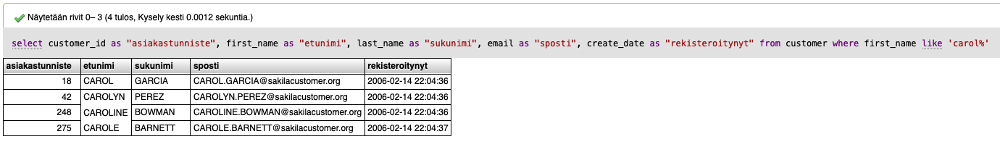

# Vastaukset SQL harjoitukset syksy 2021

## Yksinkertaiset haut


Seuraavat hakukyselyt koostuvat yhden taulun tietojen käytöstä.


Hae tietokannasta sen elokuvan tiedot, jonka tunniste on 351.

Hae tietokannasta elokuvan tunniste, nimi, julkaisuvuosi, pituus ja luokitus, jonka tunniste on 633.

Tee edellinen haku uudelleen mutta nimeä uudelleen haettujen tulosten sarakkeiden nimet suomeksi englannin sijaan siten, että tuloksessa lukee **elokuvan tunniste, elokuvan nimi, julkaisuvuosi, pituus, luokitus**.

Hae elokuvat, joiden pituus on yli 60 minuuttia. Näytä vain ensimmäiset 10 tulosta.

Tee edellinen haku uudelleen mutta tarkenna hakuehtoa vielä siten, että etsit vain PG-13 luokituksen saaneita elokuvia.

Hae 15 elokuvaa järjestettynä niiden keston mukaan pisimmästä lyhyimpään.

Hae 10 elokuvaa järjestettynä keston mukaisesti pisimmästä lyhyimpään, jotka kuuluvat PG-13 tai R -luokitukseen.

Tee edellinen haku uudestaan mutta aseta hakuehdoiksi luokitukset G ja NC-17. Toteuta hakuehto käyttäen **IN** operaattoria.

Hae lista kaikista elokuvista, joiden kesto on välillä 40 - 80 minuuttia. Järjestä pituuden mukaan pisimmästä lyhyimpään. \(yhteensä tuloksia tulisi olla 253 kpl\)

Tee edellinen haku uudelleen mutta aseta hakuehdoksi 30-60 minuuttia. Toteuta hakuehto käyttäen **BETWEEN** operaattoria. \(yhteensä tuloksia tulisi olla 104 kpl\)

Mikä on kaikkien elokuvien keskimääräinen kesto? Entä lyhimmän elokuvan kesto? Entä pisimmän elokuvan kesto?

Hae uudelleen elokuvien keskimääräinen kesto mutta pyöristä luku kokonaisluvuksi.

Ryhmittele elokuvat luokituksen mukaan, jotta saat selville elokuvien määrän eri luokituksissa.

Tee edellinen haku uudelleen mutta näytä tulokset pienimmästä suurimpaan.

Etsi niiden asiakkaiden tiedot, joiden etunimi alkaa **"carol"**.

Tee edellinen haku uudelleen mutta yhdistä tuloksessa asiakkaan etunimi ja sukunimi yhdeksi sarakkeeksi **"nimi"**.

> _Mallikuvassa nimi -sarake on nimetty väärin sukunimi -sarakkeeksi._

Etsi niiden asiakkaiden tiedot, joiden sähköpostissa esiintyy merkit **"martin"**.

Etsi niiden elokuvien määrä, joiden kuvauksessa esiintyy sana **"amazing"**.

## Haastavammat haut


Seuraavissa hakukyselyissä tarvitaan edellisten kohtien oppeja. Tulosten hakemiseen tarvitaan myös JOIN -operaattorin käyttöä.


Selvitä asiakkaan, jonka tunniste on 85, kokonimi, sähköposti ja hänen osoitetiedoissaan oleva kadunnimi. 

Tee edellinen haku uudelleen mutta lisää vielä tulokseen mukaan asiakkaan postinumero, kaupunki ja maa.

Muuta edellisen haun ehtoja. Tarkenna hakua ja etsi kaikki ne asiakkaat, joiden maa on Saksa \(germany\). 

