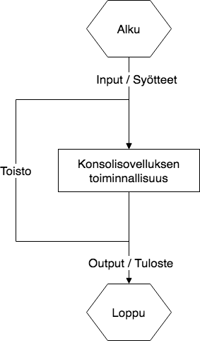
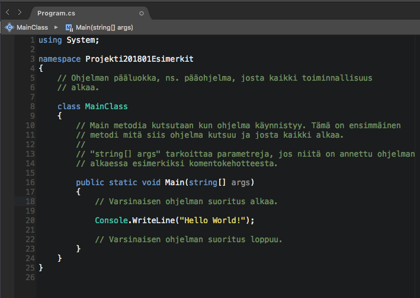
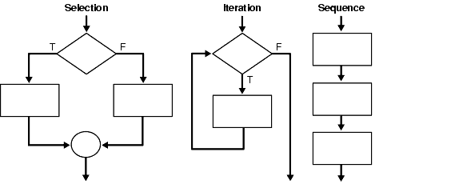

# Projekti 2018/01 Ohjelmoinnin aloittaminen

## Videoita ohjelman rakentamisesta

Soittolista, joka sisältää muutaman videon ohjelman rakenteesta. Videoissa käyty läpi miten yksinkertainen sovellus toimisi aina tiedon tallentamiseen asti. Videoilla esitettyä tapaa voisi sitten toistaa eri ohjelman toiminnoissa.

Lähdekoodit löytyvät alla olevasta liitetiedostosta. Kyseessä on ohjelman viimeinen versio, joten se näyttää erilaiselta kuin alussa.





## Konsoliohjelman rakenne ja elinkaari

Ensimmäinen kuva on yksinkertainen esitys siitä miten konsolisovellus toimii ja mikä on sen elinkaari. Ohjelmilla on aina alku- ja lopputila. Sama kaava toistuu puhutaan sitten kokonaisesta ohjelmasta tai ohjelmassa olevista metodeista.

Ohjelma toistaa itseään niin kauan kuin on tarpeen tai ohjelmoija on tahtonut sen tekevän. Aina ohjelman ei tarvitse toistaa itseään vaan se voi toimia myös yksittäisenä kerta-ajona.

Toisessa kuvassa on sama tilanne kuvattu vain lähdekoodia käyttäen ilman toistorakenteita.

Kun ohjelma alkaa, se varaa itselleen käyttöönsä muistia. Määrä riippuu siitä paljonko asioita ohjelma yrittää tehdä ja usein ei harjoitusprojekteissa ole ongelma. On kuitenkin tärkeä ymmärtää, että muistissa olevat asiat ovat käytettävissä vain niin kauan kun ohjelma on käytössä. Pitempiaikaista tiedon tallennusta varten ohjelman pitää huolehtia sen tallentamisesta.






## Ohjelmoinnin logiikat ja rakenteet

Alla esimerkki ohjelman rakenteesta, jossa on vain muutamia ohjelmoinnin logiikkaan liittyviä rakenteita. Huomaa, että ohjelmaa toistetaan niin kauan kunnes annetaan syöte "0".

Ohjelmoinnissa on muutamia perusrakenteita, joilla vaikutetaan ohjelman kulkuun ja sen käyttäytymiseen. Ohjelmointikielistä riippumatta nämä ovat seuraavat:

* IF-THEN
* IF-THEN-ELSE
* WHILE
* DO-WHILE
* FOR
* FOREACH \(ei kaikissa\)

Rakenteiden hallinta on elintärkeää ohjelmoinnin kanssa. Niiden hahmottamista auttavat esimerkiksi vuokaaviot. Jos et tunne miten edellä mainitut ohjausrakenteet vaikuttavat ohjelman toimintaan, ota ensin niistä selvää eri esimerkkien kanssa.



Toinen tärkeä tunnettava asia on muuttujat ja niiden elinkaari. Ohjelmassa on usein globaaleja ja paikallisia muuttujia. Näiden erot ovat siinä miten ne näkyvät ja vaikuttavat ohjelman eri osissa kun se on päällä.

Alla olevassa esimerkissä `ohje` on staattinen muuttuja. Se on myös määritelty  `Main` ulkopuolella mikä tarkoittaa sitä, että se on käytettävissä `Main` metodin sisällä. Jos muuttuja olisi määritetty metodin sisällä kuten esimerkissä muuttuja `komento`,  niin sitä ei voi käyttää metodin ulkopuolella. Tällaisessa tilanteessa voidaan sanoa, että `ohje` on globaali muuttuja ja `komento` paikallinen muuttuja.

Edellä mainittu tilanne on vain yksi esimerkki ja tilanne voi vaihdella ohjelmointikielen ja tilanteen mukaan. Siksi näihin on tutustuttava aina ohjelmointikielen mukaan. Esimerkiksi voi olla käytössä `global` avainsanoja, mitkä voivat määrittää muuttujille erilaisia ominiasuuksia.

Alla olevassa esimerkissä on huomioitava myös se, että muuttujat ovat olemassa aina koko ohjelman elinkaaren ajan. Tällöin niihin tallennettu tieto pysyy tallessa niin kauan kunnes ne alustetaan uudelleen tai ohjelma loppuu.



```csharp
class MainClass
    {
        static string ohje = "0.Lopetus\n1.Tuotteet\n2.Toiminto\n3.Toiminto\n4.Toiminto\n5.Toiminto";

        // Main metodia kutsutaan kun ohjelma käynnistyy. Tämä on ensimmäinen
        // metodi mitä siis ohjelma kutsuu ja josta kaikki alkaa.
        // 
        // "string[] args" tarkoittaa parametreja, jos niitä on annettu ohjelman
        // alkaessa esimerkiksi komentokehotteesta.

        public static void Main(string[] args)
        {
            // Varsinaisen ohjelman suoritus alkaa.

            Console.WriteLine(ohje);
            string komento = Console.ReadLine();
            while (!komento.StartsWith("0", StringComparison.Ordinal))
            {
                switch (komento)
                {
                    case "1":
                        Console.WriteLine("Tuoteet 1" + Environment.NewLine);
                        break;

                    case "2":
                        Console.WriteLine("Tuote 2" + Environment.NewLine);
                        break;
                    case "3":
                        Console.WriteLine("Tuote 3" + Environment.NewLine);
                        break;
                    case "4":
                        Console.WriteLine("Tuote 4" + Environment.NewLine);
                        break;
                    case "5":
                        Console.WriteLine("Tuote 5" + Environment.NewLine);
                        break;
                    default:
                        break;
                }

                Console.WriteLine(ohje);
                komento = Console.ReadLine();

                // Varsinaisen ohjelman suoritus loppuu.
            }
        }
    }
```



## Luokat ja niiden käyttö ohjelmassa

Luokat ovat olio-ohjelmoinnin tärkein käsite. Niillä pyritään tekemään kokonaisuuksia, joita ohjelmassa voidaan käyttää. Seuraavaksi on esitelty kaksi eri tapaa miten luokkia voidaan hyödyntää eri tarkoituksessa. Tapoja on muitakin mutta seuraavat ovat  tärkeitä ymmärtää tässä vaiheessa.

### Tiedon kantajat

Tässä kohdin tiedon kantajalla tarkoitetaan sellaista luokkaa, joka vain kuljettaa tietoa mukanaan. Esimerkkinä  alla `Tuote` luokka.

Tällaisen luokan tarkoitus on koostaa yksittäisiä muuttujia yhteen ymmärrettäväksi kokonaisuudeksi. Voidaan esimerkiksi ajatella, että nämä ovat oikean maailman asioita, esineitä jne.

Luokka voi myös osata tehdä omilla tiedoillaan jotain, esimerkiksi laskea sen pohjalta asioita tai muuttaa tietojaan.



```csharp
public class Tuote {

    // Luokan ominaisuudet eli sen omat muuttuja.
    // get jat set ovat C#:lle ominainen tapa luoda
    // muuttujille ns. getterit ja setterit tiedon
    // lukemista ja asettamista varten.
    public int Tuotenumero { get; set; }
    public string Nimi { get; set; }
    public int Määrä { get; set; }
    public double Hinta { get; set; }
    public double Alv { get; set; } // Muodossa 0.24 esimerkiksi.

    // Luokan parametriton rakentaja. Oletusrakentaja.
    public Tuote() {
        // Määritetään rakentajassa oletusarvot.
        this.Tuotenumero = 0;
        this.Nimi = "Tuntematon tuote";
        this.Määrä = 0;
        this.Hinta = 0;
        this.Hinta = 0;
    }

    // Luokan metodi. Toiminnallisuus mikä on tälle luokalle
    // tarkoitettu. Voidaan käyttää eri tarkoituksiin mutta tässä
    // esimerkiksi huolehtii verollisen hinnan laskemisesta.
    public double VerollinenHinta() {
        return Hinta * (1 + Alv);
    }

}
```



### Toiminnallinen luokka

Toiminnallisella luokalla tarkoitetaan tässä sellaista luokkaa, joka tekee asioita sille annetuilla parametreilla. Esimerkiksi edelliseen Tuote luokkaan viitaten, voidaan tehdä luokka, joka tulostaa sen tiedot haluttuun muottoon konsoliohjelmassa.

Alla olevassa esimerkissä luokka huolehtii konsoliin tulevista viesteistä. Huomaa `TulostaTuoterivi` metodin kohdalla, että sille annetaan `Tuote` luokan olio parametrina. Näin metodissa voidaan kertoa miltä tuloste näyttäisi.



```csharp
public class Tulostaja {

    public Tulostaja() {
        
    }

    public void TulostaTuoterivienOtsikkorivi() {
        
        string tulostettavaMerkkijono = $"Tuotenumero\tNimi\tVer.Hinta";

        Console.WriteLine(tulostettavaMerkkijono);
    }

    public void TulostaTuoterivi(Tuote tuote) {
        // Merkkijono joka alkaa $ on hyvä tietää. Sen avulla on mahdollista
        // muodostaa merkkijono muuttujien avulla esimerkin tapaa. 
        // Lauseen tai tulosteen muodostaminen on hieman.
        // Tällä ei ole eroa jos sitten tahtoo yhdistää merkkijonot + operaattorilla.
        string tulostettavaMerkkijono = $"{tuote.Tuotenumero}\t{tuote.Nimi}\t{tuote.VerollinenHinta()}";

        Console.WriteLine(tulostettavaMerkkijono);
    }

}

```



### Miksi teemme näin?

Edellisissä esimerkeissä Tuote luokka voisi yhtähyvin tulostaa itsensä samalla tavoin konsoliohjelmaan. On kuitenkin hyvä huomata, että luokkien avulla voidaan erottaa ohjelman eri osia. Siksi tässä on esimerkiksi erotettu tiedon tulostaminen itse tiedosta.

Kun kokonaisuuksia erotellaan, ohjelma on usein helpompi ymmärtää ja lukea sekä ylläpidettävämpi. Siksi on aina hyvä määrittää jonkinlainen tarkoitus luokalle... kysyä siis, että mikä on luokan tarkoitus tai mitä se yrittää tehdä.

Usein ei haittaa, että vaikka luokkia tulisi useampia. Aluksi se voi tuntua vaikeammalta mutta kyseiseen taitoon tottuu ajallaan.

Alla vielä esimerkki missä olemme käyttäneet näitä luokkia yhdessä.



```csharp

public static void Main(string[] args)
{
    // Varsinaisen ohjelman suoritus alkaa.

    Tuote sytytystulppa = new Tuote();
    sytytystulppa.Tuotenumero = 100;
    sytytystulppa.Nimi = "Sytytystulppa, Model ZYV";
    sytytystulppa.Määrä = 10;
    sytytystulppa.Alv = 0.24;
    sytytystulppa.Hinta = 15.0;

    var tulostaja = new Tulostaja();

    tulostaja.TulostaTuoterivienOtsikkorivi();

    tulostaja.TulostaTuoterivi(sytytystulppa);

    // Varsinaisen ohjelman suoritus loppuu.
    }
}
```



