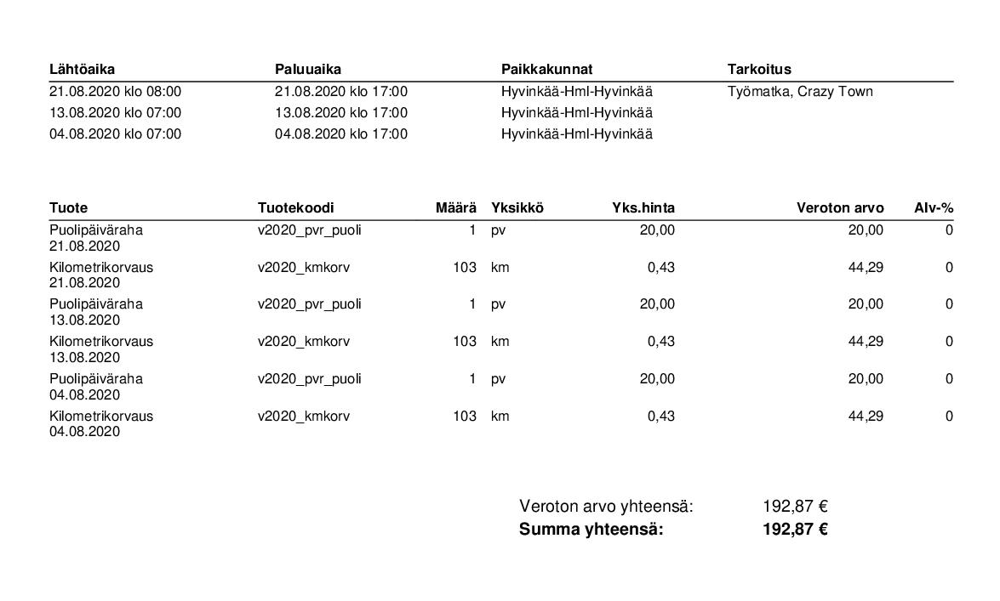

# Kilometrikorvaus


**Huom!** Opiskelijoille suunnatuissa projekteissa heidän arviointinsa ja palautettavat dokumentit on kuvattu tarkemmin heidän omalla oppimisalustallaan.


## Toimeksiannon kuvaus 

Asiakas tarvitsee apua kilometrikorvauksien kirjanpitoon ja maksamiseen. Asiakkaalla on useita myyntiedustajia, jotka kulkevat omalla autollaan. Pääasiassa asiakkaan tulee maksaa kirjattujen kilometrien perusteella kilometrikorvaus sekä mahdolliset päivärahat.

Asiakas on antanut lähteeksi seuraavan sivun: [https://www.vero.fi/henkiloasiakkaat/auto/kilometrikorvaus\_ja\_paivaraha/](https://www.vero.fi/henkiloasiakkaat/auto/kilometrikorvaus_ja_paivaraha/)

Sinun tulisi suunnitella pieni sovellus, joka auttaisi asiakasta. Asiakkaalla on joitakin toiveita mitä hän haluaisi ohjelman sisältävän, jos se vain onnistuu.

* Ohjelma sisältäisi mahdollisuuden lisätä myyntiedustajia ja kirjata heille matkakuluja
* Ohjelmaan tulisi syöttää nykyisen vuoden korvausmäärät, joista ohjelma laskee sitten kilometrikorvaukset.
* Jos mahdollista, kilometrikorvauksien lisäksi ohjelma laskisi päivärahojen suuruuden matkan keston perusteella.
* Asiakas haluaisi saada myös yhteenvedon tämän hetkisistä maksamattomista korvauksista. 
* Lisäksi jos mahdollista niin ohjelmasta näkisi, että paljonko myyntiedustajille on maksettu korvauksia ja paljonko on maksamatta.

