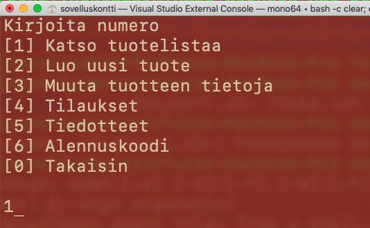
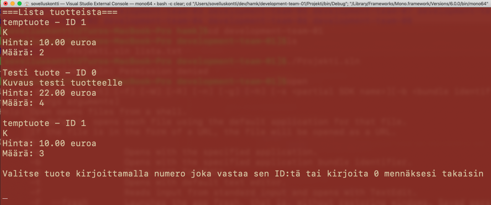

# Toimeksiannon rajaukset

## Tekniset rajaukset toimeksiannon ohjelmalle 

* Ohjelmointikielenä C\#.
* Ohjelmoinnissa pitää olla sovellettu olio-ohjelmointiin liittyviä käsitteitä, koska näitä on opetettu toisessa osuudessa.
* Ohjelma on ns. konsolisovellus.
* Esimerkkejä alapuolella. Käyttöliittymän toteuttaminen tällaiselle ohjelmalle on vapaasti ryhmän päätettävissä miten sen haluaa toimivan.
* Ohjelman tulee tallentaa ja lukea tietoa vähintään tekstitiedostosta. Muut tallennustavat ryhmän päätettävissä taitotasoon nähden.
* Kun ohjelma avataan uudelleen, tulee sen pystyä lukemaan tallennetut tiedot.

## Vähimmäisvaatimukset ominaisuuksille

Ohjelman ei ole pakko toteuttaa kaikkia toimeksiannossa kuvattuja vaatimuksia. Lisäksi kehitystiimi voi suunnitella myös lisäominaisuuksia. Ainoa rajoite on annettu aika, joten projektin palautus ei saa myöhästyä lisäominaisuuksien vuoksi. **Kehitystiimin tulee siis priorisoida tavoitteensa.**

## Kehitystiimin työskentely 

Toimeksiannon aikana on tarkoitus oppia myös työskentelytavoista. Kyseisiä asioita otetaan esille lähituntien yhteydessä sekä ryhmiä ohjattaessa. Pääasiassa käsittelemme seuraavia asioita: [Agile esimerkki](../ketterae-ohjelmistokehitys/agile-esimerkki-sykli.md)

## Palvelut ja ohjelmistot 



