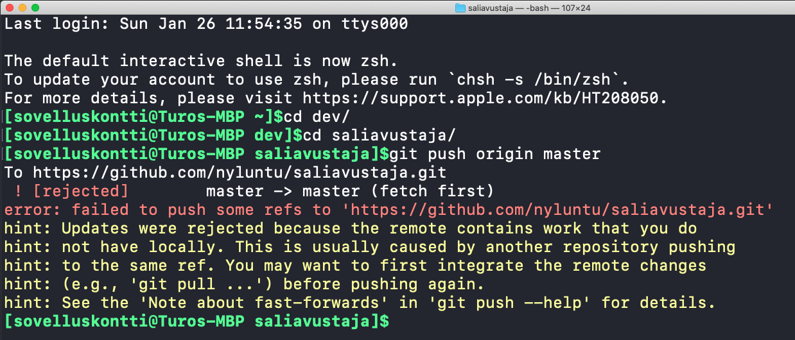
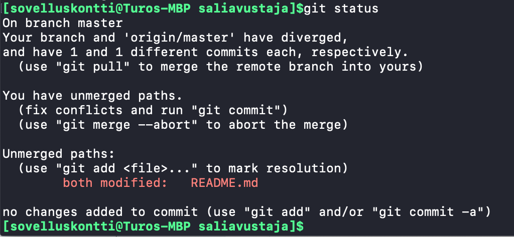
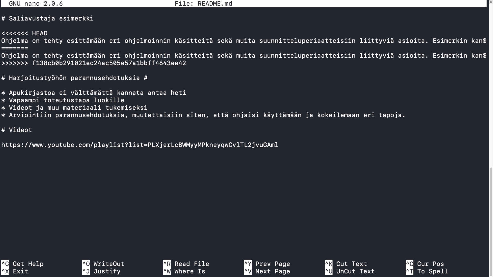
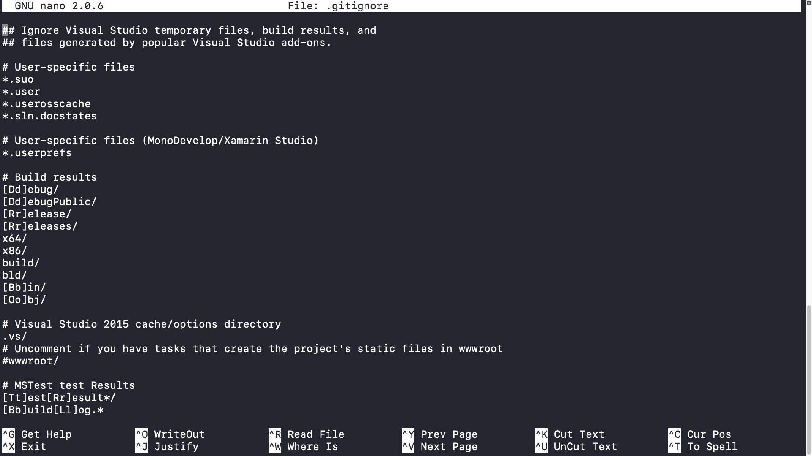
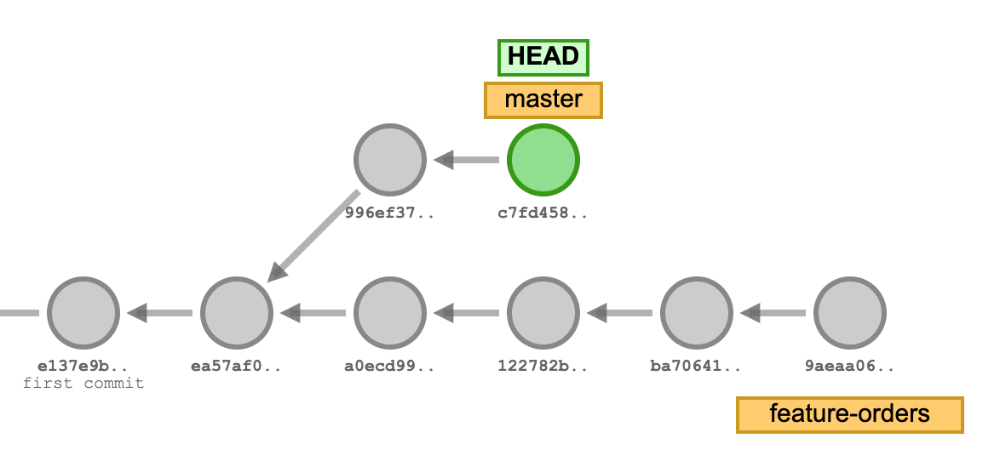
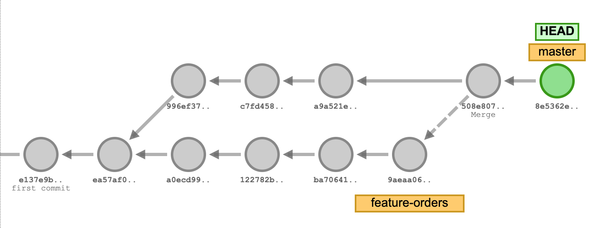
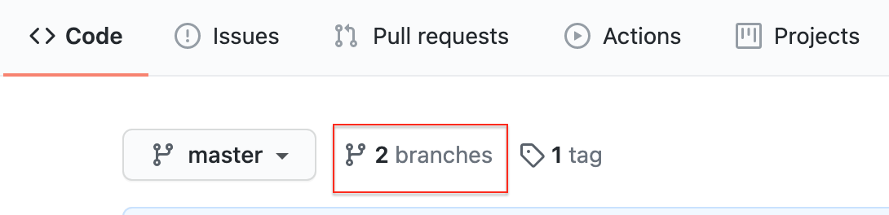

# Opas Gitin perusteisiin

Versionhallinnan avulla voidaan seurata lähdekoodin muutoksia ja työskennellä tehokkaammin yhdessä. Yksi suosituimmista versionhallintaan suunnitelluista työkaluista on Git. Seuraavassa artikkelissa käydään läpi perusteet, joiden avulla pääset alkuun.


Huomio! Joissakin lähteissä **master** branchiin viitataan nimellä **main**. Koskee toistaiseksi lähinnä Github palvelua mutta saattaa yleistyä. Kyseessä on vain teknisesti nimimuutos.


## Yleiskuva Git työkaluun

Git on monipuolinen työkalu, joka on suunniteltu toimimaan hajautettuna versionhallintana \(_distributed version control_\). Hajautettu versionhallinta tarkoittaa sitä, että jokainen kopio Gitin tietovarastosta toimii itsenäisesti. Verrattuna keskitettyihin versionhallintapalveluihin _\(centralized version control\)_, jotka vaativat toimiakseen eräänlaisen keskitetyn tietovaraston muutosten hallintaan, git toimii myös itsenäisesti. Usein kuitenkin myös Git-työkalua käytettäessä mukana on keskitetty tietovarasto, jota käytetään pääasiallisena lähteenä. Hajautettu malli mahdollistaa kuitenkin sen, että monet asiat voidaan tehdä paikallisesti ilman verkkoyhteyttä.


Etätietovarasto kannattaa ajatella vain kopiona lähdekoodista. Usein sellainen on sijoitettu palvelimelle tai  kolmannen osapuolen palveluun, kuten esimerkiksi Github -palveluun. Etätietovarasto toimii pääosin keskitettynä lähteenä, jossa pidetään lähdekoodin tuorein  versio. Muutoksia ei suoraan tehdä etätietovarastoihin vaan ensin muutokset vahvistetaan paikallisessa tietovarastossa, josta ne sitten työnnetään _\(push\) ****_etätietovarastoon ja ovat koko kehitystiimin saatavilla, joilla vain on pääsy kyseiseen palveluun.

Hajautettu versionhallinta tuo mukanaan myös sellaisen edun, että mikä tahansa tietovaraston kopio voi toimia toisen paikallisen tietovaraston etätietovarastona. Tilanteessa, jossa alkuperäinen etätietovarasto menee vikatilaan tai sitä ei saataisi korjattua, voisi yksi nykyisistä paikallisista tietovarastoista toimia uutena etätietovarastona. Käytännössä tämä tarkoittaa sitä, että yksi kehittäjistä perustaisi uuden etätietovaraston, jonne hän oman muutoshistoriansa työntää. Tällöin kannattaa valita sellainen, jolla on mahdollisimman tuorein muutoshistoria. Tämä toimii siksi, että jokainen tietovaraston kopio sisältää koko päähaaran historian kun se kopioidaan.

Git työkalu käsittelee kaikki muutokset paikallisesti. Muutokset voidaan myös työntää etätietovarastoon _\(remote repository\)_ kun ne tahdotaan jakaa muiden ohjelmoijien kanssa tai sitten muutoin pistää talteen. Karkeasti ottaen Gitin käyttö voidaan jakaa kahteen osa-alueeseen: **paikalliseen tapahtuvaan työskentelyyn** ja **etätietovarastoihin liittyvään työskentelyyn**.

## Gitin kolme tilaa

Ennen tutustumista paikalliseen työskentelyyn, pitää ymmärtää miten Git toimii paikallisesti ja kuinka se käsittelee tiedostojen muutokset. Puhutaan niin sanotusti kolmesta eri tilasta: **työhakemistosta** _\(working directory, workspace\)_, **valmistelualueesta** _\(staging area\)_ ja Git-hakemistosta eli **paikallisesta tietovarastosta** _\(repository\)_. 


### Työhakemisto

Kun työskentelet Git -työkalulla, se käsittelee tietojärjestelmän kansioita ja tiedostoja. Työhakemistolla tarkoitetaan sitä kansiota \(hakemistoa\) mikä on alustettu käyttäen Gitin komentoa tai kloonattu etätietovarastosta. Työhakemistona voi siis toimia mikä tahansa kansio ja komentokehotetta käyttäessä, sillä tarkoitetaan usein juurikin sitä kansiota missä sillä hetkellä on.

Työhakemisto, joka on Gitin seurannassa, toimii kuten normaali kansio. Kun lisäät, muutat tai poistat tiedoston niin Git seuraa näit eroja. Työkalu kertoo missä tilassa tiedostot ovat. Työhakemistossa, jossa Git on käytössä, löytyy aina piilotettu **.git** -niminen kansio \(huomaa piste nimen edessä\) ja sisältää työkalun tarvittavia tiedostoja. Kyseiseen kansioon ei tulisi koskea.

Lähdekoodeihin tehdyt muutokset eivät automaattisesti säily versionhallinnassa vaan Gitin kohdalla pitää kertoa mitkä muutokset halutaan lisätä eli valmistella seuraavaa versiota varten. Tässä termillä versio tarkoitetaan pysyvää muutosta, joka on Gitin lokissa eli muutoshistoriassa. Muutoksen tilalle ei ole väliä vaan lisättiin, poistettiin tai muutettiin tiedostoa niin se tulee aina viedä niin sanotulle valmistelualueelle.


Git ei käsittele itseasiassa kansioita vaan pelkkiä tiedostoja. Jos luot siis kansion, joka ei sisällä tiedostoja, ei Git huomaa eroa. Lisää siis aina jokin tiedosto tyhjään kansioon, jos haluat sen pysyvän lähdekoodien mukana jostain syystä.


### Valmistelualue

Valmistelualue on eräänlainen välitila ennen pysyvän muutoksen vahvistamista. Valmistelualueelle voidaan lisätä halutut muutokset. Työskentelyn aikana tulee tilanteita, kun ohjelmoija on koskenut useaan tiedostoon mutta haluaa vain lisätä tietyt yksittäiset muutokset eikä kaikkia muutoksia. 

Kun tiedosto lisätään valmistelualueelle, siitä otetaan viimeisin kopio talteen. Tiedoston muuttuessa tämän jälkeen, se pitää lisätä uudelleen valmistelualueelle, joten usein tämä tehdään siinä vaiheessa kun halutut muutokset on tehty. Valmistelualueella ei ole kovin tärkeää osaa päivittäisessä työskentelyssä mutta sen rooli on hyvä tuntea.

Seuraava vaihe on tehdä valmistelualueen tiedostojen kopioista pysyvä versio muutoshistoriaan. Tätä tilannetta kutsutaan _**commitiksi** \(commit\)_, jolloin muutokset vahvistetaan paikalliseen tietovarastoon.

### Paikallinen tietovarasto

Paikallinen tietovarasto on viimeisin kolmesta vaiheesta. Kun pysyvä muutos on tehty, se kirjataan paikalliseen tietovarastoon uutena versiona. Voidaan siis puhua niin sanotusti pysyvästä muutoksesta, josta tulee osa muutoshistoriaa. Samalla kun muutos vahvistuu niin Git merkitsee uusimman muutoksen nykyiseksi version _**"pääksi"**_ _\(HEAD\)_, joka siis viittaa tuoreimpaan versioon.

Muutoshistoria on eräänlainen ketju muutoksia ja sisältää aina tiedon edellisestä versiosta. Eri lähteissä versioista puhutaan myös termillä _snapshot_ eli eräänlaisesta sen hetkisestä tiedostojen tilasta. Pääosin Gitin komennot käsittelevät tätä paikallista tietovarastoa ja etätietovarastojen käsittelyyn varten on omat komentonsa. 


Git ei tallenna kopiota koko työhakemistosta \(kuten osa versionhallintaan tehdyistä työkaluista\) kun pysyvä muutos tehdään. Puhutaan enemmän tiedon lisäämisestä eli jokainen muutos kertoo mikä on muuttunut edelliseen versioon nähden. 


## Asennus

Asenna Git sen kotisivuilla annettujen ohjeiden mukaisesti. [https://git-scm.com/downloads](https://git-scm.com/downloads)

Esimerkit tehdään käyttäen Git komentoja, jotka suoritetaan komentokehotteen tai terminaalin avulla.

### Ensimmäinen käyttökerta

Konfiguroi Git ensimmäisellä käyttökerralla. Seuraavat kaksi komentoa ovat usein ne tarpeellisimmat, jotka pitää antaa.

```bash
# Asetusten komennot eivät tulosta mitään niiden antamisen jälkeen.
# Tarkoitus on asettaa muutama tieto käyttäjästä, jotta ne näkyvät
# muutoshistoriassa. 

# Asetetaan nimimerkki, jota käytetään muutoshistoriassa.
git config --global user.name "nimesi"

# Asetetaan sähköpostiosoite, jota käytetään muutoshistoriassa.
git config --global user.email "sähköpostiosoite"

# Voit tarkistaa asetukset, jos seuraava komento tulostaa antamasi tiedot.
git config --list | grep user
```

## Paikallisen tietovaraston kanssa työskentely

Gitin kanssa työskentely on melko yksinkertainen prosessi ja samat komennot toistuvat jatkuvasti. Tärkeää on enemmän tietää mitä on tekemässä. Kaikki usein alkaa paikallisesta työskentelystä mikä tarkoittaa sitä, että tehdään muutoksia lähdekoodiin ja vahvistetaan ne paikalliseen tietovarastoon.

Paikallinen työskentely voidaan jakaa seuraaviin pääasiallisiin kokonaisuuksiin: **tietovaraston luominen** ja **muutosten tekeminen**.

### Tietovaraston luominen

Tietovaraston luominen tarkoittaa toimenpidettä missä nykyinen työhakemisto alustetaan käyttämään versionhallintaa, tässä tapauksessa Gittiä. Työhakemiston alustaminen onnistuu alla olevalla komennolla.

Komennon jälkeen työhakemistoon luodaan piilotettu **.git** -kansio. Nyt voit käsitellä työhakemistoa miten olet tottunut eikä se vaikuta normaaliin työskentelyysi.

```bash
# Esimerkissä voidaan olettaa, että työhakemiston polku on:
# C:\repositoryt\GitHarjoitukset\

# Tietovaraston luominen työhakemistoon.
git init
```


Tietovaraston luominen tehdään vain kerran. Ei joka kerta kun aloittaa työskentelyn. Jos työhakemistossa on jo **.git** kansio niin tätä vaihetta ei tarvitse tehdä.

Jos paikallinen tietovarasto on alunperin kopioitu etätietovarastosta niin silloinkaan tätä vaihetta ei tarvitse tehdä.

Huomaa myös, että **.git** -kansio on vain usein projektin juuressa. Tarkoittaa sitä, että työhakemistossa olevat alakansiot eivät sisällä piilotettua **.git** -kansiota.

Vältä komennon antamista tietojärjestelmän asemien juuressa, esimerkiksi Windowsissa C:\ -aseman juuressa. Tällöin Git alkaa seuraamaan kaikkia tiedostoja asemalta ja tällöin se ei toimi halutulla tapaa.


### Muutoksen tekeminen

Muutoksia tehdessä ne pitää vielä vahvistaa. Seuraavat alla olevat komennot havainnollistavat vaiheita, miten pysyvä muutos paikalliseen tietovarastoon saadaan aikaiseksi. Ohjelmoija toistaa näitä vaiheita jokapäiväisessä työssään jatkuvasti.

```bash
# Esimerkissä voidaan olettaa, että työhakemiston polku on:
# C:\repositoryt\GitHarjoitukset\

# Esimerkin vuoksi voidaan olettaa, että työhakemistoon on lisätty tätä 
# ennen tekstitiedosto "Program.txt", joka sisältää mitä tahansa tekstiä.
# C:\repositoryt\GitHarjoitukset\Program.txt

# Näytä tietovaraston tila
git status

# Lisää kaikki muutokset valmistelualueelle. (komennon lopussa on siis piste)
git add .

# Tee valmistelualueen muutoksista pysyviä nykyiseen kehityshaaraan. 
# Kehityshaara lukee esimerkiksi status -komennon tulosteessa mutta
# tässä kohdin se on nimeltään master.
git commit -m "Minun ensimmäinen commit"
```

Komentojen jälkeen sinulla pitäisi olla tehtynä uusi versio, joka näkyy muutoshistoriassa. Muutoshistoriaa voit katsoa seuraavalla komennolla, jossa sinun pitäisi nähdä tuorein muutoksesi antamasi viestin kera.

```bash
# Esimerkissä voidaan olettaa, että työhakemiston polku on:
# C:\repositoryt\GitHarjoitukset\

# Log komento näyttää muutoshistorian ja parametri -5 tarkoittaa,
# että näyttää edelliset 5 muutosta. Jos komentokehote menee eräänlaiseen
# lukutilaan eikä hyväksy muita painalluksia, paina Q kirjainta.
git log -5
```


Esimerkin tilanne voidaan suorittaa myös seuraavalla yksittäisellä komennolla, jos varmasti halutaan kaikki nykyiset muutokset lisätä eikä ole tarvetta tarkistaa sisältöä.

`git commit -a -m "Minun ensimmäinen commit"`

Esimerkissä lisättiin kaikki tiedostot kun käytettiin pistettä. Yksittäisiä tiedostoja voidaan myös lisätä.

`git add Program.txt`


## Etätietovaraston kanssa työskentely

Gitin kanssa ei ole pakko käyttää etätietovarastoja mutta usein ne ovat mukana. Tämä voidaan myös jakaa muutamaan pääasialliseen kokonaisuuteen: **tietovaraston kopiointi, etätietovaraston viittauksien muutokset, muutosten työntäminen** ja **muutosten vetäminen.**

### Etätietovaraston kopiointi paikalliseen tietovarastoon

**Tämä vaihe tehdään vain kerran** siinä tilanteessa, että etätietovarasto on jo olemassa ja sitä ei ole nykyisellä työasemalla \(työkoneella\) olemassa vielä. Etätietovarasto on siis perustettu jo toisen henkilön toimesta.

```bash
# Esimerkissä voidaan olettaa, että työhakemiston polku on:
# C:\repositoryt\

# clone komento kopioi sille annetusta URL osoitteesta tietovaraston 
# paikalliseksi tietovarastoksi. Merkit < ja > eivät kuulu komentoon.
# Komennon antamisen jälkeen usein pitää tunnistautua riippuen käytettävästä
# palvelusta.
git clone <osoite git repositoryyn>

# Navigoi komennon jälkeen clone komennon luomaan kansioon.
# cd kansion_nimi
```

Kun etätietovarasto on kopioitu \(kloonattu\) niin `clone`  komento luo etätietovaraston mukaan nimisen kansion työhakemistoon. Se ei siis kopioi tietovarastoa nykyiseen työhakemistoon vaan luo sille alakansion.


Clone kopiointi tekee useita vaiheita jo valmiiksi. Esimerkiksi sen jälkeen ei tule enää antaa `git init` komentoa tai tehdä muutoksia etätietovaraston viittaamiseen, koska ne on jo tehty.


### Etätietovarastoon viittaaminen paikallisessa tietovarastossa

**Tämä vaihe tehdään vain kerran siinä tilanteessa**, että etätietovarastoa ei kopioida \(kloonata\) vaan on kyseessä paikallinen tietovarasto. Tässä tilantessa usein halutaan kertoa mihin etätietovarastoon olemassaoleva paikallinen tietovarasto halutaan työntää. 

Muita tilanteita ovat esimerkiksi sellaiset, että paikallinen tietovarasto muutoshistorian kanssa halutaan työntää toiseen uuteen etätietovarastoon. Käyttötapauksia on monenlaisia.

```bash
# Esimerkissä voidaan olettaa, että työhakemiston polku on:
# C:\repositoryt\GitHarjoitukset\

# Anna työhakemistossa alla oleva komento, joka lisää viittauksen 
# etätietovarastoon. Origin on tässä vapaavalintainen etätietovaraston
# nimi, jota tarvitaan muutoksia työntäessä myöhemmin. Origin on aina
# usein oletuksena annettu nimi.
git remote add origin <osoite git repositoryyn>

# Tarkista komennon antamisen jälkeen, että näet lisätyn viittauksen 
# seuraavan komennon avulla.
git remote -v
```

### Muutosten työntäminen etätietovarastoon

Kun työskentelyssä on tultu siihen pisteeseen, että muutokset halutaan jakaa muiden kehittäjien kanssa tai muutoin talteen eri sijaintiin niin tarvitsee ne työntää \(push\) etätietovarastoon. Tätä vaihetta tehdään niin usein kun on tarve mutta usein päivän päätteeksi.

On hyvä huomioida, että edelliset komennot ovat pääasiassa käsitelleet paikallista tietovarastoa ja seuraavat komennot käsittelevät etätietovarastoa.

```bash
# Esimerkissä voidaan olettaa, että työhakemiston polku on:
# C:\repositoryt\GitHarjoitukset\

# Anna työhakemistossa alla oleva komento. Komento työntää paikallisessa
# tietovarastossa olevat uudet muutokset etätietovarastoon. Jos uusia ei 
# ole niin komento kertoo kaiken olevan ajantasalla. Origin on viittaus
# etätietovarastoon ja master on päähaara, jota tässä ollaan lisäämässä.
git push origin master
```

Yksinkertaisesti `push` komento työntää aina muutokset etätietovarastoon. Tämän jälkeen paikalliseen tietovarastoon voidaan tehdä lisää muutoksia ja työntää taas uudelleen kun halutaan.


Vältä käyttämästä `git push --force` komentoa. Komento yliajaa muutokset ja sillä tavoin Git -historia muuttuu. Usein johtaa uusiin ongelmiin.


### Muutosten työntämisen aikana tapahtuu virhe

Push komento voi tietyissä tilanteessa epäonnistua. Todennäköisin tilanne on se kun toinen henkilö on jo ehtinyt työntää uusia muutoksia etätietovarastoon, joita sinun paikallisessa tietovarastossa ei ole. Tässä tilanteessa muutokset pitää ensin vetää omaan tietovarastoon. Alla on kuvakaappaus siitä miltä tilanne näyttää komentokehotteessa käytettäessä Gitin komentoja.



Kuvakaappauksessa on ensin navigoitu **dev/saliavustaja/** hakemistoon, joka tässä tilanteessa on paikallinen tietovarasto. Paikalliseen tietovarastoon on tätä ennen tehty yksi muutos. Kun on annettu komento `git push origin master` niin tulostuu viesti **rejected** ja perustelut sille. 

Perustelut kannattaa lukea tarkkaan, koska siinä sanotaan suoraan olevan kyseessä tilanne, jossa joku toinen on jo tehnyt muutoksia etätietovarastoon, joita sinulla ei ole paikallisessa tietovarastossa. Tällöin tulisi tehdä `git pull` komento, joka vetää muutokset etätietovarastosta. 

### Muutosten vetäminen etätietovarastosta

Työskentelyyn saattaa usein liittyä useampi ohjelmoija, jotka tekevät muutoksia. Tuoreet muutokset pitää vetää \(pull\) etätietovarastosta paikalliseen tietovarastoon siinä tilanteessa kun pitää saada muiden muutokset työasemalle. 

```bash
# Esimerkissä voidaan olettaa, että työhakemiston polku on:
# C:\repositoryt\GitHarjoitukset\

# Anna työhakemistossa alla oleva komento. Komento vetää uusimmat muutokset
# etätietovarstosta, joita paikallisessa tietovarastossa ei ole.
# Pull komento tekee myös ns. mergen eli yhdistää ne paikallisen tietovaraston
# muutoshistoriaan.
git pull origin master
```


Pull komento on hyvä tehdä aina ennen töiden aloittamista niin välttää monia ongelmatilanteita vanhentuneen lähdekoodin vuoksi.

Komento voi aiheuttaa myös niin sanotun konfliktin \(conflict\) tilanteen, jos vedettävät muutokset koskettavat sellaisia paikallisia muutoksia mitkä osuvat samoihin tiedostoihin ja lähdekoodin riveihin.


## Muut työskentelyyn liittyvät tilanteet

Versionhallintaa käytettäessä tulee vastaan joitakin tilanteita ja tarpeita mitä pitää osata selvittää. Nämä ovat hyvin perinteisiä ja kuuluvat melkein jokapäiväiseen työskentelyyn. Erilaiset työskentelytavat vaikuttavat myös näiden tilanteiden syntyyn.

Todennäköisesti ohjelmoijan pitää jossakin tilanteessa selvittää **Gitin konflikti** tai **merkitä tiedostoja, joita ei haluta versionhallinnan seuraavan**. 

### Konfliktin selvittäminen

Konflikti tarkoittaa Gitissä tilannetta, jossa työkalu ei pysty päättelemään muutoksista niitä, jotka pitäisi yhdistämisen aikana säästää. Yhdistämisellä tarkoitetaan tässä ns. _**merge**_ tapahtumaa, joka on Gitin tapa yhdistää muutokset kahdesta eri kehityshaarasta.

Konflikti voi syntyä seuraavissa tilanteissa:

* Ohjelmoija on luonut uuden kehityshaaran ja yhdistää sen siihen mistä se on alunperin luotu.
* Ohjelmoija vetää etätietovarastosta muutoksia paikalliseen tietovarastoon mutta hänellä on muutoksia samoissa lähdekoodiriveissä kuin etätietovaraston tulevissa muutoksissa.


Konflikti näyttää ylläolevan kuvan kaltaiselta kun se tapahtuu käytettäessä `git pull` komentoa. Kuvassa paikallinen tietovarasto on **dev/saliavustaja/** -hakemistossa, jossa on yritetty vetää uusia muutoksia etätietovarastosta. Gitin tulosteessa on kohta **CONFLICT**, jossa kerrotaan perässä sen tapahtuneen README.md nimisessä tiedostossa. Lisäksi mainitaan, että automaattinen yhdistäminen \(merge\) on epäonnistunut ja konflikti pitää korjata.

Konflikti korjataan aina manuaalisesti eli ohjelmoija itse korjaa kyseisestä tiedostosta epäselvät rivit. Kun kuvan mukaisessa tilanteessa on tapahtunut konflikti, mitään muutoksia ei varsinaisesti vahvisteta paikallisessa tietovarastossa ennen niiden korjaamista. Jos et tiedä missä tilassa paikallinen tietovarasto on niin `git status` komento auttaa myös selvittämään mikäli on kyseessä konflikti. 



Yllä olevassa kuvassa tuloste kertoo, että sinulla on konflikti. Tällöin kaksi kehityshaaran historiaa ei ole siis oikein yhdistyneet. Kohdassa **Unmerged paths** olevat tiedostot sinun tulee käydä läpi manuaalisesti. Jos konfliktia ei haluta tapahtuvan, voidaan antaa seuraava komento, joka peruu muutokset siihen tilaan kuin ne olivat ennen konfliktin syntymistä.

```bash
# Abort parametri peruu muutokset ja on hyödyllinen konflikti tilanteissa, 
# joka on tullut odottamatta. Usein kuitenkin konflikti on selvitettävissä
# suht helposti.
git merge --abort
```

Kuten edellä on jo mainittu, konflikti selvitetään itse. Kun konflikti on selvitetty, tulee se vielä vahvistaa `commit` komentoa käyttäen. Avaa konfliktin aiheuttanut tiedosto missä tahansa tekstieditorissa \(esim. notepad, visual studio, komentokehotteesa\). Monet ohjelmointiin tehdyt työkalut ymmärtävät konfliktitilanteita ja tarjoavat ohjelmoijalle vaihtoehdot miten toimia. Hyväksytäänkö paikalliset muutokset, etätietovaraston muutokset vai jokin näistä yhdistelmistä.

Seuraava kuva havainnollistaa tilannetta työkalun kanssa, joka ei ymmärrä konflikteja ja miltä se näyttää Gitin näkökulmasta.



Tiedostossa, jossa on konflikti, tärkein asia on Gitin merkintätapa ja korjaus. Konfliktissa Git lisää lähdekoodiin seuraavanlaiset merkinnät:

```bash
<<<<<<< HEAD
[tässä kohdin voi olla useita rivejä lähdekoodia]
=======
[tässä kohdin voi olla useita rivejä lähdekoodia]
>>>>>>> [version sha tunniste (f138cb...]
```

Ohjelmoijan tulee siis siivoa lopputilanne siten, että poistaa `<<<<, ====, >>>` rivit ja lopputulos on halutun näköinen. Ensimmäinen HEAD osio tarkoittaa, että siinä on nykyiset paikallisessa tietovarastossa olevat muutokset. Yhtäsuuruus-merkkien jälkeen tuleva lohko tarkoittaa etätietovarastosta vedettyjä muutoksia. Muutoksia voi olla useita rivejä, että ohjelmoija voi siistiä lähdekoodin käyttämään vain toista lohkoa tai sitten yhdistellä muutoksia haluamansa tavan mukaisesti. **Lopuksi tallenna tiedosto** sekä **kokeile tietysti ohjelman toimivuus**, jos kyseessä on oikea ohjelma.

Kun konflikti-tiedostot on selvitetty, tee muutokset pysyviksi seuraavilla komennoilla.

```bash
# Lisää korjattu tiedosto valmistelualueelle. 
# (vaihtoehtoisesti myös muut mahdollisesti muutokset) 
git add README.md

# Vahvista muutokset.
git commit -m "Konflikti korjattu, onnistuin."
```

### Tiedostojen sivuuttaminen versionhallinnassa

Usein tulee tarpeita tiedostojen sivuuttamisen kanssa. Sivuuttamisella \(ignore\) tarkoitetaan tässä tilannetta, että tietyn tiedoston muutoksia ei huomioida versionhallinnan näkökulmasta. Se ei ole siis koskaan osa muutoshistoriaa. Useimmat tilanteet, joissa sivuuttamista tarvitaan, liittyvät työkalujen luomiin omiin konfiguraatio hakemistoihin tai kehittävän ohjelman paikallisiin asetuksiin. Tilanteita on useita erilaisia.

Esimerkiksi Visual Studio luo aina piilokansion **.vs** projektin yhteydessä. Sinne syntyvät kehittäjälle tarkoitettuja omia tiedostoja sekä ne muuttuvat aina kun Visual Studio esimerkiksi kääntää ohjelman. Usein tällaisia tietoja ei haluta versionhallinnan seurattavaksi, koska aiheuttavat konflikti-tilanteita ja niistä ei ole apua muille kehittäjille. Vain pelkkä lähdekoodi on usein se mitä halutaan pitää versionhallinnassa sekä sitten siihen liittyvät työkalujen projektitiedostot.

Tiedostojen tai hakemistojen merkitseminen sivuutetuksi tapahtuu **.gitignore** nimisellä tiedostolla. Git sisältää joitakin tällaisia piilotettuja tiedostoja, jolla voidaan vaikuttaa versionhallinnan ominaisuuksiin. 


Edellä mainittu **.gitignore** pitää aina luoda itse, jos sitä ei ole ja sen pitää olla versionhallinnan seurattavana


Alla oleva kuva on esimerkki **.gitignore** tiedoston sisällöstä. Tiedoston jokainen rivi on eri sääntö, että mitä tiedostoja ei seurata. **Tiedoston sijaintina on usein paikallisen tietovaraston juuri eli juuri se työhakemisto, missä myös .git kansio sijaitsee**.

Kyseisiä tiedostoja voi olla myös alakansioissa mutta kyse on lähinnä mieltymyksestä miten sitä käyttää. Esimerkissä on paljon erilaisia **"villejä kortteja"** \(eng. wildcards, eräänlaiset merkintätavat kuten \* jne.\) ja muita merkintätapoja. Yksinkertaisimmillaan voit kirjoittaa vain tiedoston nimen tai hakemiston polun mitä et halua seurattavan.

Merkintätavoista voit lukea lisää esimerkiksi täältä [https://www.atlassian.com/git/tutorials/saving-changes/gitignore\#git-ignore-patterns](https://www.atlassian.com/git/tutorials/saving-changes/gitignore#git-ignore-patterns) 

Lisäksi löytyy jo paljon valmiita malleja olemassa oleviin työkaluihin. Niitä löydät täältä [https://github.com/github/gitignore](https://github.com/github/gitignore)

Etsi listalta esimerkiksi Visual Studio ja kopioi tiedoston sisältä sinun omaasi **.gitignore** tiedostoon.




Huomioitavaa kun luot **.gitinore** tiedoston, muutoin se ei toimi:

* Tiedoston nimen pitää alkaa pisteellä ja siinä ei ole tiedostopäätettä. \(windowsin notepad jättää usein .txt päätteen, joten silloin tiedosto ei toimi\)
* Muista tallentaa tiedosto muutosten jälkeen.
* Tiedostopolku tai hakemiston nimi kirjoitettu väärin.
* Sivuutettava hakemisto tai tiedosto on aiemmin lisätty versionhallinnan seurattavaksi. Tällöin tiedosto pitää ensin poistaa versionhallinnan seurattavien tiedostojen piiristä.


Jos tiedosto on aiemmin lisätty versionhallinnan seurantaan ja lisäät sen **.gitignore** tiedostoon, tiedoston sivuutus ei toimi heti. Käytä seuraavia komentoja poistamaan tiedosto ensin seurannasta ja vasta sitten **.gitignore** toimii halutusti.

```bash
# Poistaa tiedoston versionhallinnan seurannasta. Parametri --cached aiheuttaa
# sen, että tiedostoa ei poisteta työhakemistosta kokonaan vaan pelkästään
# käsitteleee versionhallinnan seurattavia tiedostoja.
git rm --cached <tiedosto>

# Tekee saman kuin yllä mutta annettu lisäksi -r parametri, joka tarkoittaa 
# rekursiivista poistamista. Tätä käytetään silloin kun kyseessä on jokin 
# hakemisto eikä yksittäinen tiedosto.
git rm -r --cached <hakemisto>
```

### Aiempaan muutokseen siirtyminen

Versionhallinnassa voidaan siirtyä aiempiin muutoksiin. Voit siis hyppiä muutosten välillä ja katsoa miltä lähdekoodi on kyseisessä tilanteessa näyttänyt. Tämä onnistuu seuraavasti.

```bash
# Etsi ensin haluttu commit id etätietävarastosta tai git log
# komentoa käyttäen. Esimerkiksi seuraava komento näyttää 
# edelliset viisi muutosta.
git log -5

# Commit id on pitkä merkkijono ja on muodoltaan seuraava:
# f138cb0b291021ec24ac505e57a1bbff4643ee42
# Checkout komennolla voit siirtyä haluttuun merkintään.
# Usein riitää kahdeksan ensimmäistä merkkiä tunnisteesta.
git checkout f138cb0b

# Takasin nykyiseen versioon pääset myös checkout komennolla.
# Jos esimerkiksi olit master kehityshaarassa niin seuraavalla
# komennolla pääset takaisin viimeisimpään muutokseen.
git checkout master

```

### Keskeneräisten muutosten kätkeminen

// TODO

Lue aiheesta täältä.

[https://www.atlassian.com/git/tutorials/saving-changes/git-stash](https://www.atlassian.com/git/tutorials/saving-changes/git-stash)

## Kehityshaarat

Versionhallinnan yhtenä tärkeänä käsitteenä on kehityshaara \(eng. branch\). Kehityshaaralla tarkoitetaan ohjelman lähdekoodissa haarautunutta polkua, jossa kaksi eri kehityshaaraa eroavat. Niiden tarkoituksena on helpottaa yhden tai useamman henkilön työskentelyä saman ohjelman parissa. Git kanssa käytetään termiä kehityshaara ja esimerkissä käytämme sen englanninkielistä vastinetta **branch.** Puhekielessä puhutaan siis "**brancheista"**.

Käsitellään kehityshaarat vielä alla olevalla havainnollistavalla kuvalla. Kuvassa **harmaat ympyrät** ovat muutoksia \(committeja\). Ympyrän alla on osa sen uniikkia tunnistetta, joka syntyy aina `git commit` komennon yhteydessä.  Esimerkissä ei haittaa sisältääkö yksi commit yhden vai useamman tiedoston. **Vihreä ympyrä** kuvastaa sitä mikä on viimeisin muutos. **HEAD** on kuvassa viittaus viimeisimpään muutokseen. **Keltaiset laatikot** ovat kehityshaarojen nimiä. Kuvaa luetaan vasemmalta oikealle eli älä tulkitse nuolia väärin. Nuoli näyttää aina edelliseen muutokseen muutoshistoriassa.



Tulkitaan kuva läpi yksi muutos kerrallaan käyttäen niiden tunnisteita apuna.

**e137a9b:** Tämä on ensimmäinen muutos ohjelman historiassa, joka on tehty master kehityshaaraan.

**ea57af0:** Toinen muutos ohjelmassa. Edelleen tehty master kehityshaaraan.

**a0ecd99 - 9aeaa06:** Ensimmäisenä mainittu on uusi muutos, joka on tehty kehityshaaraan nimeltä **feature-orders**. Tämän jälkeen siihen on tehty kolme muuta muutosta.

**996af37 - c7fd458:** Nämä kaksi mainittua muutosta on tehty olemassa olevaan **master** kehityshaaraan.

Seuraamalla nuolien mukaisesti oikealta vasemmalle mistä tahansa muutoksesta niin voidaan nähdä koko kyseisen kehityshaaran historia. Esimerkin kuvassa kaksi ensimmäistä muutosta ovat siis yhteisiä **master** ja **feature-orders** kehityshaaroille. Tämän jälkeen tulevat muutokset ovat vain olemassa toisessa näistä kehityshaaroista. Tämä tarkoittaa sitä, että ilman kehityshaarojen yhdistämistä muutokset säilyvät niissä erillään.

Kehityshaarat ovat siis juurikin versionhallinnan tekemää historiaa. Aina on olemassa vähintään yksi kehityshaara, joka on nimetty oletetusta **master** nimiseksi. Gitin `log` komennolla voit aina selata historiaa ja tarvittaessa nähdä kehityshaarat. On kuitenkin suositeltavaa, että käytät tarvittaessa työpöytäohjelmaa, joka visuaalisesti näyttää muutokset.


Seuraavalla komennolla voit komentokehotteella nähdä kehityshaarojen muodostaman historian.

`git log --graph --decorate --oneline`


Tutustutaan tarkemmin kehityshaarojen kanssa työskentelyyn Gitin avulla. Oppimalla käyttämään kehityshaaroja helpotat monia asioita. Työskennelläsi voit luoda esimerkiksi kehityshaaran missä haluat vain kokeilla jotain uutta tapaa ratkaista ongelma tietämättä vielä haluatko säilyttää lopputulosta. Tällöin muutoksia ei ole tarvetta heti vielä **master** kehityshaaraan.

### Uuden kehityshaaran luominen

Ennen kuin voit luoda kehityshaaroja niin sinulla pitää olla tietovarasto \(repository\) mitä haluat käsitellä. Lähtökohtana oletetaan, että sinulla on olemassa vain **master** kehityshaara. Ei haittaa vaikka niitä olisi jo useampi.

Voit aina tarkistaa nykyisessä tietovarastossa olemassa olevat kehityshaarat seuraavalla komennolla:

```bash
# Listaa kehityshaarat
git branch

# Listaa vain etätietovaraston kehityshaarat
git branch -r

# Listaa kaikki kehityshaarat paikallisesta sekä etätietovarastosta.
git branch -a
```

Luodaan uusi kehityshaara. Huomioi, että sinulla pitää olla vähintään yksi aikaisempi muutos \(commit\) tehtynä. Muuten uuden branchin luominen ei onnistu.

```bash
# Komento luo uuden feature-orders nimisen kehityshaaran.
# Komento on muotoa: git branch <kehityshaaran-nimi>
git branch feature-orders
```

Kun olet luonut kehityshaaran, voit käyttää kehityshaaroja listaavia komentoja. Huomaa, että tähti kehityshaaran nimen edessä kertoo nykyisen valitun branchin. Nykyinen kehityshaara selviää myös `git status` komennolla, joka kertoo mikä on valittuna.

Kehityshaaran luominen tapahtuu esimerkissä sinun paikallisella koneella. Ne eivät näy etätietovarastossa, esimerkiksi Githubissa, jos sinulla on sellainen käytössä. Muutokset pitää sinne työntää erikseen.


Kehityshaaran voi luoda mistä tahansa muutoksesta eli niitä ei ole pakko tehdä aina master kehityshaarasta alkaen.


### Kehityshaarojen välillä vaihtaminen

Uuden kehityshaaran jälkeen sinun pitää vaihtaa se aktiiviseksi. Aktiivinen kehityshaara tarkoittaa sitä, että kun annan `git commit` komennon niin muutokset merkitään siihen.

```bash
# Kehityshaarojen välillä vaihtaminen.
# git checkout <kehityshaaran-nimi>
git checkout feature-orders

# Jos haluat vaihtaa takaisin master kehityshaaraan niin komento on seuraava.
# Kokeile myös minkälaisen tekstin saat kun koitat vaihtaa kehityshaaraan, 
# jonka nimistä ei ole olemassa.
git checkout master
```

Kehityshaarojen vaihtamisen jälkeen voit työskennelllä normaalisti käyttäen `git add` ja `git commit` komentoja. Työskentely ei siis eroa **master** kehityshaaran käytöstä.


On myös mahdollista käyttää uudempaa **switch** komentoa. Komento on luotu sen vuoksi, että **checkout** komento on alunperin monipuolinen ominaisuuksiltaan ja mahdollisesti aiheuttanut sekaannuksia.

`git switch <kehityshaaran-nimi>` 

Kehityshaaran voi luoda myös seuraavilla komennolla mikä välittömästi vaihtaa siihen.

`git checkout -b <kehityshaaran-nimi>`


### Kehityshaarojen yhdistäminen

Uuden kehityshaaran luomisen jälkeen tulee usein tarve yhdistää kaksi kehityshaaraa yhtenäiseksi. Git tarjoaa tähän helpon tavan ja huolehtii, että muutokset menevät oikein eri lähdetiedostoissa. Ominaisuutta kutsutaan termillä **merge**. Havainnollistetaan kehityshaarojen yhdistämistä seuraavalla kuvalla käyttäen taas muutosten tunnisteita.



**ea57af0:** Vasemmalta toinen muutos. Tämä on viimeinen yhteinen muutos esimerkin kahdella kehityshaaralla. Tämän jälkeen seuraavat muutokset ovat eri kehityshaaroissa.

**a0ecd99 - 9aeaa06:** Muutokset ovat **feature-orders** kehityshaaraan tehtyjä ja niitä ei vielä ole **master** kehityshaarassa.

**508e807:** Kyseessä on muutosmerkintä, joka on tullut kehityshaarojen yhdistämisestä. Tässä on tapahtunut ns. **merge** ja sisältää kaikki **feature-orders** \(a0ecd99 - 9aeaa06\) kehityshaaran muutokset.

**8e5362e:** Muutos, joka on taas tehty master kehityshaaraan edellisen haarojen yhdistämisen jälkeen.

Käydään komentojen avulla läpi miten esimerkin tilanne on tapahtunut.

```bash
# Esimerkin kuvassa feature-orders haara on yhdistetty takaisin
# master haaraan. Tämä tarkoittaa sitä, että aktiivisena 
# kehityshaarana on aluksi ollut masters. Vaihdetaan tarvittaessa
# siihen.
git checkout master

# Haaran yhdistäminen onnistuu merge komennolla.
# git merge <kehityshaaran-nimi>
git merge --no-ff feature-orders

# Yllä oleva --no-ff parametri ei ole pakollinen. Parametri on kuitenkin
# hyödyllinen siitä syystä, että se luo erillinen muutosmerkinnän
# haarojen yhdistämisestä. Näin on helpompi myöhemmin nähdä historiasta
# kohdat, joissa yhdistäminen on tapahtunut.
```


Merge komennon yhteydessä on mahdollista, että syntyy konflikti. Sen selvittämiseen toimivat jo aiemmin mainitut tavat. Katso oppaasta kohta **Konfliktin selvittäminen.**


Kehityshaarojen yhdistämisen jälkeen yhdistetty haara ei katoa. Esimerkissä feature-orders jää olemaan ellei sitä erikseen poisteta. Poistaminen on käsitelty tässä oppaassa myöhemmin.

### Kehityshaarojen käsitteleminen etätietovarastossa

Ohjelmoidessa tulee vastaan tilanne, että muutokset halutaan työntää etätietovarastoon. Käsitellään tilanne kehityshaarojen kanssa. Samoin myös tietojen päivittäminen voi tulla ajankohtaiseksi useamman ohjelmoijan kohdalla. 

Muutosten käsittely etätietovaraston kanssa onnistuu jo aiemmin kuvatulla tavalla mutta käydään tässä vielä esimerkin mukaiset komennot läpi.

```bash
# Kehityshaaran työntäminen etätietovarastoon. Seuraava komento toimii
# tietoja päivittäessä mutta myös uuden kehityshaaran työntämisessä.
# Ei haittaa siis vaikka kehityshaaraa ei ole etätietovarastossa.
git push origin feature-orders

# Vastaavasti uudet muutokset etätietovarastosta voidaan hakea.
git pull origin feature-orders

# Edellä mainitut komennot toimivat samalla tapaa kuin master 
# kehityshaaran kohdalla. Jälleen kerran pull komennon aikana voi
# syntyä mahdollinen konflikti tilanne.
```

Etätietovaraston kautta voit myös nähdä sinne työnnetyt kehityshaarat ja niiden historian. Alla oleva kuva esittää mistä tieto kehityshaaroista löytyy Githubin kohdalla. Ulkoasu vaihtelee aina eri palveluissa, joten ota tarvittaessa selvää näistä ominaisuuksista.



Lähtökohta voi olla myös toinen. Käydään vielä läpi esimerkki, jossa kehityshaaraa ei ole omalla paikallisessa tietovarastossa vaan pelkästään etätietovarastossa. Tilanteena voisi olla, että toinen ohjelmoija on sen luonut ja laittanut etätietovarastoon.

```bash
# Luodaan etätietovarastossa olevasta kehityshaarasta paikallinen
# versio. Komento on muotoa: 
# git fetch origin <kehityshaaran-nimi>:<kehityshaaran-nimi>
git fetch origin feature-orders:feature-orders

# Tämän jälkeen voidaan vielä vaihtaa äskettäin haettuun kehityshaaraan.
git checkout feature-orders

# Tämän jälkeen voidaan taas työskennellä normaaliin tapaan. Push ja
# pull komennot toimivat tämän jälkeen. Fetch komentoa ei tarvitse
# enää sellaisenaan käyttää.
```

### Kehityshaaran poistaminen

Kehityshaara voi jäädä turhaksi monesta syystä. Syitä voivat olla esimerkiksi:

* Kehityshaaran yhdistäminen ja siihen ei enää haluta tehdä muutoksia.
* Kehityshaarassa on kokeiltu uusia asioita mutta niitä ei haluta yhdistää muun historian kanssa.
* Kehityshaara jää muusta syystä käyttämättömäksi.

Kehityshaaran poistamisen jälkeen sitä ei saa enää takaisin. Jos siis kehityshaaraa ei ole yhdistety siihen kehityshaaraan, josta se on alunperin luotu niin muutokset eivät säily. Git osaa huomauttaa tällaisesta tilanteesta. Mikäli kehityshaara on taas yhdistetty toiseen niin silloin siinä olleet muutokset säilyvät.

```bash
# Voit ensin tarkistaa mitä kehityshaaroja sinulla on paikallisella
# tietovarastolla. Muista myös katsoa mikä on nykyinen aktiivinen
# kehityshaara, että se ei ole sama mitä olet poistamassa.
git branch

# Komento poistaa kehityshaaran, jos se on yhdistetty siihen kehityshaaraan,
# josta se on alunperin luotu ja yhdistämisen jälkeen siihen ei ole tullut
# uusia muutoksia.
git branch -d feature-orders

# Edellinen komento antaa ilmoituksen, jos kehityshaaraa ei ole yhdistetty vielä.
# Näin vahingossa ei poistu mistään. Voit kuitenkin kiertää tämän ja silti
# poistaa kehityshaaran käyttämällä -D parametria. Tällöin sinun pitää
# vain itse huolehtia, että olet tarkoituksenmukaisesti poistamassa haaran.
git branch -D feature-orders

# Edelliset komennot poistavat kehityshaaran vain paikallisesti. Jos haluat
# poistaa sen vielä etätietovarastosta niin se onnistuu seuraavalla komennolla.
# Joskus voi olla kuitenkin tarpeen säilyttää kehityshaaroja etätietovarastoissa
# ja poistaa niitä vain paikallisesta tietotavastosta.
git push -d origin feature-orders
```

## Lähteet








