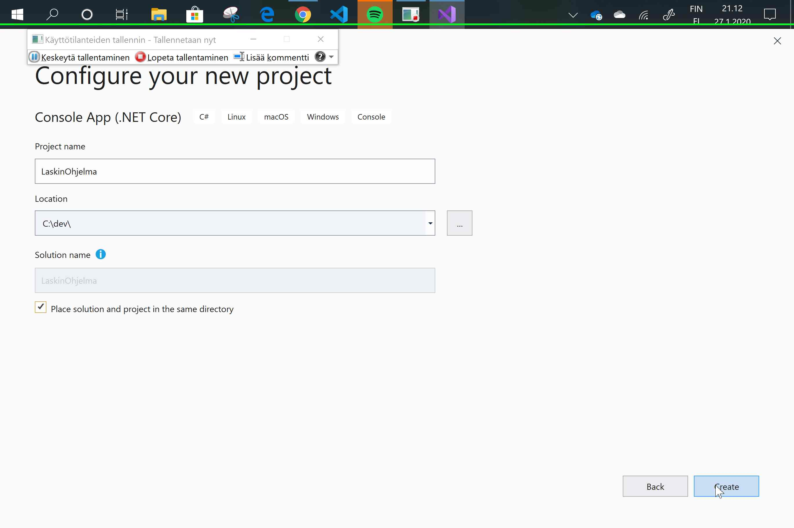
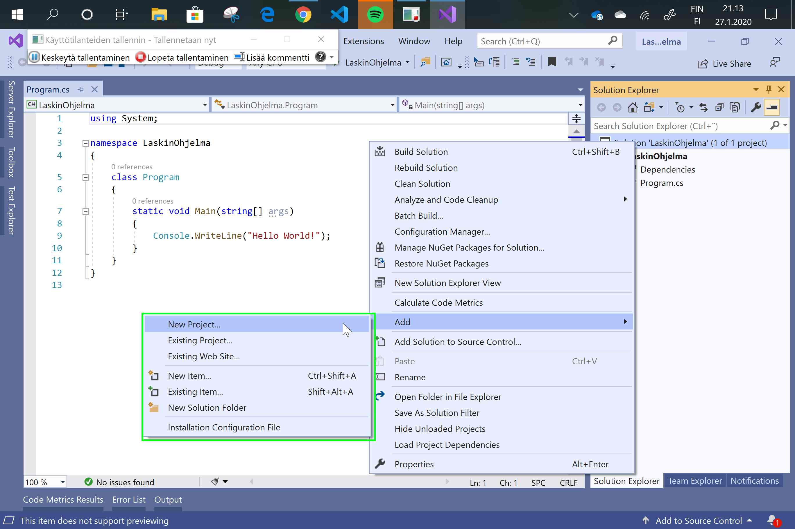
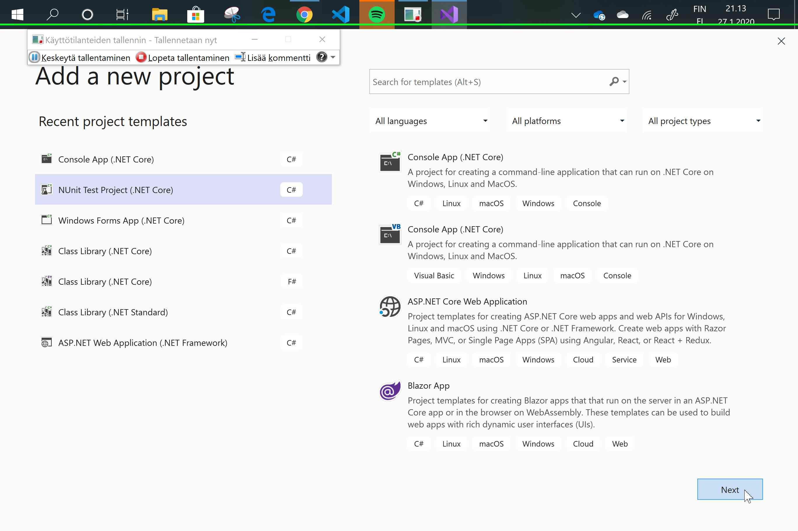
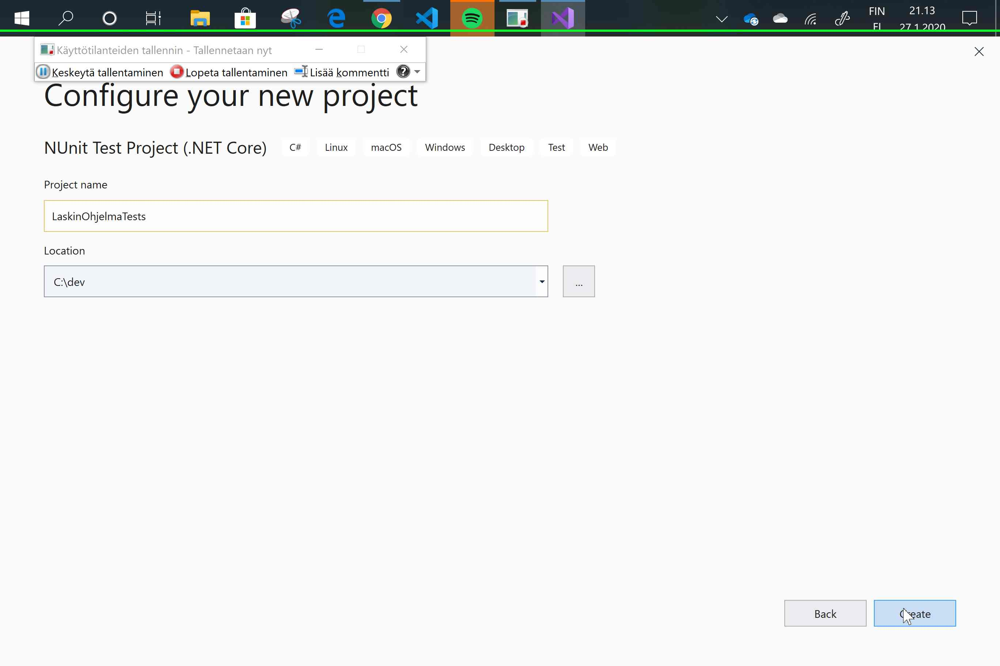
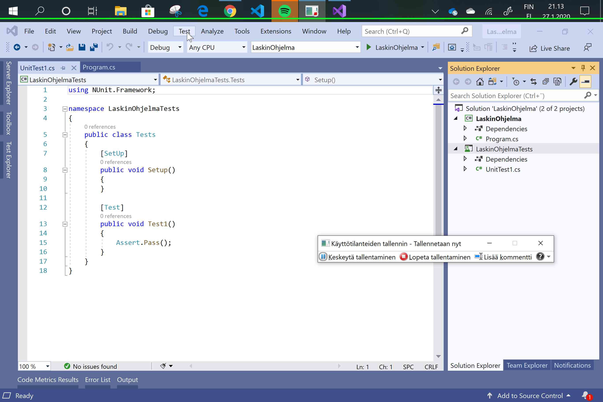
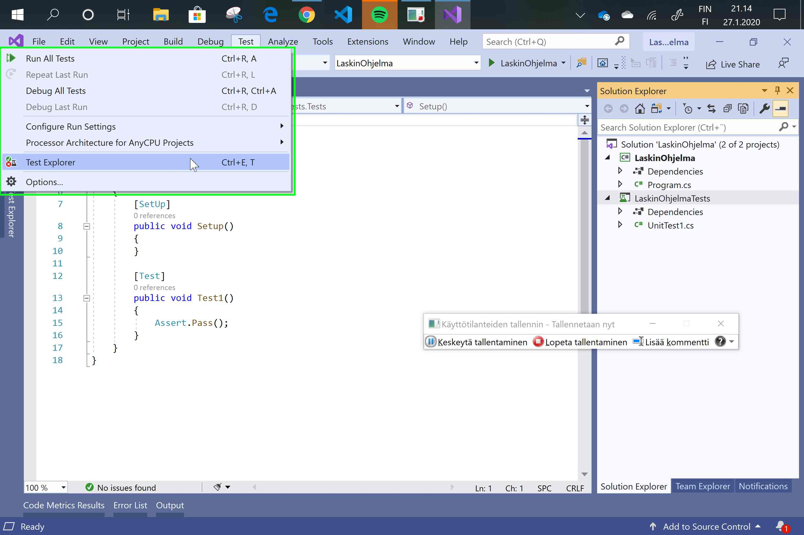
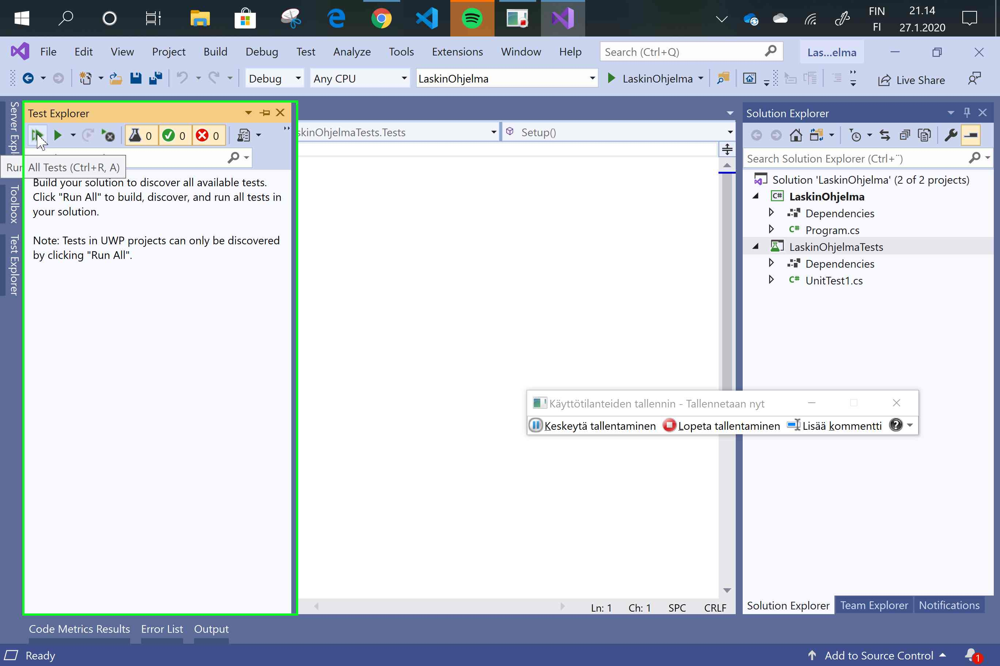
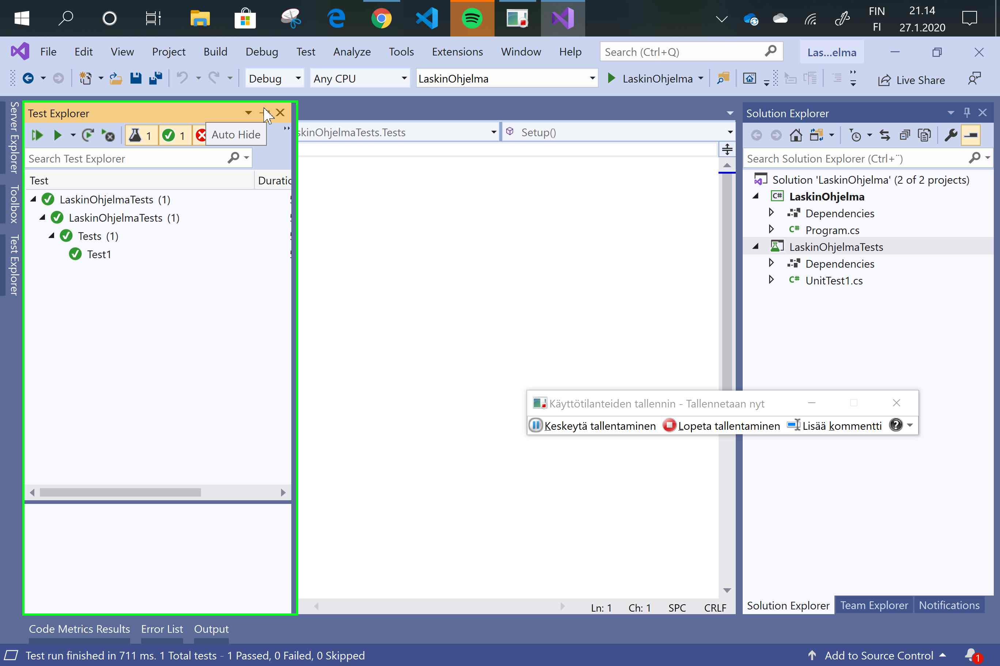
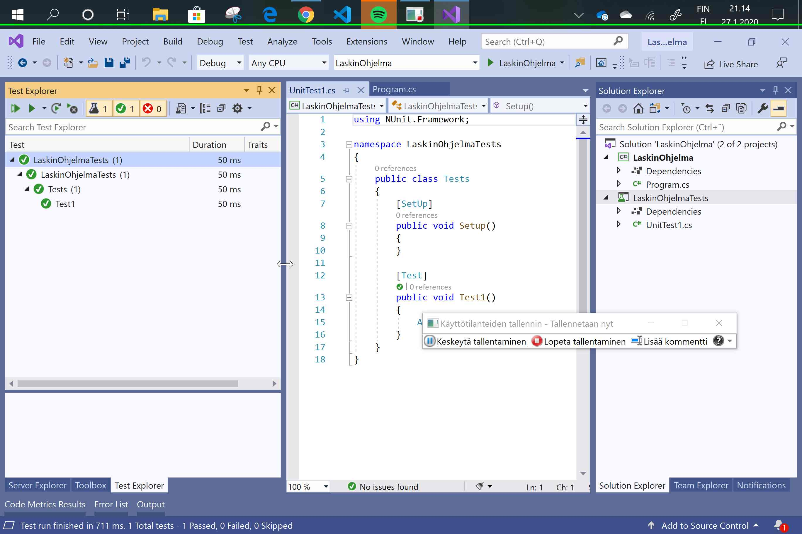

# NUnit lisääminen VS2019

Alla kuvasarja Visual Studio 2019 työkalusta ja kuinka luoda siinä pohja testiprojektille. Lue kuvien sisällöt niin onnistut. Älä välitä kuvissa näkyvästä **käyttötilanteiden tallentimesta**, joka on lähinnä ohjelma joka kuvat on ottanut.

### Kuva 1. Luo ensin uusi Console App -projekti.


Ei ole merkitystä, valitsetko projektityypin jossa lukee **.NET Core** tai **.NET Framework** kunhan on vain C\# projekti.


### Kuva 2. Klikkaa hiiren oikealla Solution tiedoston päällä ja valitse Add &gt; New Project

### Kuva 3. Valitse NUnit Test Project -projetityyppi


Muista valita samanlainen projektityyppi kuin alussa eli **.NET Core** tai **.NET Framework**.


### Kuva 4. Nimeä ohjelma samoin kuin ensimmäinen projekti mutta lisää nimen loppuun Tests

### Kuva 5. Sinulla pitäisi olla kuvan Solution Explorer ikkunan mukaisesti kaksi eri projektia. 

### Kuva 6. Valitse "Test" valikosta "Test Explorer" kohta.

### Kuva 7. Paina Run All Tests avautuvasta ikkunasta.

### Kuva 8. Jos testit ajamisen jälkeen näyttää vihreää niin hyvä.

### Kuva 9. Lopputilanne

Sinulla pitäisi olla Solution Explorer ikkunan mukaan kaksi projektia ja testit menevät läpi. 

Nyt projektipohja on valmis ja voit aloittaa harjoittelun.

