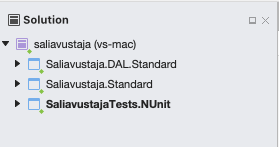

# NUnit perusteet 101

## **Tavoite**

Osaat luoda Visual Studio projektin, jossa käytössä on NUnit yksikkötestauskirjasto.

## **Katso ensin video** malliksi



## **Videon katsomisen jälkeen**

Tee Visual Studio projekti, jossa on tehty seuraavat toimenpiteet.

### Luo NUnit kirjastoa käyttävä projekti videon mukaisesti

Kokeile siis päästä samaan tilanteeseen kuin videon lopussa, että työkalu tulee tutuksi. Sinun pitäisi pystyä ajamaan siis muutama testi malliksi. Voit käyttää videolla tehtyä esimerkkiä.

### Lisää aiemmin luotuu projektiin muutamia eri testejä lisää

Harjoittele siis luomalla yksittäisiä testejä lisää. Videolla luodaan yksinkertainen laskin. Voit esimerkiksi lisätä laskimeen metodin kertolaskulle, jakolaskulle, jakojäännökselle jne. Voit myös luoda muunlaisen metodin millä vain pystyt kokeilemaan testien epäonnistumista ja ajoa.

### Lisää samaan Solutioniin toinen projekti, joka on tyypiltään Console Application

Videolla Console Application projektia ei lisätty. Tee se kuitenkin samaan tapaan kuin videolla muutoin tehtiin projekti. Kun olet luomassa uutta projektia, sinun pitäisi pystyä siinä kohdin valitsemaan, että se lisätään olemassa olevaan Solution projektiin.


Visual Studiossa on kahdenlaisia projektityyppejä. Solution ja Project. Solution on eräänlainen kokoava projektimuoto, jossa voi olla useita projekteja. Alla kuva joka havainnollistaa rakennetta mutta sinun voi olla nimetty eri tavoin.


